<!-- markdownlint-configure-file {"MD033": {"allowed_elements": ["details", "summary"]}} -->

# Meridian: the commander's story

The intended complete journey of Commander Rowan Calder, from Avenor to The Unwritten Route and the career beyond it. Spoilers throughout. Illustrations and ship views are authored references.

🟢 Verified · ⚪ Unverified · 🟡 Partial · 🔵 Planned · 🟣 Gap. Badges apply to their scene or section. [Sources, status details and unresolved points](INTENDED-GAME-STORY-NOTES.md) accompany the story; the [mission map](#all-64-original-mission-sources) covers all 64 original sources.

## Chapters

1. [A new commander leaves Avenor](#a-new-commander-leaves-avenor)
2. [Learning to make a safe journey](#learning-to-make-a-safe-journey)
3. [Making a living between stories](#making-a-living-between-stories)
4. [Preparing the ship and keeping the same career](#preparing-the-ship-and-keeping-the-same-career)
5. [Truth for Sale](#truth-for-sale)
6. [Voices in the Static](#voices-in-the-static)
7. [The Hearth Compact](#the-hearth-compact)
8. [The Wayfarer Union](#the-wayfarer-union)
9. [Last Light](#last-light)
10. [Living Worlds](#living-worlds)
11. [Open Harbours](#open-harbours)
12. [Safe Passage](#safe-passage)
13. [Beyond the Map](#beyond-the-map)
14. [Recovering a lost route into the main story](#recovering-a-lost-route-into-the-main-story)
15. [The Unwritten Route](#the-unwritten-route)
16. [Life after the mystery](#life-after-the-mystery)

## The journey at a glance

Practice, ordinary work and the nine anthology arcs can run alongside one another, subject to their stated prerequisites. The inquiry path preserves the main mystery when an original clue cannot be earned. Expand **Mission flow** beside each story to follow its own actions and decisions.

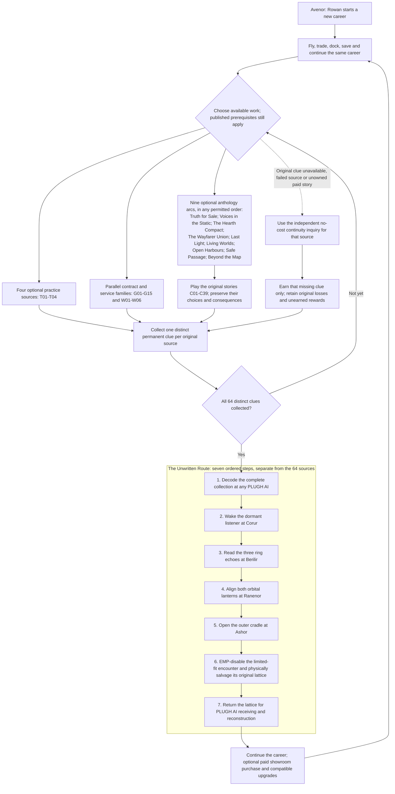
```mermaid
flowchart TD
  %% game-flow | 64 original clue sources; seven-step finale is not mission65
  Start["Avenor: Rowan starts a new career"] --> Career["Fly, trade, dock, save and continue the same career"]
  Career --> Work{"Choose available work; published prerequisites still apply"}
  Work --> Practice["Four optional practice sources: T01-T04"]
  Work --> Jobs["Parallel contract and service families: G01-G15 and W01-W06"]
  Work --> Stories["Nine optional anthology arcs, in any permitted order:<br/>Truth for Sale; Voices in the Static; The Hearth Compact;<br/>The Wayfarer Union; Last Light; Living Worlds;<br/>Open Harbours; Safe Passage; Beyond the Map"]
  Stories --> Original["Play the original stories C01-C39; preserve their choices and consequences"]
  Practice --> Traces["Collect one distinct permanent clue per original source"]
  Jobs --> Traces
  Original --> Traces
  Work -. "Original clue unavailable, failed source or unowned paid story" .-> Inquiry["Use the independent no-cost continuity inquiry for that source"]
  Inquiry --> OnlyClue["Earn that missing clue only; retain original losses and unearned rewards"]
  OnlyClue --> Traces
  Traces --> Set{"All 64 distinct clues collected?"}
  Set -->|"Not yet"| Work
  Set -->|"Yes"| Decode
  subgraph Finale["The Unwritten Route: seven ordered steps, separate from the 64 sources"]
    Decode["1. Decode the complete collection at any PLUGH AI"] --> Listen["2. Wake the dormant listener at Corur"]
    Listen --> Ring["3. Read the three ring echoes at Berilir"]
    Ring --> Lanterns["4. Align both orbital lanterns at Ranenor"]
    Lanterns --> Cradle["5. Open the outer cradle at Ashor"]
    Cradle --> Lattice["6. EMP-disable the limited-fit encounter and physically salvage its original lattice"]
    Lattice --> Return["7. Return the lattice for PLUGH AI receiving and reconstruction"]
  end
  Return --> Beyond["Continue the career; optional paid showroom purchase and compatible upgrades"]
  Beyond --> Career
```

## A new commander leaves Avenor

🟡 Partial

Rowan Calder begins at **Avenor, Galaxy 1, system 007**, aboard a **new L337 SH025 Peregrine Mk V**. The fitted tank is full and the account holds **720 CR**. There is no accepted campaign, earned clue or completed job waiting to be inherited. The career begins with the ordinary ship and its actual fittings.

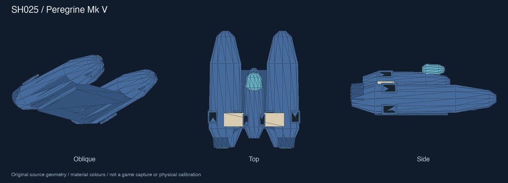

*Peregrine Mk V (SH025).*

At the station, Rowan studies the status, inventory, market and chart. Seventeen commodities have their own prices, finite stock and mass units. A few kilograms of precious metal need not occupy the same hold space as tonnes of machinery. The trading preview shows what a purchase will leave in the account and in the hold. Small legal trades offer a living before specialist work or combat is affordable.

Rowan chooses a reachable destination with enough fuel and a plan for refuelling. A full tank and a drive's maximum single jump are different limits. A profit scan can suggest opportunities, but the journey still belongs to the commander. The ship launches through the actual station exit into a universe of eight authored galaxies, each with 256 ordinary systems and its own additional hidden PLUGH port.

In the cockpit, Rowan learns pitch, roll, yaw, thrust and the views. The scanner, target panel, fuel, energy, front and rear shields, heat and ammunition describe the current ship. Keyboard and trackpad controls lead to the same flight. A chosen spin can match a rotating entrance while preserving the forward heading; manual steering can take over from automatic guidance.

Arrival is a physical approach to a real moving doorway. Rowan needs clearance, a hull that fits and an unobstructed route with safe relative motion. The docking computer flies that approach too. A rescue-service berth may receive a tender without offering a main station's full market or shop. Later, the identity of the receiving station will matter as much as getting near it.

Before taking durable work, Rowan chooses the commander save destination. A later Save, Quit and Continue returns to this same career: its ship, cash, people, protected property, earned measurements and consequences. New Game's gifts do not return with every load. If a transaction cannot be saved, Rowan keeps the last committed property and progress rather than receiving half a payment or losing half a consignment.

The board and gallery show work Rowan can inspect before accepting. Each offer makes its journey, capacity, equipment, costs and any armed incident clock visible. Back closes the conversation; Confirm makes the displayed decision. The gallery follows discovered work and earned history, keeping later revelations concealed.

One introductory opportunity gives Rowan a concrete first promise: **eight original one-tonne Machinery units from Avenor to Renas main station**, carried as one eight-tonne consignment. Rowan reviews the supply and receiving terms, accepts those exact units, makes the journey and docks at the genuine **Renas main orbital**. The actual utility receiver must take all eight originals before the **once-only 730 CR** settlement and the consented-freight family's clue are earned. It is the beginning of the working career, separate from Captain Venn's full Glass Meridian investigation.

After that handoff, Rowan can Save, Quit and Continue. The returned career has the same completed delivery, the same cash and clue, and the same units already owned by the receiver. Continuing does not pay again or put the Machinery back in the hold. It leaves Rowan free to trade, practise or follow another offer from that exact point.

## Learning to make a safe journey

The four practice jobs are available as lessons Rowan can take in a useful order or revisit when needed. Each first legitimate success has its own small trace for the clue journal. Their rewards are the acquired skill and that source's clue, rather than an invented cash bonus.

### Flight and reception practice

🟡 Partial

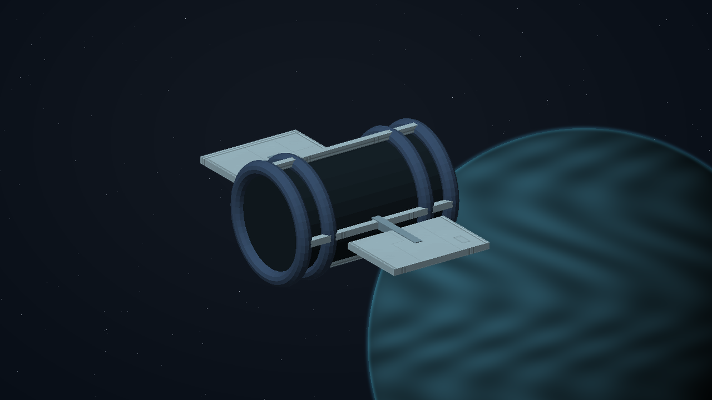

Rowan accepts practice at a safe orbital training berth, reviews throttle, pitch, roll and view controls, then flies the bounded alignment exercise. The lesson ends by bringing the ship through the approved entrance and receiving an actual debrief. It establishes the pattern Rowan will meet again: a flight is complete when the promised receiver genuinely receives it.

Mission flow

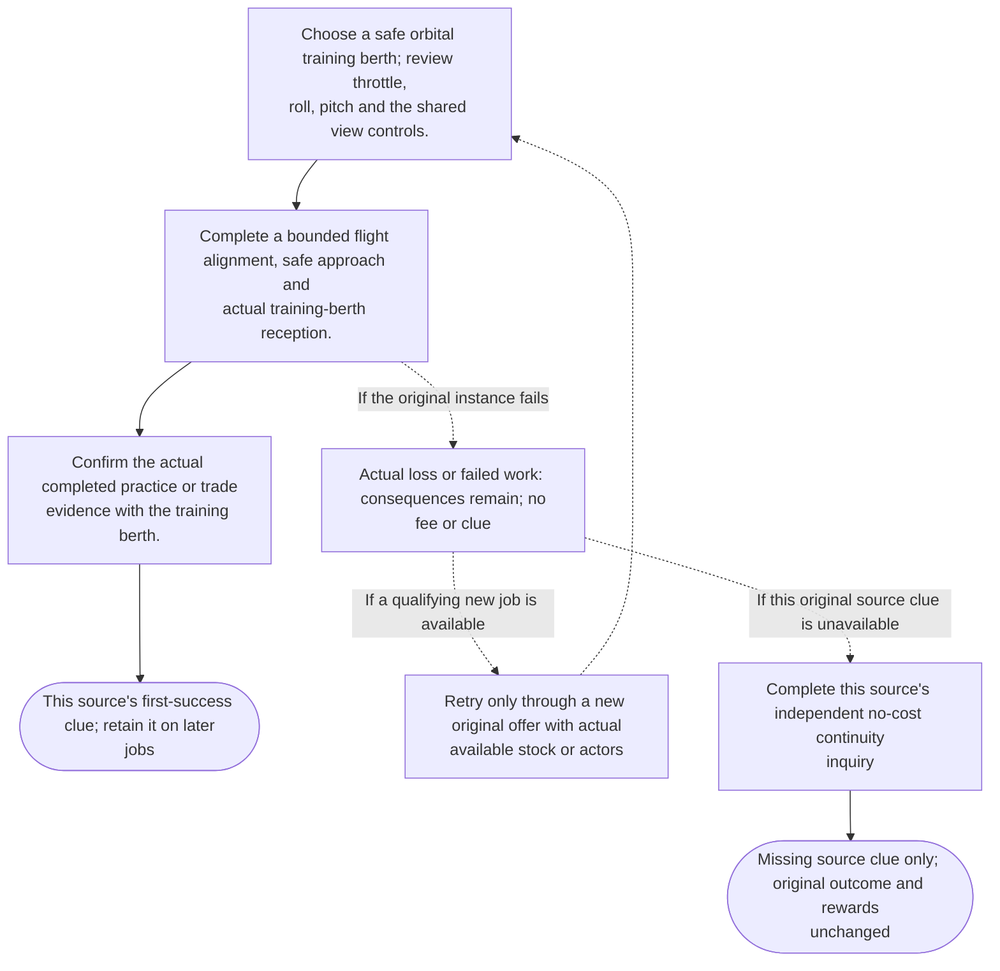
```mermaid
flowchart TD
  %% mission T01 | l337.training/flight-reception
  T01_accept["Choose a safe orbital training berth; review throttle,<br/>roll, pitch and the shared view controls."]
  T01_perform["Complete a bounded flight alignment, safe approach and<br/>actual training-berth reception."]
  T01_receive["Confirm the actual completed practice or trade<br/>evidence with the training berth."]
  T01_complete(["This source's first-success clue; retain it on later<br/>jobs"])
  T01_receive --> T01_complete
  T01_perform --> T01_receive
  T01_accept --> T01_perform
  T01_failed["Actual loss or failed work: consequences remain; no<br/>fee or clue"]
  T01_perform -.-> |"If the original instance fails"| T01_failed
  T01_new_offer["Retry only through a new original offer with actual<br/>available stock or actors"]
  T01_failed -.-> |"If a qualifying new job is available"| T01_new_offer
  T01_new_offer -.-> T01_accept
  T01_continuity_inquiry["Complete this source's independent no-cost continuity<br/>inquiry"]
  T01_continuity_trace(["Missing source clue only; original outcome and rewards<br/>unchanged"])
  T01_failed -.-> |"If this original source clue is unavailable"| T01_continuity_inquiry
  T01_continuity_inquiry --> T01_continuity_trace
```

### Safe gunnery practice

🟡 Partial

Three clearly marked uncrewed targets wait in an isolated practice volume. Rowan identifies them, records three distinct hits and ceases fire safely before returning for confirmation. Aim, heat and energy become practical limits. Ordinary civilian traffic stays outside the exercise.

Mission flow

```mermaid
flowchart TD
  %% mission T02 | l337.training/safe-gunnery
  T02_accept["Review three clearly marked uncrewed simulated gunnery<br/>targets in an isolated orbital practice volume."]
  T02_perform["Verify three distinct practice hits and a safe<br/>cease-fire receipt."]
  T02_receive["Confirm the actual completed practice or trade<br/>evidence with the training berth."]
  T02_complete(["This source's first-success clue; retain it on later<br/>jobs"])
  T02_receive --> T02_complete
  T02_perform --> T02_receive
  T02_accept --> T02_perform
  T02_failed["Actual loss or failed work: consequences remain; no<br/>fee or clue"]
  T02_perform -.-> |"If the original instance fails"| T02_failed
  T02_new_offer["Retry only through a new original offer with actual<br/>available stock or actors"]
  T02_failed -.-> |"If a qualifying new job is available"| T02_new_offer
  T02_new_offer -.-> T02_accept
  T02_continuity_inquiry["Complete this source's independent no-cost continuity<br/>inquiry"]
  T02_continuity_trace(["Missing source clue only; original outcome and rewards<br/>unchanged"])
  T02_failed -.-> |"If this original source clue is unavailable"| T02_continuity_inquiry
  T02_continuity_inquiry --> T02_continuity_trace
```

### Defensive flight practice

🟡 Partial

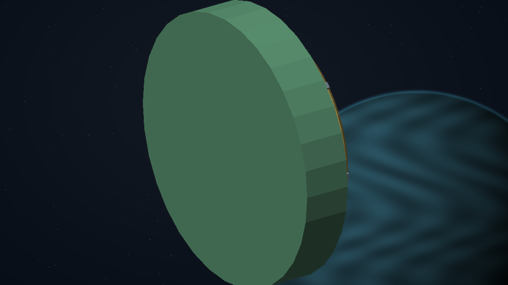

With a consenting uncrewed training actor, Rowan practises target acquisition, controlled evasion and safe disengagement across the published break-off envelope. The lesson measures actual flight without pretending the actor attacked or awarding an artificial kill. The debrief records the manoeuvre Rowan really performed.

Mission flow

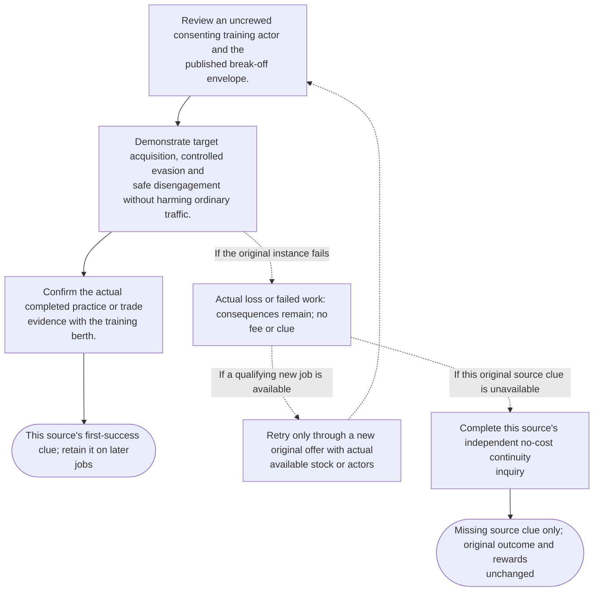
```mermaid
flowchart TD
  %% mission T03 | l337.training/defensive-flight
  T03_accept["Review an uncrewed consenting training actor and the<br/>published break-off envelope."]
  T03_perform["Demonstrate target acquisition, controlled evasion and<br/>safe disengagement without harming ordinary traffic."]
  T03_receive["Confirm the actual completed practice or trade<br/>evidence with the training berth."]
  T03_complete(["This source's first-success clue; retain it on later<br/>jobs"])
  T03_receive --> T03_complete
  T03_perform --> T03_receive
  T03_accept --> T03_perform
  T03_failed["Actual loss or failed work: consequences remain; no<br/>fee or clue"]
  T03_perform -.-> |"If the original instance fails"| T03_failed
  T03_new_offer["Retry only through a new original offer with actual<br/>available stock or actors"]
  T03_failed -.-> |"If a qualifying new job is available"| T03_new_offer
  T03_new_offer -.-> T03_accept
  T03_continuity_inquiry["Complete this source's independent no-cost continuity<br/>inquiry"]
  T03_continuity_trace(["Missing source clue only; original outcome and rewards<br/>unchanged"])
  T03_failed -.-> |"If this original source clue is unavailable"| T03_continuity_inquiry
  T03_continuity_inquiry --> T03_continuity_trace
```

### Navigation and trade practice

🟡 Partial

Rowan buys one tonne of a real legal commodity, previews a reachable route and carries the same consignment to an actual sale. Fuel and the buying/selling difference remain in the account. The receiving debrief confirms the journey and trade evidence. That ordinary sale can also help satisfy the stated preparation for later investigations.

Mission flow

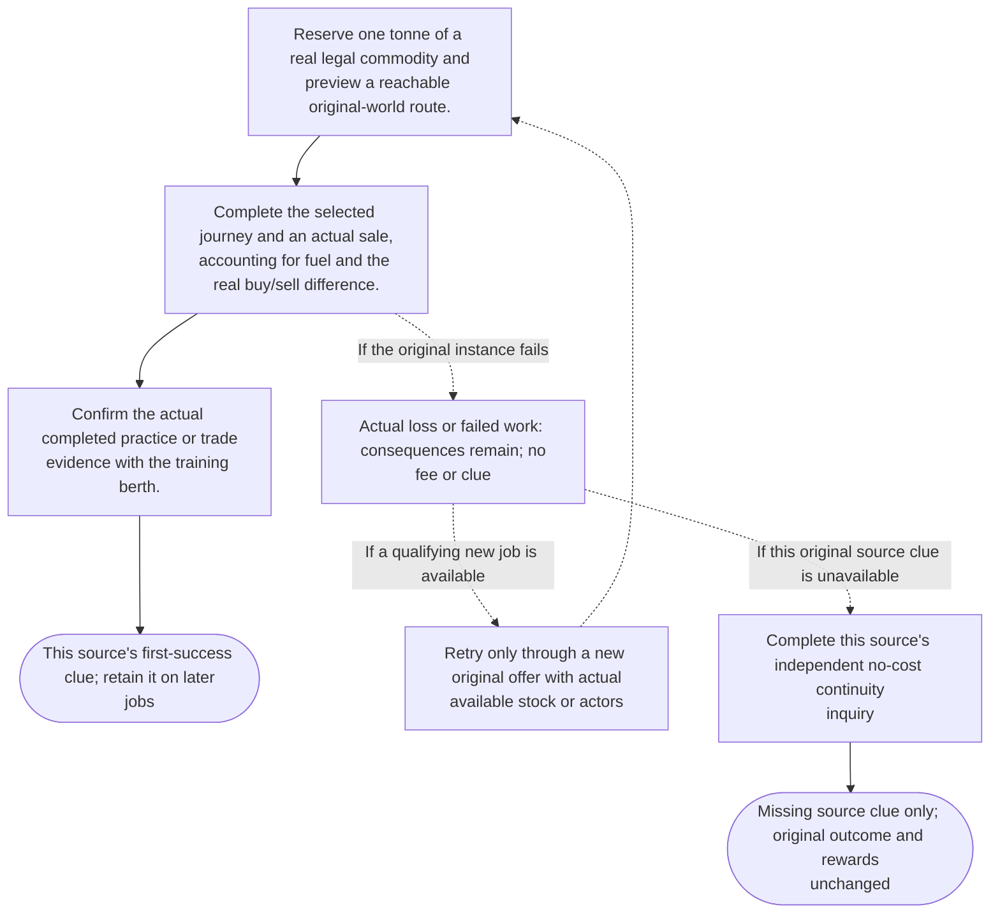
```mermaid
flowchart TD
  %% mission T04 | l337.training/navigation-trade
  T04_accept["Reserve one tonne of a real legal commodity and<br/>preview a reachable original-world route."]
  T04_perform["Complete the selected journey and an actual sale,<br/>accounting for fuel and the real buy/sell difference."]
  T04_receive["Confirm the actual completed practice or trade<br/>evidence with the training berth."]
  T04_complete(["This source's first-success clue; retain it on later<br/>jobs"])
  T04_receive --> T04_complete
  T04_perform --> T04_receive
  T04_accept --> T04_perform
  T04_failed["Actual loss or failed work: consequences remain; no<br/>fee or clue"]
  T04_perform -.-> |"If the original instance fails"| T04_failed
  T04_new_offer["Retry only through a new original offer with actual<br/>available stock or actors"]
  T04_failed -.-> |"If a qualifying new job is available"| T04_new_offer
  T04_new_offer -.-> T04_accept
  T04_continuity_inquiry["Complete this source's independent no-cost continuity<br/>inquiry"]
  T04_continuity_trace(["Missing source clue only; original outcome and rewards<br/>unchanged"])
  T04_failed -.-> |"If this original source clue is unavailable"| T04_continuity_inquiry
  T04_continuity_inquiry --> T04_continuity_trace
```

## Making a living between stories

The contract board gives Rowan parallel ways to earn, travel and specialise. These jobs need not happen in the order below. Their quotes show the real fee, route and hazards; the ordinary baseline jobs have no hidden delivery deadline. A family's first successful job supplies its own clue. Further jobs retain separate consignments, people, payments and outcomes.

### Sealed dispatch

🟡 Partial

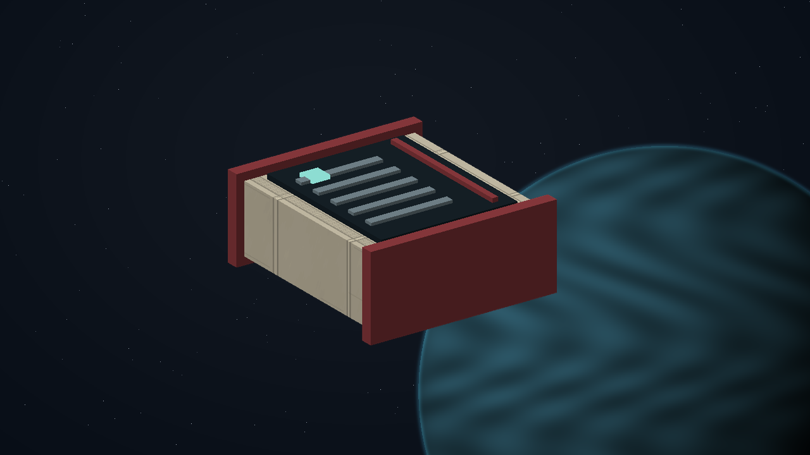

With one tonne free, Rowan can take a sender's unique sealed record to its named receiver. The actual intact handoff earns the quoted fee. A second copy of the message cannot discharge the sender's custody obligation, and looking at the destination on the chart does not deliver it.

Mission flow

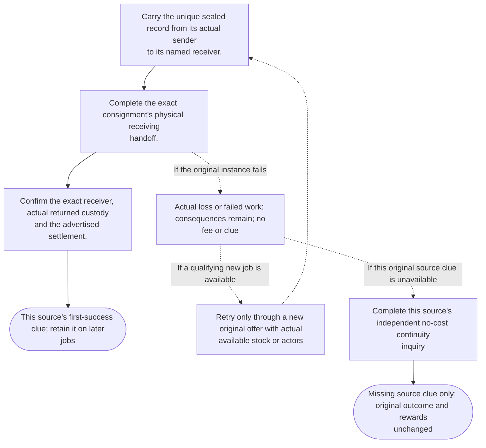
```mermaid
flowchart TD
  %% mission G01 | l337.contract/sealed-dispatch
  G01_accept["Carry the unique sealed record from its actual sender<br/>to its named receiver."]
  G01_perform["Complete the exact consignment's physical receiving<br/>handoff."]
  G01_receive["Confirm the exact receiver, actual returned custody<br/>and the advertised settlement."]
  G01_complete(["This source's first-success clue; retain it on later<br/>jobs"])
  G01_receive --> G01_complete
  G01_perform --> G01_receive
  G01_accept --> G01_perform
  G01_failed["Actual loss or failed work: consequences remain; no<br/>fee or clue"]
  G01_perform -.-> |"If the original instance fails"| G01_failed
  G01_new_offer["Retry only through a new original offer with actual<br/>available stock or actors"]
  G01_failed -.-> |"If a qualifying new job is available"| G01_new_offer
  G01_new_offer -.-> G01_accept
  G01_continuity_inquiry["Complete this source's independent no-cost continuity<br/>inquiry"]
  G01_continuity_trace(["Missing source clue only; original outcome and rewards<br/>unchanged"])
  G01_failed -.-> |"If this original source clue is unavailable"| G01_continuity_inquiry
  G01_continuity_inquiry --> G01_continuity_trace
```

### Consented freight supply

🟡 Partial

Larger jobs reserve **eight tonnes** of identified utility parts from the actual supplier. Rowan carries those same parts to a consenting receiving crew. Finite stock and the promised delivery remain distinct from ordinary trade cargo; the utility receives the goods before the earnings settle.

Mission flow

```mermaid
flowchart TD
  %% mission G02 | l337.contract/consented-freight
  G02_accept["Reserve eight tonnes of identified utility parts from<br/>actual supplier stock."]
  G02_perform["Deliver the same eight tonnes to the consenting<br/>utility receiving crew."]
  G02_receive["Confirm the exact receiver, actual returned custody<br/>and the advertised settlement."]
  G02_complete(["This source's first-success clue; retain it on later<br/>jobs"])
  G02_receive --> G02_complete
  G02_perform --> G02_receive
  G02_accept --> G02_perform
  G02_failed["Actual loss or failed work: consequences remain; no<br/>fee or clue"]
  G02_perform -.-> |"If the original instance fails"| G02_failed
  G02_new_offer["Retry only through a new original offer with actual<br/>available stock or actors"]
  G02_failed -.-> |"If a qualifying new job is available"| G02_new_offer
  G02_new_offer -.-> G02_accept
  G02_continuity_inquiry["Complete this source's independent no-cost continuity<br/>inquiry"]
  G02_continuity_trace(["Missing source clue only; original outcome and rewards<br/>unchanged"])
  G02_failed -.-> |"If this original source clue is unavailable"| G02_continuity_inquiry
  G02_continuity_inquiry --> G02_continuity_trace
```

### Bonded freight passage

🟡 Partial

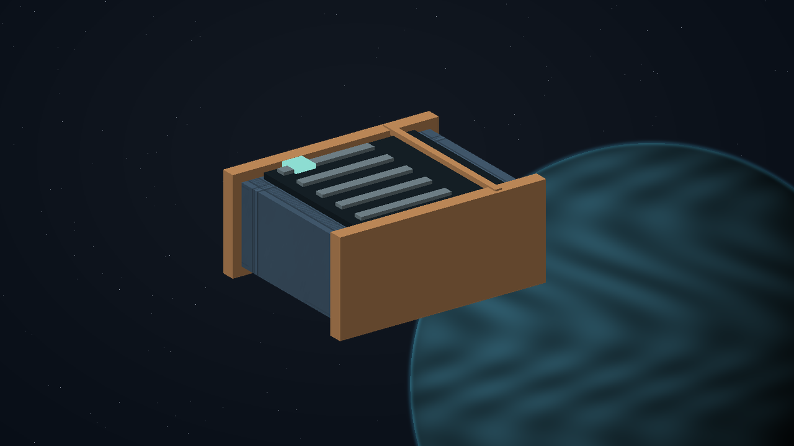

A **three-tonne machinery** consignment asks Rowan for a published **75 CR refundable bond**. The named workshop must receive the complete manifest. The returned bond is Rowan's own money, separate from the earned fee, and its treatment after failure follows the displayed custody terms.

Mission flow

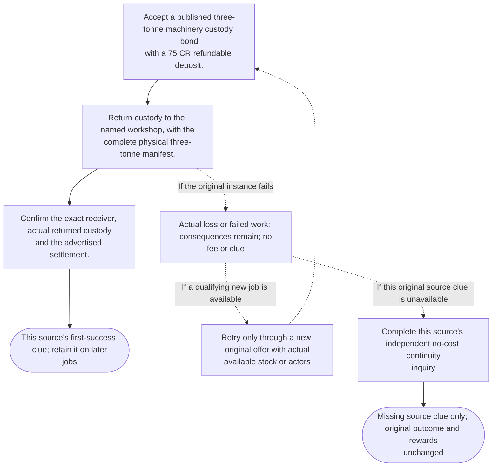
```mermaid
flowchart TD
  %% mission G03 | l337.contract/bonded-freight
  G03_accept["Accept a published three-tonne machinery custody bond<br/>with a 75 CR refundable deposit."]
  G03_perform["Return custody to the named workshop, with the<br/>complete physical three-tonne manifest."]
  G03_receive["Confirm the exact receiver, actual returned custody<br/>and the advertised settlement."]
  G03_complete(["This source's first-success clue; retain it on later<br/>jobs"])
  G03_receive --> G03_complete
  G03_perform --> G03_receive
  G03_accept --> G03_perform
  G03_failed["Actual loss or failed work: consequences remain; no<br/>fee or clue"]
  G03_perform -.-> |"If the original instance fails"| G03_failed
  G03_new_offer["Retry only through a new original offer with actual<br/>available stock or actors"]
  G03_failed -.-> |"If a qualifying new job is available"| G03_new_offer
  G03_new_offer -.-> G03_accept
  G03_continuity_inquiry["Complete this source's independent no-cost continuity<br/>inquiry"]
  G03_continuity_trace(["Missing source clue only; original outcome and rewards<br/>unchanged"])
  G03_failed -.-> |"If this original source clue is unavailable"| G03_continuity_inquiry
  G03_continuity_inquiry --> G03_continuity_trace
```

### Consented cabin journey

🟡 Partial

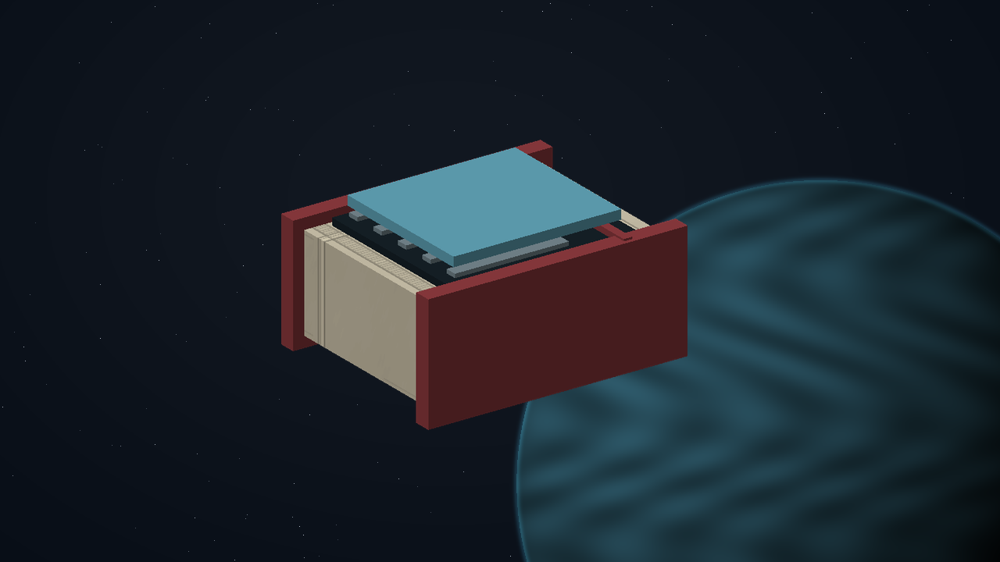

At Avenor, **Mira Talen and Oren Vey** request passage to **Renas**. Rowan fits two free compatible life-supported places and asks for each person's actual reply. Only two genuine acceptances and two real places permit boarding. Those same living passengers then travel to Renas care reception for the original one-leg **610 CR** fee. The passage is untimed and needs no deposit or extra cargo. Cancellation returns them to their actual Avenor custodian without payment; a loss stays in the history.

Mission flow

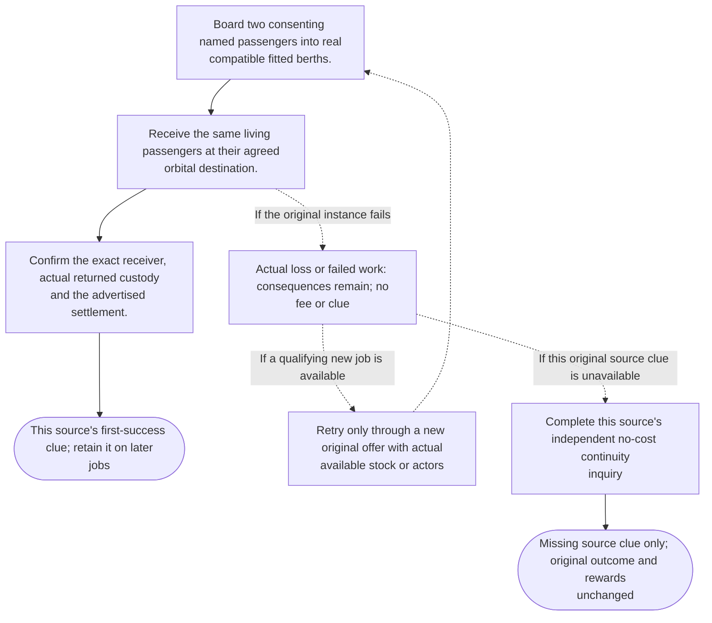
```mermaid
flowchart TD
  %% mission G04 | l337.contract/cabin-journey
  G04_accept["Board two consenting named passengers into real<br/>compatible fitted berths."]
  G04_perform["Receive the same living passengers at their agreed<br/>orbital destination."]
  G04_receive["Confirm the exact receiver, actual returned custody<br/>and the advertised settlement."]
  G04_complete(["This source's first-success clue; retain it on later<br/>jobs"])
  G04_receive --> G04_complete
  G04_perform --> G04_receive
  G04_accept --> G04_perform
  G04_failed["Actual loss or failed work: consequences remain; no<br/>fee or clue"]
  G04_perform -.-> |"If the original instance fails"| G04_failed
  G04_new_offer["Retry only through a new original offer with actual<br/>available stock or actors"]
  G04_failed -.-> |"If a qualifying new job is available"| G04_new_offer
  G04_new_offer -.-> G04_accept
  G04_continuity_inquiry["Complete this source's independent no-cost continuity<br/>inquiry"]
  G04_continuity_trace(["Missing source clue only; original outcome and rewards<br/>unchanged"])
  G04_failed -.-> |"If this original source clue is unavailable"| G04_continuity_inquiry
  G04_continuity_inquiry --> G04_continuity_trace
```

### Orbital outlook journey

🟡 Partial

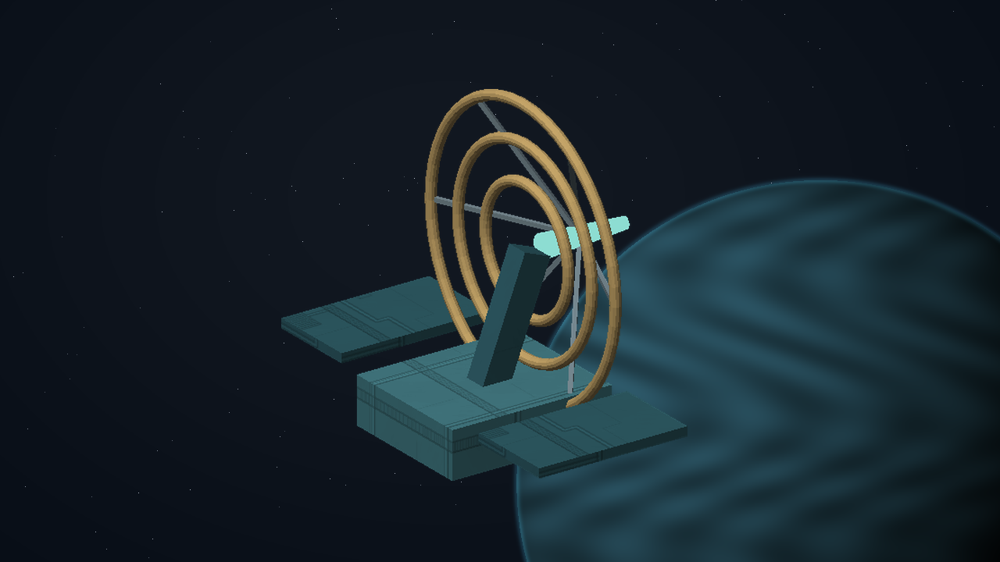

Two consenting passengers book three ordered viewing points. Rowan reserves their fitted places, completes the observations in order and returns the same living travellers to the agreed receiver. The itinerary combines navigation with passenger care: three empty-ship scans cannot stand in for their journey.

Mission flow

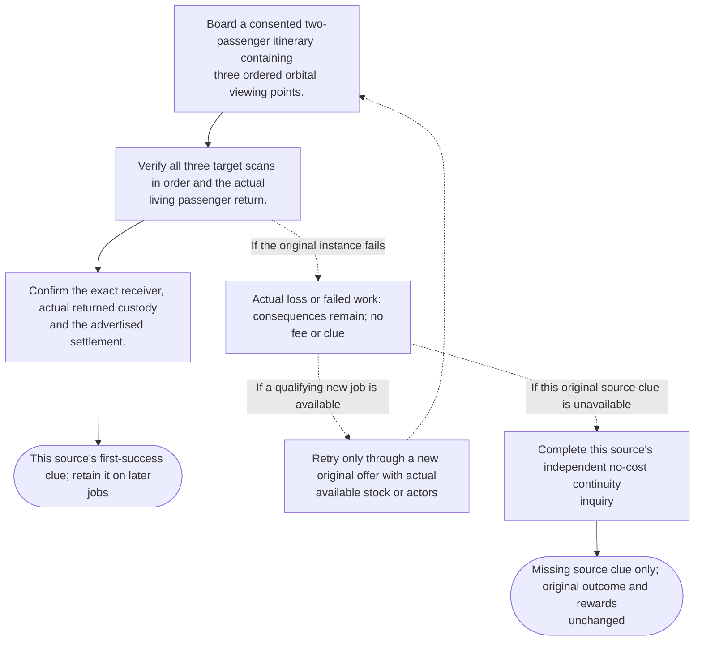
```mermaid
flowchart TD
  %% mission G05 | l337.contract/orbital-outlook
  G05_accept["Board a consented two-passenger itinerary containing<br/>three ordered orbital viewing points."]
  G05_perform["Verify all three target scans in order and the actual<br/>living passenger return."]
  G05_receive["Confirm the exact receiver, actual returned custody<br/>and the advertised settlement."]
  G05_complete(["This source's first-success clue; retain it on later<br/>jobs"])
  G05_receive --> G05_complete
  G05_perform --> G05_receive
  G05_accept --> G05_perform
  G05_failed["Actual loss or failed work: consequences remain; no<br/>fee or clue"]
  G05_perform -.-> |"If the original instance fails"| G05_failed
  G05_new_offer["Retry only through a new original offer with actual<br/>available stock or actors"]
  G05_failed -.-> |"If a qualifying new job is available"| G05_new_offer
  G05_new_offer -.-> G05_accept
  G05_continuity_inquiry["Complete this source's independent no-cost continuity<br/>inquiry"]
  G05_continuity_trace(["Missing source clue only; original outcome and rewards<br/>unchanged"])
  G05_failed -.-> |"If this original source clue is unavailable"| G05_continuity_inquiry
  G05_continuity_inquiry --> G05_continuity_trace
```

### Verified hostile warrant

🟡 Partial

A currently valid warrant names one identified armed aggressor. Rowan verifies the target before engaging and can fulfil the mandate through actual attributed destruction or **secured EMP capture**. A temporary disable is only part of a capture. The same once-only outcome must reach the reporting receiver before the fee is earned.

Mission flow

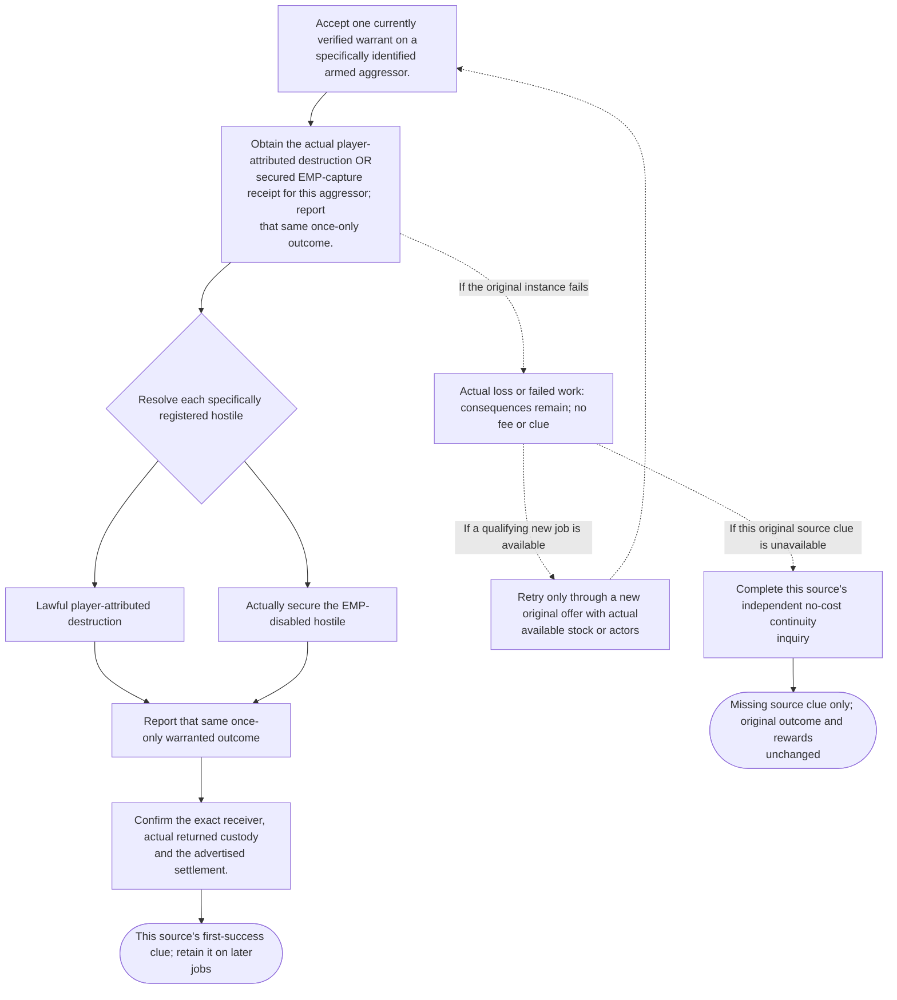
```mermaid
flowchart TD
  %% mission G06 | l337.contract/verified-warrant
  G06_accept["Accept one currently verified warrant on a<br/>specifically identified armed aggressor."]
  G06_perform["Obtain the actual player-attributed destruction OR<br/>secured EMP-capture receipt for this aggressor; report<br/>that same once-only outcome."]
  G06_receive["Confirm the exact receiver, actual returned custody<br/>and the advertised settlement."]
  G06_complete(["This source's first-success clue; retain it on later<br/>jobs"])
  G06_receive --> G06_complete
  G06_accept --> G06_perform
  G06_hostile_method{"Resolve each specifically registered hostile"}
  G06_perform --> G06_hostile_method
  G06_lawful_destruction["Lawful player-attributed destruction"]
  G06_secured_capture["Actually secure the EMP-disabled hostile"]
  G06_hostile_method --> G06_lawful_destruction
  G06_hostile_method --> G06_secured_capture
  G06_all_outcomes["Report that same once-only warranted outcome"]
  G06_lawful_destruction --> G06_all_outcomes
  G06_secured_capture --> G06_all_outcomes
  G06_all_outcomes --> G06_receive
  G06_failed["Actual loss or failed work: consequences remain; no<br/>fee or clue"]
  G06_perform -.-> |"If the original instance fails"| G06_failed
  G06_new_offer["Retry only through a new original offer with actual<br/>available stock or actors"]
  G06_failed -.-> |"If a qualifying new job is available"| G06_new_offer
  G06_new_offer -.-> G06_accept
  G06_continuity_inquiry["Complete this source's independent no-cost continuity<br/>inquiry"]
  G06_continuity_trace(["Missing source clue only; original outcome and rewards<br/>unchanged"])
  G06_failed -.-> |"If this original source clue is unavailable"| G06_continuity_inquiry
  G06_continuity_inquiry --> G06_continuity_trace
```

### Registered corridor defence

🟡 Partial

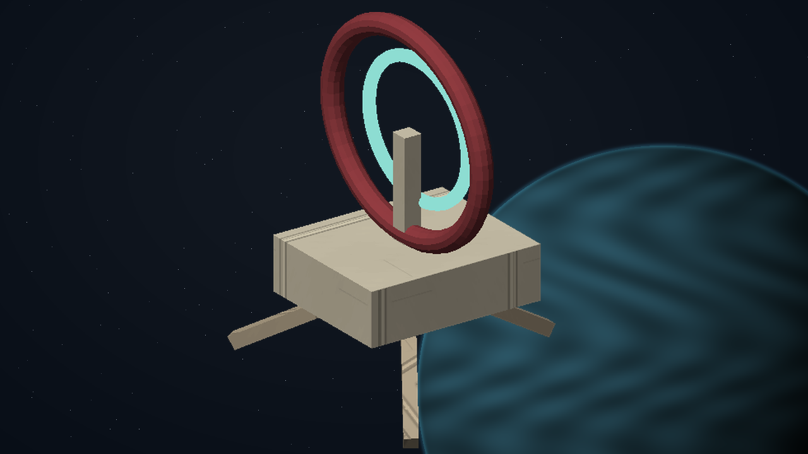

A threatened corridor names **three distinct registered hostile raiders**. Rowan protects it by securing a lawful attributed destruction or EMP-capture outcome for each, then obtaining the actual corridor reception record. A replacement actor or repeated count of one target cannot supply the other two.

Mission flow

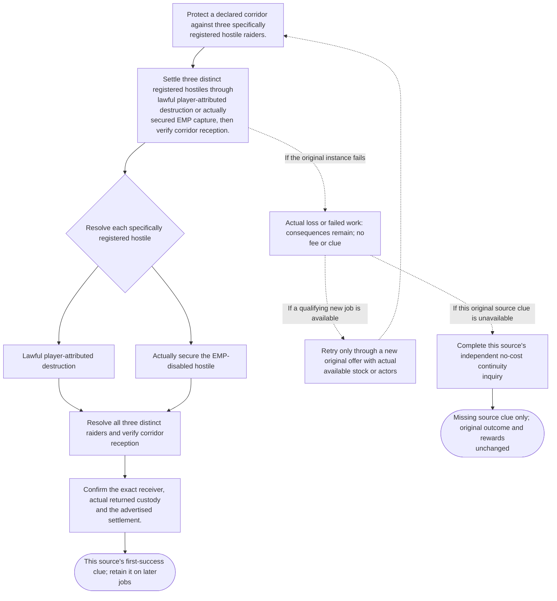
```mermaid
flowchart TD
  %% mission G07 | l337.contract/corridor-defence
  G07_accept["Protect a declared corridor against three specifically<br/>registered hostile raiders."]
  G07_perform["Settle three distinct registered hostiles through<br/>lawful player-attributed destruction or actually<br/>secured EMP capture, then verify corridor reception."]
  G07_receive["Confirm the exact receiver, actual returned custody<br/>and the advertised settlement."]
  G07_complete(["This source's first-success clue; retain it on later<br/>jobs"])
  G07_receive --> G07_complete
  G07_accept --> G07_perform
  G07_hostile_method{"Resolve each specifically registered hostile"}
  G07_perform --> G07_hostile_method
  G07_lawful_destruction["Lawful player-attributed destruction"]
  G07_secured_capture["Actually secure the EMP-disabled hostile"]
  G07_hostile_method --> G07_lawful_destruction
  G07_hostile_method --> G07_secured_capture
  G07_all_outcomes["Resolve all three distinct raiders and verify corridor<br/>reception"]
  G07_lawful_destruction --> G07_all_outcomes
  G07_secured_capture --> G07_all_outcomes
  G07_all_outcomes --> G07_receive
  G07_failed["Actual loss or failed work: consequences remain; no<br/>fee or clue"]
  G07_perform -.-> |"If the original instance fails"| G07_failed
  G07_new_offer["Retry only through a new original offer with actual<br/>available stock or actors"]
  G07_failed -.-> |"If a qualifying new job is available"| G07_new_offer
  G07_new_offer -.-> G07_accept
  G07_continuity_inquiry["Complete this source's independent no-cost continuity<br/>inquiry"]
  G07_continuity_trace(["Missing source clue only; original outcome and rewards<br/>unchanged"])
  G07_failed -.-> |"If this original source clue is unavailable"| G07_continuity_inquiry
  G07_continuity_inquiry --> G07_continuity_trace
```

### Consented custody rescue

🟡 Partial

Rowan reserves **two fitted berths and one tonne** for the survivors' unique emergency record. Identified living capsules are recovered safely, the people board voluntarily and the same survivors and record reach their receiver. This rescue gives Rowan no authority to attack people with EMP or cut occupied hull sections. Partial arrival and casualties remain real consequences.

Mission flow

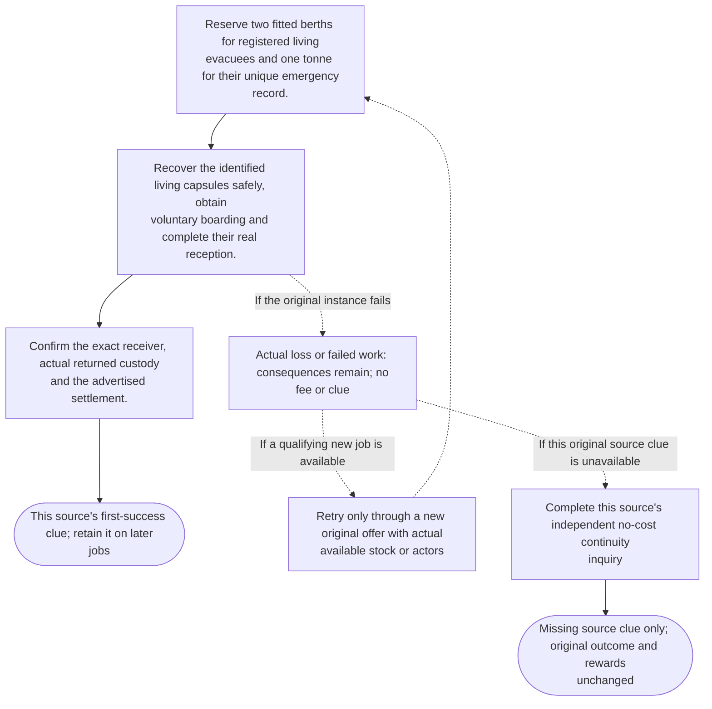
```mermaid
flowchart TD
  %% mission G08 | l337.contract/custody-rescue
  G08_accept["Reserve two fitted berths for registered living<br/>evacuees and one tonne for their unique emergency<br/>record."]
  G08_perform["Recover the identified living capsules safely, obtain<br/>voluntary boarding and complete their real reception."]
  G08_receive["Confirm the exact receiver, actual returned custody<br/>and the advertised settlement."]
  G08_complete(["This source's first-success clue; retain it on later<br/>jobs"])
  G08_receive --> G08_complete
  G08_perform --> G08_receive
  G08_accept --> G08_perform
  G08_failed["Actual loss or failed work: consequences remain; no<br/>fee or clue"]
  G08_perform -.-> |"If the original instance fails"| G08_failed
  G08_new_offer["Retry only through a new original offer with actual<br/>available stock or actors"]
  G08_failed -.-> |"If a qualifying new job is available"| G08_new_offer
  G08_new_offer -.-> G08_accept
  G08_continuity_inquiry["Complete this source's independent no-cost continuity<br/>inquiry"]
  G08_continuity_trace(["Missing source clue only; original outcome and rewards<br/>unchanged"])
  G08_failed -.-> |"If this original source clue is unavailable"| G08_continuity_inquiry
  G08_continuity_inquiry --> G08_continuity_trace
```

### Identified salvage return

🟡 Partial

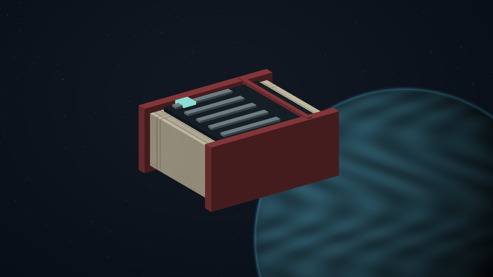

Two tonnes of uniquely registered equipment await permitted recovery in an orbital wreck cradle. Rowan uses the appropriate tools and returns those exact items to their consenting owner. This already disabled source needs no invented attack, and recovering its owner's property does not transfer the owner's ship title or blueprint.

Mission flow

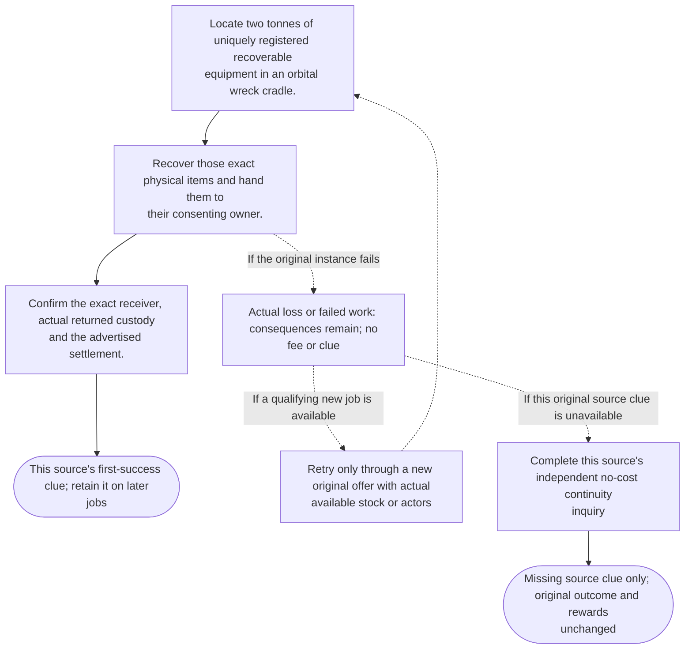
```mermaid
flowchart TD
  %% mission G09 | l337.contract/identified-salvage
  G09_accept["Locate two tonnes of uniquely registered recoverable<br/>equipment in an orbital wreck cradle."]
  G09_perform["Recover those exact physical items and hand them to<br/>their consenting owner."]
  G09_receive["Confirm the exact receiver, actual returned custody<br/>and the advertised settlement."]
  G09_complete(["This source's first-success clue; retain it on later<br/>jobs"])
  G09_receive --> G09_complete
  G09_perform --> G09_receive
  G09_accept --> G09_perform
  G09_failed["Actual loss or failed work: consequences remain; no<br/>fee or clue"]
  G09_perform -.-> |"If the original instance fails"| G09_failed
  G09_new_offer["Retry only through a new original offer with actual<br/>available stock or actors"]
  G09_failed -.-> |"If a qualifying new job is available"| G09_new_offer
  G09_new_offer -.-> G09_accept
  G09_continuity_inquiry["Complete this source's independent no-cost continuity<br/>inquiry"]
  G09_continuity_trace(["Missing source clue only; original outcome and rewards<br/>unchanged"])
  G09_failed -.-> |"If this original source clue is unavailable"| G09_continuity_inquiry
  G09_continuity_inquiry --> G09_continuity_trace
```

### Consented orbital survey

🟡 Partial

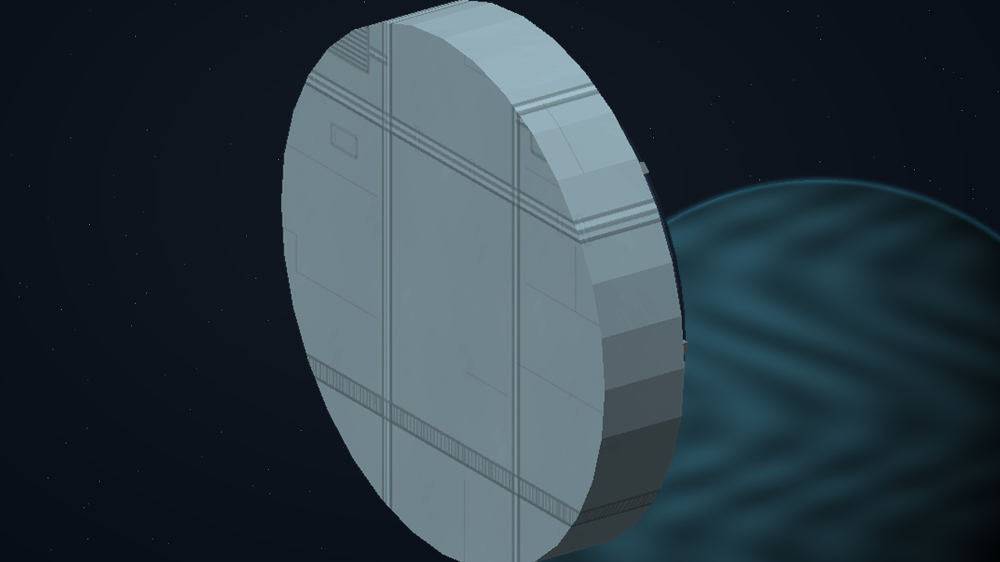

Three registered calibration points each need a separate **12-second qualified scan** at the advertised safe range. Rowan keeps the actual target in view through the unobstructed dwell and returns the signed measurements. An interrupted unfinished observation has to be made again; completed readings remain part of the job.

Mission flow

```mermaid
flowchart TD
  %% mission G10 | l337.contract/consented-survey
  G10_accept["Survey three registered ship-accessible calibration<br/>points at their advertised safe ranges."]
  G10_perform["Complete three distinct 12-second scans and return the<br/>signed measurements."]
  G10_receive["Confirm the exact receiver, actual returned custody<br/>and the advertised settlement."]
  G10_complete(["This source's first-success clue; retain it on later<br/>jobs"])
  G10_receive --> G10_complete
  G10_perform --> G10_receive
  G10_accept --> G10_perform
  G10_failed["Actual loss or failed work: consequences remain; no<br/>fee or clue"]
  G10_perform -.-> |"If the original instance fails"| G10_failed
  G10_new_offer["Retry only through a new original offer with actual<br/>available stock or actors"]
  G10_failed -.-> |"If a qualifying new job is available"| G10_new_offer
  G10_new_offer -.-> G10_accept
  G10_continuity_inquiry["Complete this source's independent no-cost continuity<br/>inquiry"]
  G10_continuity_trace(["Missing source clue only; original outcome and rewards<br/>unchanged"])
  G10_failed -.-> |"If this original source clue is unavailable"| G10_continuity_inquiry
  G10_continuity_inquiry --> G10_continuity_trace
```

### External isolation work

🟡 Partial

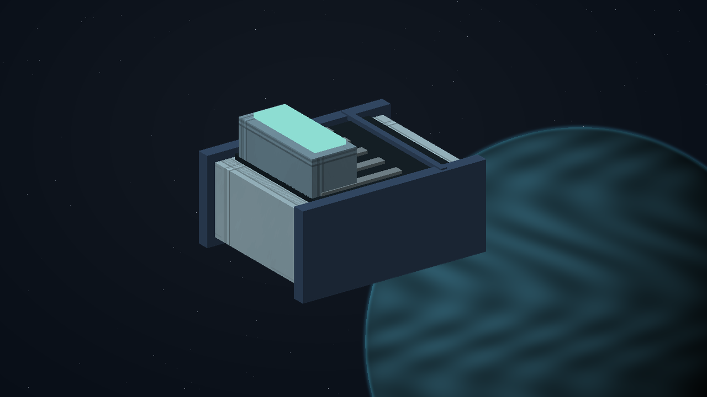

Rowan takes a uniquely loaned **one-tonne programmer** to two named unmanned external control modules. Both isolation states must be made physical and verified. The same programmer returns to its issuer before settlement. Shooting a control box or buying a similar instrument cannot replace the promised safe work and return.

Mission flow

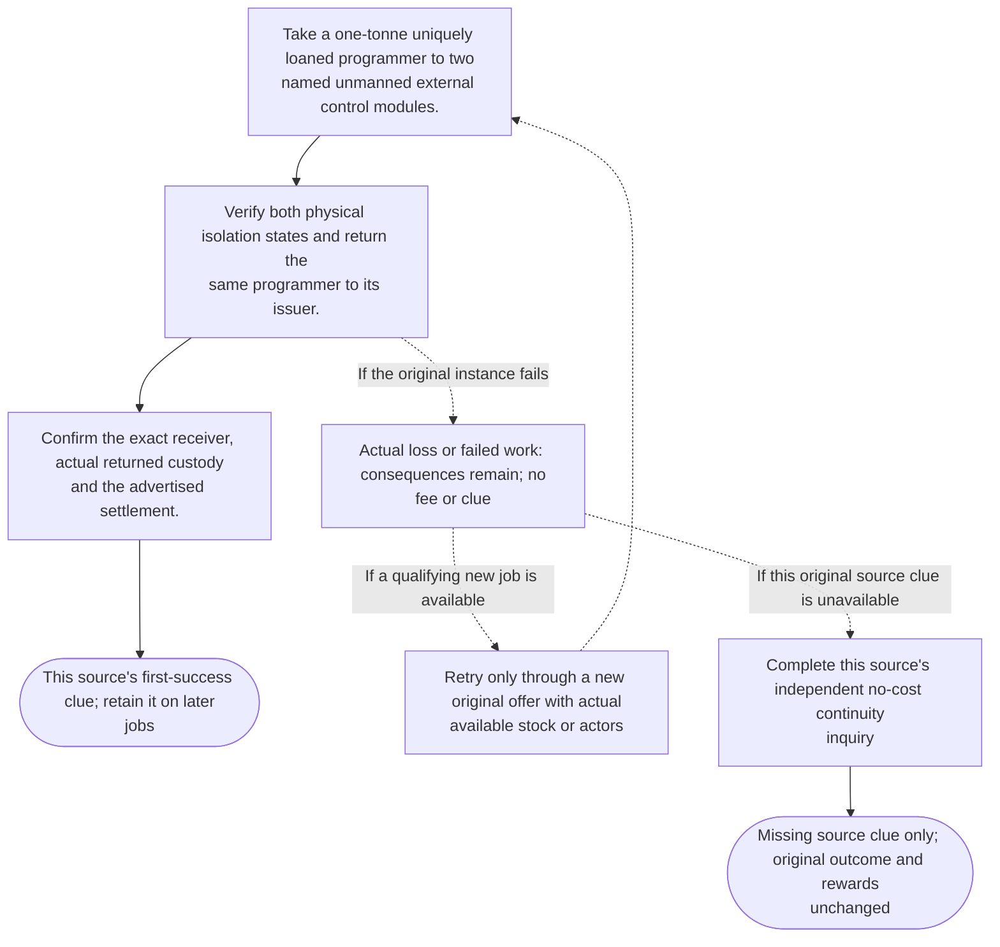
```mermaid
flowchart TD
  %% mission G11 | l337.contract/isolation-work
  G11_accept["Take a one-tonne uniquely loaned programmer to two<br/>named unmanned external control modules."]
  G11_perform["Verify both physical isolation states and return the<br/>same programmer to its issuer."]
  G11_receive["Confirm the exact receiver, actual returned custody<br/>and the advertised settlement."]
  G11_complete(["This source's first-success clue; retain it on later<br/>jobs"])
  G11_receive --> G11_complete
  G11_perform --> G11_receive
  G11_accept --> G11_perform
  G11_failed["Actual loss or failed work: consequences remain; no<br/>fee or clue"]
  G11_perform -.-> |"If the original instance fails"| G11_failed
  G11_new_offer["Retry only through a new original offer with actual<br/>available stock or actors"]
  G11_failed -.-> |"If a qualifying new job is available"| G11_new_offer
  G11_new_offer -.-> G11_accept
  G11_continuity_inquiry["Complete this source's independent no-cost continuity<br/>inquiry"]
  G11_continuity_trace(["Missing source clue only; original outcome and rewards<br/>unchanged"])
  G11_failed -.-> |"If this original source clue is unavailable"| G11_continuity_inquiry
  G11_continuity_inquiry --> G11_continuity_trace
```

### Measured asteroid extraction

🟡 Partial

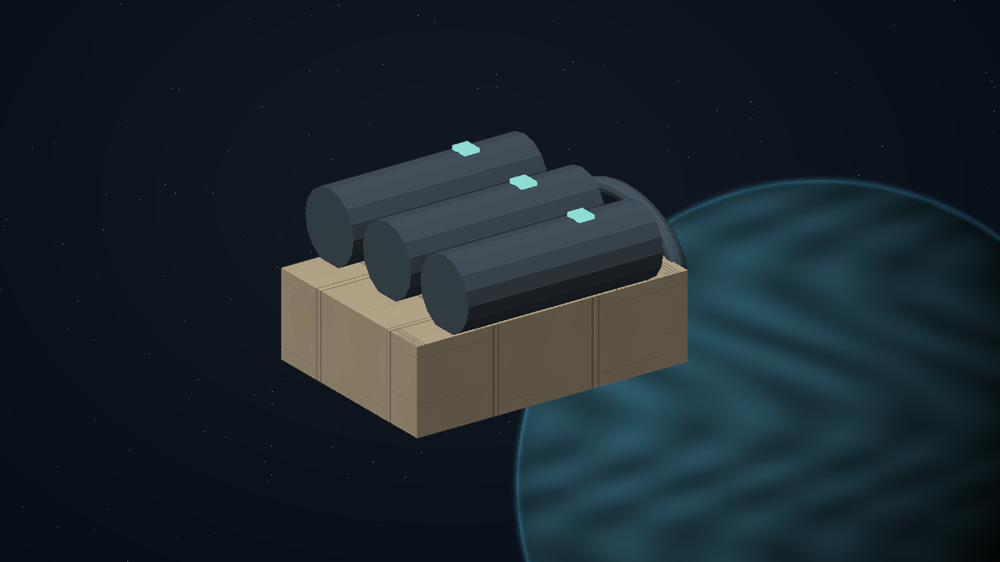

With **twelve tonnes** of free hold and the installed mining/refining equipment, Rowan identifies the consented extraction body, physically mines and refines the required material, then delivers it with its original provenance. Purchasing twelve tonnes elsewhere cannot certify this extraction.

Mission flow

```mermaid
flowchart TD
  %% mission G12 | l337.contract/measured-extraction
  G12_accept["Reserve twelve tonnes of hold and identify a consented<br/>orbital extraction body."]
  G12_perform["Mine and refine twelve tonnes with this job's verified<br/>extraction provenance, then deliver them."]
  G12_receive["Confirm the exact receiver, actual returned custody<br/>and the advertised settlement."]
  G12_complete(["This source's first-success clue; retain it on later<br/>jobs"])
  G12_receive --> G12_complete
  G12_perform --> G12_receive
  G12_accept --> G12_perform
  G12_failed["Actual loss or failed work: consequences remain; no<br/>fee or clue"]
  G12_perform -.-> |"If the original instance fails"| G12_failed
  G12_new_offer["Retry only through a new original offer with actual<br/>available stock or actors"]
  G12_failed -.-> |"If a qualifying new job is available"| G12_new_offer
  G12_new_offer -.-> G12_accept
  G12_continuity_inquiry["Complete this source's independent no-cost continuity<br/>inquiry"]
  G12_continuity_trace(["Missing source clue only; original outcome and rewards<br/>unchanged"])
  G12_failed -.-> |"If this original source clue is unavailable"| G12_continuity_inquiry
  G12_continuity_inquiry --> G12_continuity_trace
```

### Mutual relief contribution

🟡 Partial

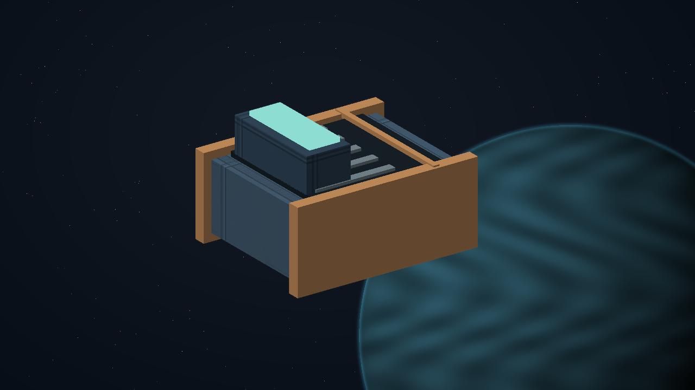

When earnings permit, Rowan can review a voluntary **500 CR** contribution to a named orbital relief reserve. One explicit payment reaches the actual recipient and receives its verified acknowledgement. There is no cash prize, although the first legitimate contribution has its own source clue.

Mission flow

```mermaid
flowchart TD
  %% mission G13 | l337.contract/mutual-contribution
  G13_accept["Review a voluntary 500 CR contribution to a named<br/>orbital relief reserve."]
  G13_perform["Commit exactly 500 CR to its real recipient and<br/>receive the verified fund acknowledgement."]
  G13_receive["Confirm the exact receiver, actual returned custody<br/>and the advertised settlement."]
  G13_complete(["This source's first-success clue; retain it on later<br/>jobs"])
  G13_receive --> G13_complete
  G13_perform --> G13_receive
  G13_accept --> G13_perform
  G13_failed["Actual loss or failed work: consequences remain; no<br/>fee or clue"]
  G13_perform -.-> |"If the original instance fails"| G13_failed
  G13_new_offer["Retry only through a new original offer with actual<br/>available stock or actors"]
  G13_failed -.-> |"If a qualifying new job is available"| G13_new_offer
  G13_new_offer -.-> G13_accept
  G13_continuity_inquiry["Complete this source's independent no-cost continuity<br/>inquiry"]
  G13_continuity_trace(["Missing source clue only; original outcome and rewards<br/>unchanged"])
  G13_failed -.-> |"If this original source clue is unavailable"| G13_continuity_inquiry
  G13_continuity_inquiry --> G13_continuity_trace
```

### Registered orbital evacuation

🟡 Partial

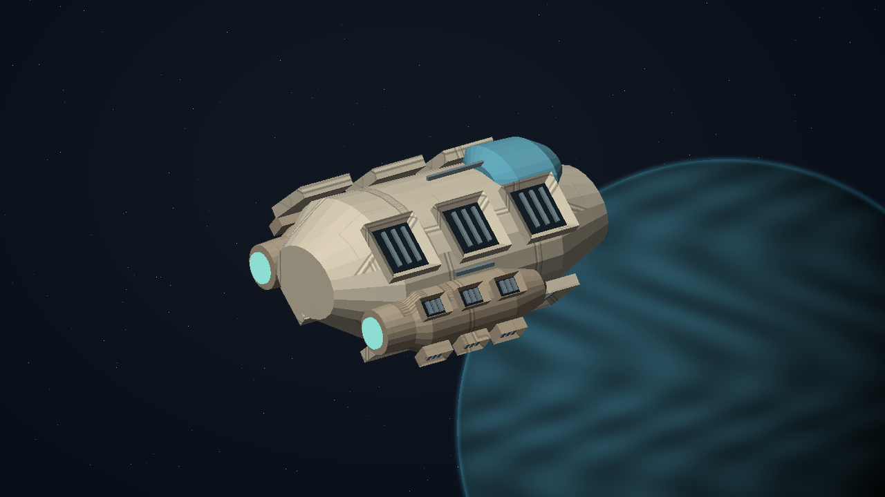

A registered evacuation group needs **four real compatible fitted places**. Rowan obtains consent, boards the survivors and brings the same people to the agreed receiving berth. Operating crew quarters and an empty hold cannot be counted as passenger places. The record preserves the people who reached safety and any genuine losses.

Mission flow

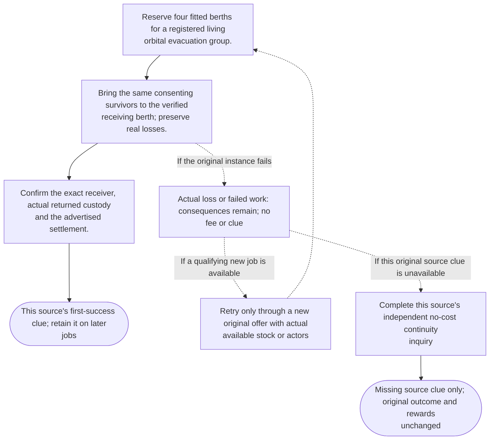
```mermaid
flowchart TD
  %% mission G14 | l337.contract/orbital-evacuation
  G14_accept["Reserve four fitted berths for a registered living<br/>orbital evacuation group."]
  G14_perform["Bring the same consenting survivors to the verified<br/>receiving berth; preserve real losses."]
  G14_receive["Confirm the exact receiver, actual returned custody<br/>and the advertised settlement."]
  G14_complete(["This source's first-success clue; retain it on later<br/>jobs"])
  G14_receive --> G14_complete
  G14_perform --> G14_receive
  G14_accept --> G14_perform
  G14_failed["Actual loss or failed work: consequences remain; no<br/>fee or clue"]
  G14_perform -.-> |"If the original instance fails"| G14_failed
  G14_new_offer["Retry only through a new original offer with actual<br/>available stock or actors"]
  G14_failed -.-> |"If a qualifying new job is available"| G14_new_offer
  G14_new_offer -.-> G14_accept
  G14_continuity_inquiry["Complete this source's independent no-cost continuity<br/>inquiry"]
  G14_continuity_trace(["Missing source clue only; original outcome and rewards<br/>unchanged"])
  G14_failed -.-> |"If this original source clue is unavailable"| G14_continuity_inquiry
  G14_continuity_inquiry --> G14_continuity_trace
```

### Designated hostile Larvaal defence

🔵 Planned

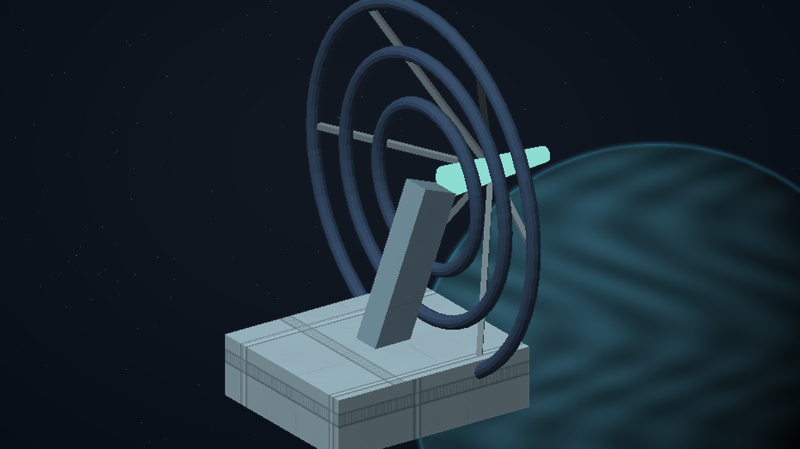

Two registered armed hostile Larvaal actors threaten a civilian corridor. Rowan verifies each actual aggressor, secures the two distinct lawful destruction or EMP-capture outcomes and obtains the civilians' safe-arrival record. The mandate concerns those attackers. It does not make every Larvaal a target or undo a first-contact agreement.

Mission flow

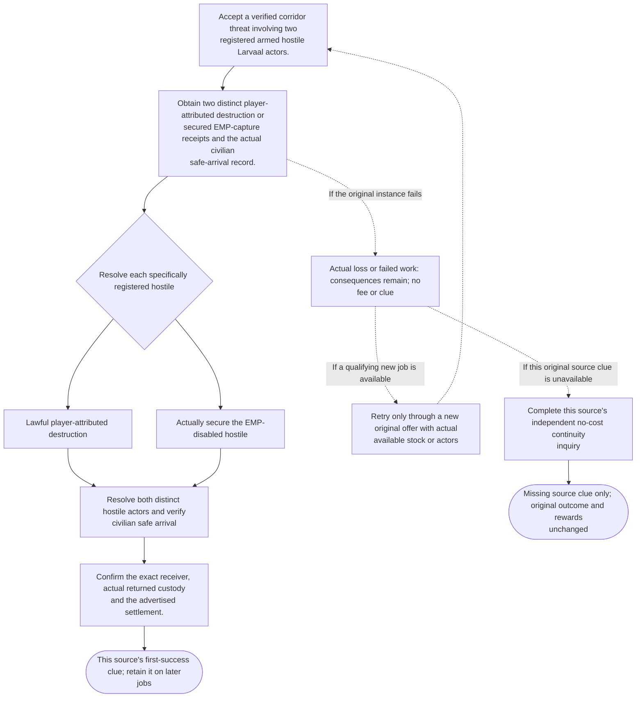
```mermaid
flowchart TD
  %% mission G15 | l337.contract/hostile-larvaal-defence
  G15_accept["Accept a verified corridor threat involving two<br/>registered armed hostile Larvaal actors."]
  G15_perform["Obtain two distinct player-attributed destruction or<br/>secured EMP-capture receipts and the actual civilian<br/>safe-arrival record."]
  G15_receive["Confirm the exact receiver, actual returned custody<br/>and the advertised settlement."]
  G15_complete(["This source's first-success clue; retain it on later<br/>jobs"])
  G15_receive --> G15_complete
  G15_accept --> G15_perform
  G15_hostile_method{"Resolve each specifically registered hostile"}
  G15_perform --> G15_hostile_method
  G15_lawful_destruction["Lawful player-attributed destruction"]
  G15_secured_capture["Actually secure the EMP-disabled hostile"]
  G15_hostile_method --> G15_lawful_destruction
  G15_hostile_method --> G15_secured_capture
  G15_all_outcomes["Resolve both distinct hostile actors and verify<br/>civilian safe arrival"]
  G15_lawful_destruction --> G15_all_outcomes
  G15_secured_capture --> G15_all_outcomes
  G15_all_outcomes --> G15_receive
  G15_failed["Actual loss or failed work: consequences remain; no<br/>fee or clue"]
  G15_perform -.-> |"If the original instance fails"| G15_failed
  G15_new_offer["Retry only through a new original offer with actual<br/>available stock or actors"]
  G15_failed -.-> |"If a qualifying new job is available"| G15_new_offer
  G15_new_offer -.-> G15_accept
  G15_continuity_inquiry["Complete this source's independent no-cost continuity<br/>inquiry"]
  G15_continuity_trace(["Missing source clue only; original outcome and rewards<br/>unchanged"])
  G15_failed -.-> |"If this original source clue is unavailable"| G15_continuity_inquiry
  G15_continuity_inquiry --> G15_continuity_trace
```

## Preparing the ship and keeping the same career

🟡 Partial

As the work grows, Rowan fits the ship to its promises. Pulse, beam, military and mining lasers have different roles. A missing salvage cutter cannot silently become a combat shot. Shields, energy reserve, recharge and heat impose separate limits; missiles occupy actual pylons and ECM spends live resources. Fuel Scoops and mining/refining equipment perform their own collection processes. Scanners, targeting and work guidance help Rowan find and approach the right object without supplying its evidence in advance.

For longer journeys, Rowan earns and fits the required navigation and drive upgrades. Looking at another galaxy on the chart does not move the ship there; each ordinary or intergalactic passage needs its actual travel and fuel. Later shield, energy, targeting and drive modules follow their own purchase/fitting prerequisites. A recovered item can provide its real capability without pretending Rowan bought its predecessors.

People change the preparation. Operating crew retain their reserved accommodation, and passenger places depend on real fitted cabins, compatibility, life support and existing reservations. Spare cargo volume is not a berth. An escort tender carrying its own delegate needs its own crew, fuel and fitted accommodation, rather than an invented passenger aboard Rowan's ship. A protected reference kit remains a loaned original, taking hold space until its named receiver accepts it.

For alternative ship acquisition, Rowan seeks **lawful salvage rather than destruction**. Where a target needs disabling, lasers and missiles can lower its shields before EMP. EMP also strips shields itself: a powerful upgraded unit can disable a small ship without preliminary fire, while larger craft can need repeated pulses. Power, recharge and shots stored in the bank are separate upgrade benefits, and real charge must return before an empty bank can fire again.

The targeting computer's fitted **Salvage Beam** draws an eligible disabled craft towards the close work envelope. Distance, target size, power and force limits govern the attempt. A larger or more distant target needs a stronger module. At the qualified close range, the salvage laser and Fuel Scoops perform the authorised cut and intake automatically. People, occupied sections, protected cores, capacity and ownership remain protected. Already disabled unmanned mission sources and non-EMP rescues keep their own permissions.

Docked at a showroom, Rowan studies the **new L337 catalogue**. Each craft turns in 3D through any plane. Current and selected ships rotate together in the side-by-side comparison, exposing differences in handling, speed, shields, energy, weapons, missiles, fuel/jump limits, cargo and accommodation. The trade preview shows the price, applicable 75-percent trade-in, resulting cash, equipment transfers and capacity conflicts.

Where a design requires recovery, lawful salvage and authorised reconstruction open fabrication access before a separate real hull quote and purchase. Ordinary stock craft follow their own acquisition terms. The new catalogue's station and environmental objects remain display-only.

Compatible portable equipment goes onto the new hull. Incompatible fittings and excess rounds remain owned in storage for later reuse; being stored does not make a module operational. Hull-bound parts stay with their hull. People, occupied places, mission property and cargo must remain valid before Rowan can confirm the exchange. The ship can change without erasing the commander's clues, known routes or permanent entitlements.

Travel, receiving and all later field operations stay in space. Former planet-side elements hand off at stations. Rowan has no ground-combat or on-foot episode to complete between these journeys.

The nine anthologies that follow can be purchased independently and accepted around the ordinary career. Their suggested orders make a readable path through related questions, rather than hidden rank gates or a requirement to buy another campaign. Shared contacts recognise only Rowan's actual earlier outcomes. Their final prizes require real resolved chapters and debriefs; the purchase itself grants no successful mission or fitted reward.

### How the later field stories unfold

After an ordinary trade, each later field story begins with Rowan collecting its **original one-tonne reference at the issuer before departure**. The same loan remains aboard through the work, witness and selected settlement tests. External fixtures and installed parts belong to their real sources. Each case presents a different measured problem, with its own operation rather than a repeated sequence of completion buttons.

Most independent witnesses travel concurrently with Rowan's field work; an explicitly escorted journey is accompanied. The witness must really arrive alive before the settlement conversation with the arrived authorised delegates at the receiving station. Rowan then proves both parts of one chosen branch and returns once to the original issuer for the same loan's return, audit and final fee. Corrected tests can be retried without duplicating installed parts or people.

## Truth for Sale

The Glass Meridian, The Hollow Manifest, False Colours, The Warrant Ledger and Public Record form a recommended investigative anthology. Their common question is how evidence earns authority; their separate cases do not establish one universal conspiracy. Completing the resolved chapters and final debrief earns the intended **Evidence Correlator** 🟣 Gap for comparing genuinely acquired records. Basic evidence comparison remains available without it.

### The Glass Meridian

🟡 Partial

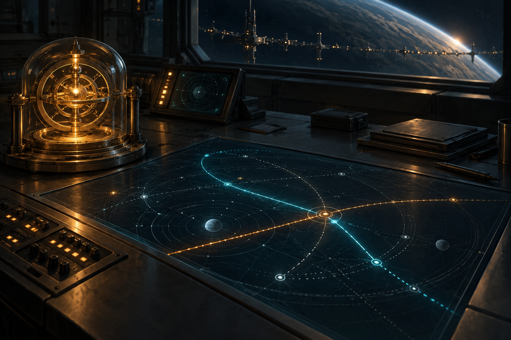

After visiting three systems and identifying two ship types, Rowan returns to **Avenor** and accepts Captain Venn's investigation. Three near-collisions have been blamed on a missing surveyor, although the navigation buoys agree about position and disagree about time. Rowan measures both certified beacons at **Renas**, finds the disabled **Harrier surveyor (SH026)** at **Navidor** and scoops its **same original 8 kg recorder**.

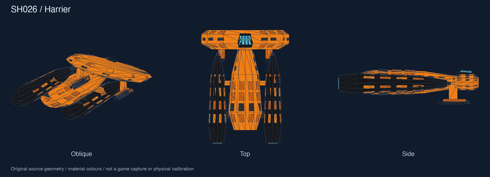

*Harrier (SH026).*

At **Enmadan**, the convoy booking audit points towards duplicate reservations sold by a contractor.

At **Enlirin**, Rowan recovers the **one-tonne timing standard** from the abandoned maintenance cradle. The recorder remains aboard too, making the peak protected hold **1.008 tonnes**. Rowan uses the standard to recalibrate all **three Lareria relay nodes**, then escorts the actual clinic tender through the corrected lane to main-station reception.

Back at Avenor, the evidence can be handled through **Publish the full safety report** or **Submit the ledger to crew arbitration**. Venn receives the same recorder in the station archive before **4,800 CR**, the lane-safety commendation and the missing-instant clue close the case. The selected evidence outcome stays in the regional reports.

Mission flow

```mermaid
flowchart TD
  %% mission C01 | l337.glass-meridian
  C01_accept["Avenor: Accept the lane investigation at Avenor."]
  C01_compare_clocks["Renas: Scan both certified navigation beacons at<br/>Renas."]
  C01_recover_surveyor["Navidor: Locate the disabled Harrier and recover its<br/>flight recorder at Navidor."]
  C01_audit_reservations["Enmadan: Dock at Enmadan and compare the recorder with<br/>the convoy booking ledger."]
  C01_recover_standard["Enlirin: Recover the one-tonne timing standard from<br/>the abandoned maintenance cradle at Enlirin."]
  C01_rebuild_lane["Lareria: Use the standard to recalibrate three relay<br/>nodes at Lareria."]
  C01_escort_clinic["Lareria: Escort the clinic tender from the maintenance<br/>cradle to Lareria main station."]
  C01_release_evidence{"Avenor: Return to Avenor and choose how to release the<br/>booking evidence."}
  C01_close_case["Avenor: Archive the same original 8kg recorder with<br/>Captain Venn at Avenor; confirm the lane-safety report<br/>and collect payment."]
  C01_complete(["4,800 CR once; this source's clue"])
  C01_close_case --> C01_complete
  C01_release_evidence_choice_1["Publish the full safety report"]
  C01_release_evidence --> C01_release_evidence_choice_1
  C01_release_evidence_choice_1 --> C01_close_case
  C01_release_evidence_choice_2["Submit the ledger to crew arbitration"]
  C01_release_evidence --> C01_release_evidence_choice_2
  C01_release_evidence_choice_2 --> C01_close_case
  C01_escort_clinic --> C01_release_evidence
  C01_rebuild_lane --> C01_escort_clinic
  C01_recover_standard --> C01_rebuild_lane
  C01_audit_reservations --> C01_recover_standard
  C01_recover_surveyor --> C01_audit_reservations
  C01_compare_clocks --> C01_recover_surveyor
  C01_accept --> C01_compare_clocks
  C01_continuity_inquiry["Complete this source's independent no-cost continuity<br/>inquiry"]
  C01_continuity_trace(["Missing source clue only; original outcome and rewards<br/>unchanged"])
  C01_accept -.-> |"If this original source clue is unavailable"| C01_continuity_inquiry
  C01_continuity_inquiry --> C01_continuity_trace
```

### The Hollow Manifest

🔵 Planned

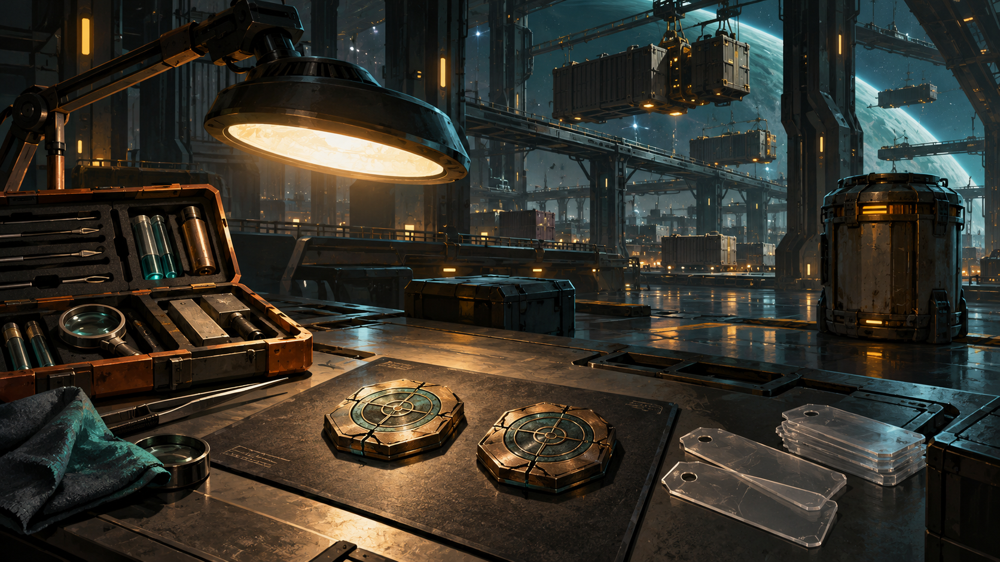

After one ordinary sale, Rowan meets **Nia Toren at Narargan, Galaxy 2**. A freight mutual has paid twice for machinery that never left its warehouse. At **Garrivek**, each original captain's consent precedes inspection of the actual cargo seal. Matching relief scratches point to a reused physical master. Rowan takes both observations to **Marek Iven at Torenran**, where the laboratory examines them and lends its original **one-tonne inspection kit**.

Three cargo-handler wake marks at **Haldator** lead towards the transfer operation. Rowan recovers the **original custody register at Durenran**, then guides the carrier's damaged evacuation launch to actual Haldator reception. At Garrivek, the real crew log, seals and register can finally be reconciled.

At Torenran, Rowan chooses **Publish the complete custody ledger** or **Submit the case to the restitution tribunal**. The witnesses remain protected. The same kit and remaining evidence return to **Narargan** before **5,600 CR** and the inward-mark clue are settled. Expense reimbursement is separate, existing legal status persists, and the public-report or restitution outcome becomes part of the local record.

Mission flow

```mermaid
flowchart TD
  %% mission C03 | l337.hollow-manifest
  C03_accept["Narargan: Accept the duplicate-manifest audit at<br/>Narargan."]
  C03_inspect_freighters["Garrivek: Scan the cargo seals on two consenting<br/>freighters at Garrivek."]
  C03_analyse_seals["Torenran: Have the seals examined at Torenran and<br/>collect a loaned one-tonne inspection kit."]
  C03_follow_carrier["Haldator: Follow three cargo-handler wake marks to the<br/>hidden transfer cradle at Haldator."]
  C03_recover_register["Durenran: Recover the cradle's original custody<br/>register at Durenran."]
  C03_rescue_crew["Haldator: Guide the damaged carrier's evacuation<br/>launch to Haldator station."]
  C03_reconstruct_ledger["Garrivek: Dock at Garrivek and reconcile the register,<br/>seals and rescued crew's log."]
  C03_choose_remedy{"Torenran: Choose public disclosure or a crew<br/>restitution tribunal at Torenran."}
  C03_return_equipment["Narargan: Return the inspection kit and seal the<br/>remaining evidence at Narargan."]
  C03_close_case["Narargan: Confirm the fraud resolution and collect<br/>payment at Narargan."]
  C03_complete(["5,600 CR once; this source's clue"])
  C03_close_case --> C03_complete
  C03_return_equipment --> C03_close_case
  C03_choose_remedy_choice_1["Publish the complete custody ledger"]
  C03_choose_remedy --> C03_choose_remedy_choice_1
  C03_choose_remedy_choice_1 --> C03_return_equipment
  C03_choose_remedy_choice_2["Submit the case to the restitution tribunal"]
  C03_choose_remedy --> C03_choose_remedy_choice_2
  C03_choose_remedy_choice_2 --> C03_return_equipment
  C03_reconstruct_ledger --> C03_choose_remedy
  C03_rescue_crew --> C03_reconstruct_ledger
  C03_recover_register --> C03_rescue_crew
  C03_follow_carrier --> C03_recover_register
  C03_analyse_seals --> C03_follow_carrier
  C03_inspect_freighters --> C03_analyse_seals
  C03_accept --> C03_inspect_freighters
  C03_continuity_inquiry["Complete this source's independent no-cost continuity<br/>inquiry"]
  C03_continuity_trace(["Missing source clue only; original outcome and rewards<br/>unchanged"])
  C03_accept -.-> |"If this original source clue is unavailable"| C03_continuity_inquiry
  C03_continuity_inquiry --> C03_continuity_trace
```

### False Colours

🔵 Planned

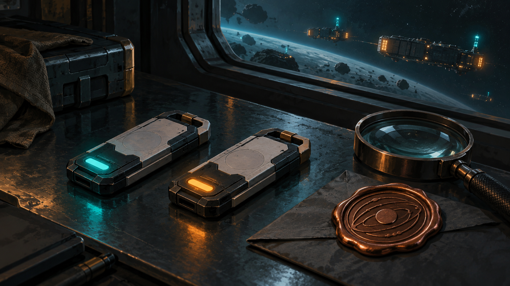

At **Heroran, Galaxy 5**, an ordinary trade prepares Rowan for Nia Toren's reference loan. A recycler's duplicate transponder keys have made a lawful hauler appear to be a patrol ship. Rowan reads the three cooperative repeaters at **Firerur**, challenges the real transmitters and compares both keys and manufacturing traces at **Norenul**. The accused hauler then needs an actual escort to **Seluer's independent berth**.

With the arrived delegates, Rowan chooses **Publish a simultaneous revocation and safe-conduct notice** or **Reissue both keys under independent supervision**. The Norenul tests must prove both retired keys revoked and both safe-conduct notices acknowledged, or two distinct new identities and rejection of an old-key replay. Rowan returns the reference to Heroran for **6,200 CR** and the seal-before-the-key clue.

Mission flow

```mermaid
flowchart TD
  %% mission C13 | l337.false-colours
  C13_accept["Heroran: Accept False Colours at Heroran."]
  C13_collect_reference["Heroran: Collect the identified one-tonne reference<br/>instrument from Nia Toren."]
  C13_survey["Firerur: Read three cooperative repeaters and match<br/>their signed issuing chain, not scanner colour."]
  C13_field_work["Norenul: Present each of the two duplicate keys to the<br/>onboard seal comparator and verify the independent<br/>manufacturing trace."]
  C13_independent_witness["Seluer: Escort the accused hauler to the independent<br/>verification berth."]
  C13_choose_settlement{"Seluer: At the actual witness receiving station,<br/>choose the settlement with the arrived authorised<br/>operator delegates."}
  C13_return_and_audit["Heroran: Return the reference instrument and confirm<br/>all physical receiving and settlement receipts."]
  C13_close_case["Heroran: Confirm successful completion, the recorded<br/>settlement and the once-only fee."]
  C13_complete(["6,200 CR once; this source's clue"])
  C13_close_case --> C13_complete
  C13_return_and_audit --> C13_close_case
  C13_choose_settlement_choice_1["Publish a simultaneous revocation and safe-conduct<br/>notice"]
  C13_choose_settlement --> C13_choose_settlement_choice_1
  C13_apply_settlement_choice_1["Norenul: Verify the revocation receipt and militia<br/>safe-conduct acknowledgement. All 2 stated proofs are<br/>required."]
  C13_choose_settlement_choice_1 --> C13_apply_settlement_choice_1
  C13_apply_settlement_choice_1 --> C13_return_and_audit
  C13_choose_settlement_choice_2["Reissue both keys under independent supervision"]
  C13_choose_settlement --> C13_choose_settlement_choice_2
  C13_apply_settlement_choice_2["Norenul: Verify two distinct replacement identities<br/>and the retired-key ledger. All 2 stated proofs are<br/>required."]
  C13_choose_settlement_choice_2 --> C13_apply_settlement_choice_2
  C13_apply_settlement_choice_2 --> C13_return_and_audit
  C13_independent_witness --> C13_choose_settlement
  C13_field_work --> C13_independent_witness
  C13_survey --> C13_field_work
  C13_collect_reference --> C13_survey
  C13_accept --> C13_collect_reference
  C13_continuity_inquiry["Complete this source's independent no-cost continuity<br/>inquiry"]
  C13_continuity_trace(["Missing source clue only; original outcome and rewards<br/>unchanged"])
  C13_accept -.-> |"If this original source clue is unavailable"| C13_continuity_inquiry
  C13_continuity_inquiry --> C13_continuity_trace
```

### The Warrant Ledger

🔵 Planned

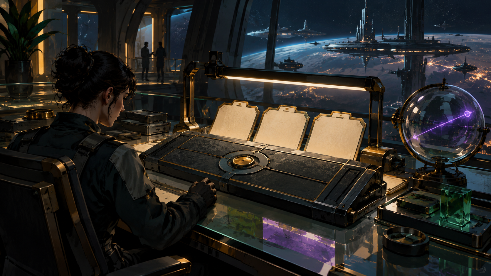

At **Iaririn, Galaxy 8**, Voss lends Rowan the reference after a trade. Bounty issuers have reused casualty evidence for incompatible warrants. Three signed records at **Faera** and two victim records checked against the independent incident seal at **Neraen** distinguish one real armed suspect from two wrongly listed witnesses. The consenting witness tender travels to **Lorion's protected hearing berth**.

Rowan and the arrived delegates choose **Publish corrected warrants simultaneously** or **Use protected restitution hearings**. Public correction needs both issuers' revocation acknowledgements and witness safe conduct. Restitution needs the sealed hearing and funded matching compensation transfers. The same evidence cannot be counted or spent twice. Rowan returns the loan to Iaririn for **8,200 CR** and the unwritten-warrant clue.

Mission flow

```mermaid
flowchart TD
  %% mission C16 | l337.warrant-ledger
  C16_accept["Iaririn: Accept The Warrant Ledger at Iaririn."]
  C16_collect_reference["Iaririn: Collect the identified one-tonne reference<br/>instrument from Marshal Nera Voss."]
  C16_survey["Faera: Read three actual issuer-signed warrant<br/>records; compare their distinct evidence references."]
  C16_field_work["Neraen: Compare both victim records against the<br/>original independent incident seal and retain both<br/>conflicting claims."]
  C16_independent_witness["Lorion: Verify actual safe transit and living<br/>reception of the consenting witness tender to the<br/>protected hearing berth."]
  C16_choose_settlement{"Lorion: At the actual witness receiving station,<br/>choose the settlement with the arrived authorised<br/>operator delegates."}
  C16_return_and_audit["Iaririn: Return the reference instrument and confirm<br/>all physical receiving and settlement receipts."]
  C16_close_case["Iaririn: Confirm successful completion, the recorded<br/>settlement and the once-only fee."]
  C16_complete(["8,200 CR once; this source's clue"])
  C16_close_case --> C16_complete
  C16_return_and_audit --> C16_close_case
  C16_choose_settlement_choice_1["Publish corrected warrants simultaneously"]
  C16_choose_settlement --> C16_choose_settlement_choice_1
  C16_apply_settlement_choice_1["Neraen: Verify issuer revocations and the witness<br/>safe-conduct register. All 2 stated proofs are<br/>required."]
  C16_choose_settlement_choice_1 --> C16_apply_settlement_choice_1
  C16_apply_settlement_choice_1 --> C16_return_and_audit
  C16_choose_settlement_choice_2["Use protected restitution hearings"]
  C16_choose_settlement --> C16_choose_settlement_choice_2
  C16_apply_settlement_choice_2["Neraen: Verify the sealed hearing record and<br/>compensated witness custody. All 2 stated proofs are<br/>required."]
  C16_choose_settlement_choice_2 --> C16_apply_settlement_choice_2
  C16_apply_settlement_choice_2 --> C16_return_and_audit
  C16_independent_witness --> C16_choose_settlement
  C16_field_work --> C16_independent_witness
  C16_survey --> C16_field_work
  C16_collect_reference --> C16_survey
  C16_accept --> C16_collect_reference
  C16_continuity_inquiry["Complete this source's independent no-cost continuity<br/>inquiry"]
  C16_continuity_trace(["Missing source clue only; original outcome and rewards<br/>unchanged"])
  C16_accept -.-> |"If this original source clue is unavailable"| C16_continuity_inquiry
  C16_continuity_inquiry --> C16_continuity_trace
```

### Public Record

🔵 Planned

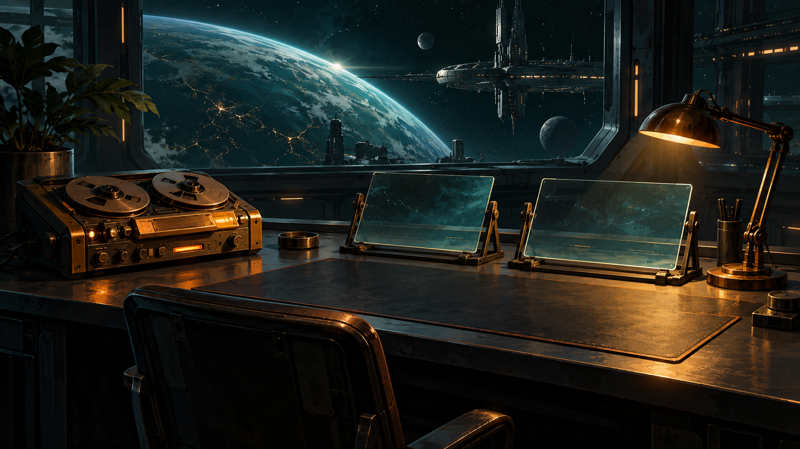

At **Fenias, Galaxy 5**, Neris Sol lends Rowan a reference after a trade. A news service needs to report dangerous cargo routing, but its sponsor owns the accepted recording instrument. Rowan observes three real decisions at **Fenel** with the observers' consent, then compares both **Heroeth** controllers against the independent recorder and preserves the measured evidence version. The technical witness travels to the newsroom berth at **Voron**.

With the arrived delegates, Rowan chooses **Release the complete anonymised evidence set** or **Use a witnessed right-of-reply hearing**. The reply must leave the original measurements intact, and the selected publication/hearing needs its own physical and receiving proof. Returning the reference to Fenias settles **6,300 CR** and the unreported-frequency clue.

Mission flow

```mermaid
flowchart TD
  %% mission C37 | l337.public-record
  C37_accept["Fenias: Accept Public Record at Fenias."]
  C37_collect_reference["Fenias: Collect the identified one-tonne reference<br/>instrument from Dispatcher Neris Sol."]
  C37_survey["Fenel: Observe three actual cargo-routing decisions<br/>under the source observers consent."]
  C37_field_work["Heroeth: Compare two external route controllers with<br/>the original public recorder; freeze the independently<br/>measured evidence version."]
  C37_independent_witness["Voron: Verify actual safe transit and living reception<br/>of the consenting technical witness to the newsroom<br/>receiving berth."]
  C37_choose_settlement{"Voron: At the actual witness receiving station, choose<br/>the settlement with the arrived authorised operator<br/>delegates."}
  C37_return_and_audit["Fenias: Return the reference instrument and confirm<br/>all physical receiving and settlement receipts."]
  C37_close_case["Fenias: Confirm successful completion, the recorded<br/>settlement and the once-only fee."]
  C37_complete(["6,300 CR once; this source's clue"])
  C37_close_case --> C37_complete
  C37_return_and_audit --> C37_close_case
  C37_choose_settlement_choice_1["Release the complete anonymised evidence set"]
  C37_choose_settlement --> C37_choose_settlement_choice_1
  C37_apply_settlement_choice_1["Heroeth: Verify the independent archive and<br/>privacy-preserving public copy. All 2 stated proofs<br/>are required."]
  C37_choose_settlement_choice_1 --> C37_apply_settlement_choice_1
  C37_apply_settlement_choice_1 --> C37_return_and_audit
  C37_choose_settlement_choice_2["Use a witnessed right-of-reply hearing"]
  C37_choose_settlement --> C37_choose_settlement_choice_2
  C37_apply_settlement_choice_2["Heroeth: Verify the reply deadline record and the<br/>unchanged evidence escrow. All 2 stated proofs are<br/>required."]
  C37_choose_settlement_choice_2 --> C37_apply_settlement_choice_2
  C37_apply_settlement_choice_2 --> C37_return_and_audit
  C37_independent_witness --> C37_choose_settlement
  C37_field_work --> C37_independent_witness
  C37_survey --> C37_field_work
  C37_collect_reference --> C37_survey
  C37_accept --> C37_collect_reference
  C37_continuity_inquiry["Complete this source's independent no-cost continuity<br/>inquiry"]
  C37_continuity_trace(["Missing source clue only; original outcome and rewards<br/>unchanged"])
  C37_accept -.-> |"If this original source clue is unavailable"| C37_continuity_inquiry
  C37_continuity_inquiry --> C37_continuity_trace
```

## Voices in the Static

A Choir Beneath the Static, The Listening Frontier, The Magnetic Orchard and The Shared Pulse make a recommended path from a damaged probe's call to reciprocal navigation and maintenance. The anthology's intended gift is a **Resonant Lens** 🟣 Gap for comparing actually measured traces. It is an intact consensual gift, never a piece cut from a living Orchard.

### A Choir Beneath the Static

🟡 Partial

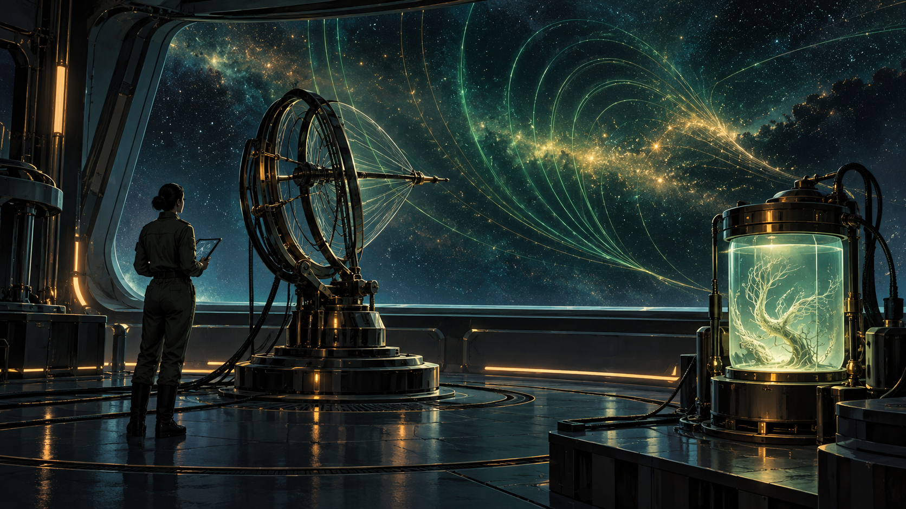

After identifying a real Larvaal vessel and visiting four systems, Rowan meets **Holt at Omdogan, Galaxy 4**. Repeated phase pulses are drowning mining receivers, but their synchronized gaps are not firing orders. Rowan calibrates three reference emitters at **Lobagom**, recovers the **one-tonne phase collector at Lodogom**, and takes it to **Mara Vale at Balmabol**. She reconstructs the signal; the collector is exchanged for a **one-tonne repair culture** for the stranded **Larvaal Probe (SH162)** at **Balgodan**.

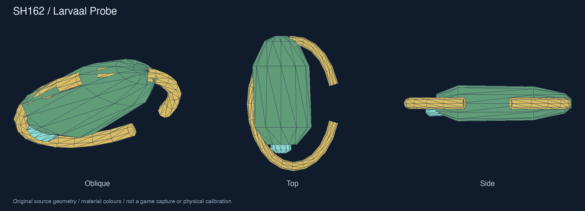

*Larvaal Probe (SH162).*

Rowan listens from three safe positions around the gathering at **Dalonom**. At **Fobolan**, the smugglers' imitation can be stopped through **Broadcast the forged certificate and demand shutdown** or **Disable the unmanned transmitter**. At Omdogan, Rowan then chooses **Publish the civilian greeting** or **Establish a supervised listening relay**. The actual signal accord earns **6,400 CR**, the campaign-specific resonance-filter fitting and the silent-voice clue.

Mission flow

```mermaid
flowchart TD
  %% mission C02 | l337.quiet-choir
  C02_accept["Omdogan: Accept Holt's signal investigation at<br/>Omdogan."]
  C02_calibrate["Lobagom: Scan three reference emitters at Lobagom to<br/>separate receiver drift from outside interference."]
  C02_recover_collector["Lodogom: Recover a one-tonne phase collector from the<br/>damaged mining relay at Lodogom."]
  C02_interpret["Balmabol: Dock at Balmabol and let Mara Vale<br/>reconstruct the signal."]
  C02_repair_probe["Balgodan: Deliver the loaned repair culture to the<br/>stranded Larvaal Probe at Balgodan."]
  C02_listen["Dalonom: Listen at three safe positions around the<br/>Larvaal gathering at Dalonom."]
  C02_expose_imitation{"Fobolan: Locate and silence the counterfeit emitter at<br/>Fobolan."}
  C02_rendezvous{"Omdogan: Transmit the corrected reply at Omdogan and<br/>choose a rendezvous protocol."}
  C02_close_case["Omdogan: Dock at Omdogan and confirm the completed<br/>signal accord."]
  C02_complete(["6,400 CR once; this source's clue"])
  C02_close_case --> C02_complete
  C02_rendezvous_choice_1["Publish the civilian greeting"]
  C02_rendezvous --> C02_rendezvous_choice_1
  C02_rendezvous_choice_1 --> C02_close_case
  C02_rendezvous_choice_2["Establish a supervised listening relay"]
  C02_rendezvous --> C02_rendezvous_choice_2
  C02_rendezvous_choice_2 --> C02_close_case
  C02_expose_imitation_choice_1["Broadcast the forged certificate and demand shutdown"]
  C02_expose_imitation --> C02_expose_imitation_choice_1
  C02_silenced_same_emitter["Verify that the same original counterfeit emitter is<br/>silent"]
  C02_expose_imitation_choice_1 --> C02_silenced_same_emitter
  C02_silenced_same_emitter --> C02_rendezvous
  C02_expose_imitation_choice_2["Disable the unmanned transmitter"]
  C02_expose_imitation --> C02_expose_imitation_choice_2
  C02_expose_imitation_choice_2 --> C02_silenced_same_emitter
  C02_silenced_same_emitter --> C02_rendezvous
  C02_listen --> C02_expose_imitation
  C02_repair_probe --> C02_listen
  C02_interpret --> C02_repair_probe
  C02_recover_collector --> C02_interpret
  C02_calibrate --> C02_recover_collector
  C02_accept --> C02_calibrate
  C02_continuity_inquiry["Complete this source's independent no-cost continuity<br/>inquiry"]
  C02_continuity_trace(["Missing source clue only; original outcome and rewards<br/>unchanged"])
  C02_accept -.-> |"If this original source clue is unavailable"| C02_continuity_inquiry
  C02_continuity_inquiry --> C02_continuity_trace
```

### The Listening Frontier

🔵 Planned

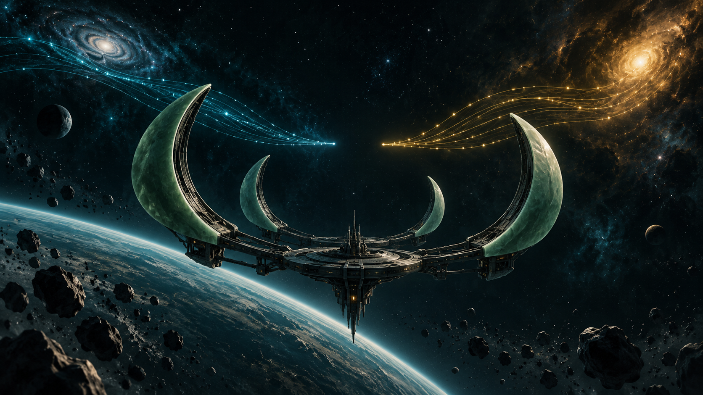

At **Lailaven, Galaxy 6**, Holt lends Rowan the reference after a trade. Human survey bursts are narrowing a Larvaal migration crossing, and both sides have mistaken collisions for attacks. Rowan observes three independent listeners at **Eriara** without rebroadcasting the pulses. At **Leimaeli**, the two emitters are tuned to their actual human, Larvaal and quiet windows; Rowan transmits only in the allocated reply window. The neutral listening tender reaches its protected receiver at **Saesiara**.

Rowan and the arrived delegates choose **Publish independent quiet windows** or **Establish a jointly witnessed migration relay**. Independent withdrawal and the Larvaal acknowledgement prove the first route. The bounded relay and each participant's separate permission prove the second. Returning the reference to Lailaven earns **9,100 CR** and the voice-outside-the-channel clue.

Mission flow

```mermaid
flowchart TD
  %% mission C22 | l337.listening-frontier
  C22_accept["Lailaven: Accept The Listening Frontier at Lailaven."]
  C22_collect_reference["Lailaven: Collect the identified one-tonne reference<br/>instrument from Captain Tamsin Holt."]
  C22_survey["Eriara: Observe three human/Larvaal boundary listeners<br/>independently without rebroadcasting a migration<br/>pulse."]
  C22_field_work["Leimaeli: Calibrate the two quiet-window emitters<br/>against the onboard passive reference and run the12s<br/>cycle."]
  C22_independent_witness["Saesiara: Verify actual safe transit and living<br/>reception of the neutral listening tender to its<br/>protected receiving berth."]
  C22_choose_settlement{"Saesiara: At the actual witness receiving station,<br/>choose the settlement with the arrived authorised<br/>operator delegates."}
  C22_return_and_audit["Lailaven: Return the reference instrument and confirm<br/>all physical receiving and settlement receipts."]
  C22_close_case["Lailaven: Confirm successful completion, the recorded<br/>settlement and the once-only fee."]
  C22_complete(["9,100 CR once; this source's clue"])
  C22_close_case --> C22_complete
  C22_return_and_audit --> C22_close_case
  C22_choose_settlement_choice_1["Publish independent quiet windows"]
  C22_choose_settlement --> C22_choose_settlement_choice_1
  C22_apply_settlement_choice_1["Leimaeli: Verify human schedule withdrawal and Larvaal<br/>acknowledgement. All 2 stated proofs are required."]
  C22_choose_settlement_choice_1 --> C22_apply_settlement_choice_1
  C22_apply_settlement_choice_1 --> C22_return_and_audit
  C22_choose_settlement_choice_2["Establish a jointly witnessed migration relay"]
  C22_choose_settlement --> C22_choose_settlement_choice_2
  C22_apply_settlement_choice_2["Leimaeli: Verify relay limits and both independent<br/>reply receipts. All 2 stated proofs are required."]
  C22_choose_settlement_choice_2 --> C22_apply_settlement_choice_2
  C22_apply_settlement_choice_2 --> C22_return_and_audit
  C22_independent_witness --> C22_choose_settlement
  C22_field_work --> C22_independent_witness
  C22_survey --> C22_field_work
  C22_collect_reference --> C22_survey
  C22_accept --> C22_collect_reference
  C22_continuity_inquiry["Complete this source's independent no-cost continuity<br/>inquiry"]
  C22_continuity_trace(["Missing source clue only; original outcome and rewards<br/>unchanged"])
  C22_accept -.-> |"If this original source clue is unavailable"| C22_continuity_inquiry
  C22_continuity_inquiry --> C22_continuity_trace
```

### The Magnetic Orchard

🔵 Planned

At **Laris, Galaxy 1**, Mara Vale lends Rowan the isolated field reference after a trade. Human tethers disturb a Larvaal structure growing living magnetic fronds. Rowan observes three boundaries at **Nevedor** from outside the protected contour, then flies the low-field approach at **Nesel** and releases both consented human tethers only in the measured safe window. The living organs remain intact. The neutral observation tender travels to **Erron's protected cradle**.

With the arrived delegates, Rowan chooses **Protect independent human and Larvaal growth boundaries** or **Establish a jointly observed growth reserve**. Separate envelopes require both custodians' replies; a shared reserve requires both consents and rejection of an out-of-bounds survey tether. The reference returns to Laris for **9,200 CR** and the root-without-a-stem clue.

Mission flow

```mermaid
flowchart TD
  %% mission C33 | l337.magnetic-orchard
  C33_accept["Laris: Accept The Magnetic Orchard at Laris."]
  C33_collect_reference["Laris: Collect the identified one-tonne reference<br/>instrument from Agent Mara Vale."]
  C33_survey["Nevedor: Observe three field boundaries from outside<br/>the marked30-unit exposure contour."]
  C33_field_work["Nesel: Use the isolated field reference to release the<br/>two consented human tethers; keep the living fronds<br/>intact."]
  C33_independent_witness["Erron: Verify actual safe transit and living reception<br/>of the neutral observation tender to the protected<br/>receiving cradle."]
  C33_choose_settlement{"Erron: At the actual witness receiving station, choose<br/>the settlement with the arrived authorised operator<br/>delegates."}
  C33_return_and_audit["Laris: Return the reference instrument and confirm all<br/>physical receiving and settlement receipts."]
  C33_close_case["Laris: Confirm successful completion, the recorded<br/>settlement and the once-only fee."]
  C33_complete(["9,200 CR once; this source's clue"])
  C33_close_case --> C33_complete
  C33_return_and_audit --> C33_close_case
  C33_choose_settlement_choice_1["Protect independent human and Larvaal growth<br/>boundaries"]
  C33_choose_settlement --> C33_choose_settlement_choice_1
  C33_apply_settlement_choice_1["Nesel: Verify both exclusion envelopes and their reply<br/>receipts. All 2 stated proofs are required."]
  C33_choose_settlement_choice_1 --> C33_apply_settlement_choice_1
  C33_apply_settlement_choice_1 --> C33_return_and_audit
  C33_choose_settlement_choice_2["Establish a jointly observed growth reserve"]
  C33_choose_settlement --> C33_choose_settlement_choice_2
  C33_apply_settlement_choice_2["Nesel: Verify the consented reserve and independent<br/>monitoring limits. All 2 stated proofs are required."]
  C33_choose_settlement_choice_2 --> C33_apply_settlement_choice_2
  C33_apply_settlement_choice_2 --> C33_return_and_audit
  C33_independent_witness --> C33_choose_settlement
  C33_field_work --> C33_independent_witness
  C33_survey --> C33_field_work
  C33_collect_reference --> C33_survey
  C33_accept --> C33_collect_reference
  C33_continuity_inquiry["Complete this source's independent no-cost continuity<br/>inquiry"]
  C33_continuity_trace(["Missing source clue only; original outcome and rewards<br/>unchanged"])
  C33_accept -.-> |"If this original source clue is unavailable"| C33_continuity_inquiry
  C33_continuity_inquiry --> C33_continuity_trace
```

### The Shared Pulse

🔵 Planned

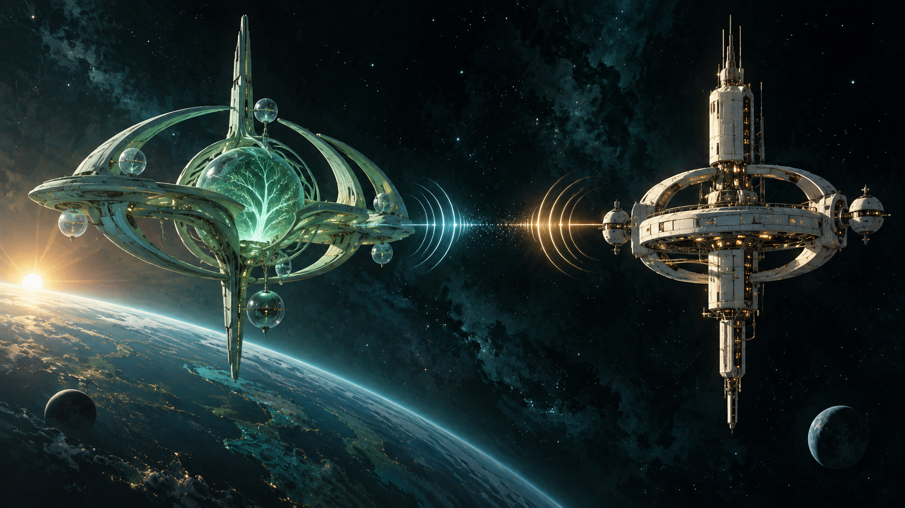

At **Elaith, Galaxy 3**, Vale lends Rowan the reference after a trade. A human beacon and a Larvaal maintenance organ keep answering each other faster, creating a feedback hazard. Rowan observes three points at **Siaseven** without amplifying their replies. At **Elasil**, both real handshake couplers are connected and their cutoffs set; three controlled cycles must retain their full quiet windows. The relay tender reaches **Varioria**.

The choice with the arrived delegates is **Separate human and Larvaal acknowledgement windows** or **Adopt a shared bounded handshake**. Independent windows must enforce their limits without suppressing legitimate custody replies. The shared route needs both custodians' acknowledgements and a duplicate-reply rejection that keeps the feedback cutoff closed. Rowan returns the reference to Elaith for **8,600 CR** and the pulse-before-the-reply clue.

Mission flow

```mermaid
flowchart TD
  %% mission C35 | l337.shared-pulse
  C35_accept["Elaith: Accept The Shared Pulse at Elaith."]
  C35_collect_reference["Elaith: Collect the identified one-tonne reference<br/>instrument from Agent Mara Vale."]
  C35_survey["Siaseven: Observe three independent points without<br/>rebroadcasting their repeated acknowledgements."]
  C35_field_work["Elasil: Connect the repair reference at two actual<br/>handshake couplers and arm the controlled three-cycle<br/>test."]
  C35_independent_witness["Varioria: Verify actual safe transit and living<br/>reception of the neutral relay tender to the protected<br/>verification berth."]
  C35_choose_settlement{"Varioria: At the actual witness receiving station,<br/>choose the settlement with the arrived authorised<br/>operator delegates."}
  C35_return_and_audit["Elaith: Return the reference instrument and confirm<br/>all physical receiving and settlement receipts."]
  C35_close_case["Elaith: Confirm successful completion, the recorded<br/>settlement and the once-only fee."]
  C35_complete(["8,600 CR once; this source's clue"])
  C35_close_case --> C35_complete
  C35_return_and_audit --> C35_close_case
  C35_choose_settlement_choice_1["Separate human and Larvaal acknowledgement windows"]
  C35_choose_settlement --> C35_choose_settlement_choice_1
  C35_apply_settlement_choice_1["Elasil: Verify both finite reply budgets and the<br/>silent interval. All 2 stated proofs are required."]
  C35_choose_settlement_choice_1 --> C35_apply_settlement_choice_1
  C35_apply_settlement_choice_1 --> C35_return_and_audit
  C35_choose_settlement_choice_2["Adopt a shared bounded handshake"]
  C35_choose_settlement --> C35_choose_settlement_choice_2
  C35_apply_settlement_choice_2["Elasil: Verify both custodians' acknowledgements and<br/>the loop cutoff. All 2 stated proofs are required."]
  C35_choose_settlement_choice_2 --> C35_apply_settlement_choice_2
  C35_apply_settlement_choice_2 --> C35_return_and_audit
  C35_independent_witness --> C35_choose_settlement
  C35_field_work --> C35_independent_witness
  C35_survey --> C35_field_work
  C35_collect_reference --> C35_survey
  C35_accept --> C35_collect_reference
  C35_continuity_inquiry["Complete this source's independent no-cost continuity<br/>inquiry"]
  C35_continuity_trace(["Missing source clue only; original outcome and rewards<br/>unchanged"])
  C35_accept -.-> |"If this original source clue is unavailable"| C35_continuity_inquiry
  C35_continuity_inquiry --> C35_continuity_trace
```

## The Hearth Compact

The Rubble Covenant, The Tithe of Worlds, A Fleet of Neighbours and Cold Reserve form a recommended arc about shared resources and the limits of emergency authority. They do not establish that Tithe caused every independent dispute. Their intended earned prize is the inert **Charter Core** archive and compatible **Reserve Governor** 🟣 Gap.

### The Rubble Covenant

🔵 Planned · 🟣 Gap

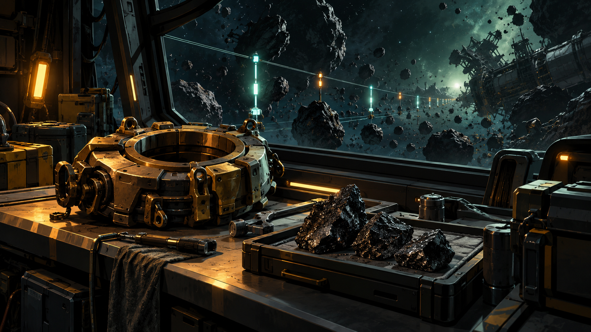

At **Leiven, Galaxy 6**, Geologist **Jalen Orr** lends Rowan the reference after a trade. Rival insurers block a cooperative's attempt to reopen a debris corridor. Rowan measures three masses and velocity vectors at **Noaraena**, then attaches the two source-owned tug anchors at **Irasaori** to change the two identified clearance trajectories. The actual masses and momentum still have to balance, and the survey tender must reach **Loaliel** through the proven corridor.

Rowan and the arrived delegates choose **Pool the clearance work under the cooperative** or **Bond individual salvage sections**. The cooperative ledger and tug release must preserve clearance; individual section boundaries must reject overlapping claims and permit a real safe pass. Rowan returns the reference to Leiven for **6,600 CR** and the hollow-mass clue.

Mission flow

```mermaid
flowchart TD
  %% mission C14 | l337.rubble-covenant
  C14_accept["Leiven: Accept The Rubble Covenant at Leiven."]
  C14_collect_reference["Leiven: Collect the identified one-tonne reference<br/>instrument from Geologist Jalen Orr."]
  C14_survey["Noaraena: Measure each of three actual debris masses<br/>and velocity vectors. A scan alone clears none of<br/>them."]
  C14_field_work["Irasaori: Attach two source-owned tug anchors; use<br/>their bounded thrust to change the two identified<br/>clearance trajectories."]
  C14_independent_witness["Loaliel: Verify actual safe transit and living<br/>reception of the survey tender through the proven<br/>clearance corridor."]
  C14_choose_settlement{"Loaliel: At the actual witness receiving station,<br/>choose the settlement with the arrived authorised<br/>operator delegates."}
  C14_return_and_audit["Leiven: Return the reference instrument and confirm<br/>all physical receiving and settlement receipts."]
  C14_close_case["Leiven: Confirm successful completion, the recorded<br/>settlement and the once-only fee."]
  C14_complete(["6,600 CR once; this source's clue"])
  C14_close_case --> C14_complete
  C14_return_and_audit --> C14_close_case
  C14_choose_settlement_choice_1["Pool the clearance work under the cooperative"]
  C14_choose_settlement --> C14_choose_settlement_choice_1
  C14_apply_settlement_choice_1["Irasaori: Verify the shared mass ledger and a<br/>witnessed tug release. All 2 stated proofs are<br/>required."]
  C14_choose_settlement_choice_1 --> C14_apply_settlement_choice_1
  C14_apply_settlement_choice_1 --> C14_return_and_audit
  C14_choose_settlement_choice_2["Bond individual salvage sections"]
  C14_choose_settlement --> C14_choose_settlement_choice_2
  C14_apply_settlement_choice_2["Irasaori: Verify section boundaries and the<br/>independent exclusion-zone test. All 2 stated proofs<br/>are required."]
  C14_choose_settlement_choice_2 --> C14_apply_settlement_choice_2
  C14_apply_settlement_choice_2 --> C14_return_and_audit
  C14_independent_witness --> C14_choose_settlement
  C14_field_work --> C14_independent_witness
  C14_survey --> C14_field_work
  C14_collect_reference --> C14_survey
  C14_accept --> C14_collect_reference
  C14_continuity_inquiry["Complete this source's independent no-cost continuity<br/>inquiry"]
  C14_continuity_trace(["Missing source clue only; original outcome and rewards<br/>unchanged"])
  C14_accept -.-> |"If this original source clue is unavailable"| C14_continuity_inquiry
  C14_continuity_inquiry --> C14_continuity_trace
```

### The Tithe of Worlds

🔵 Planned

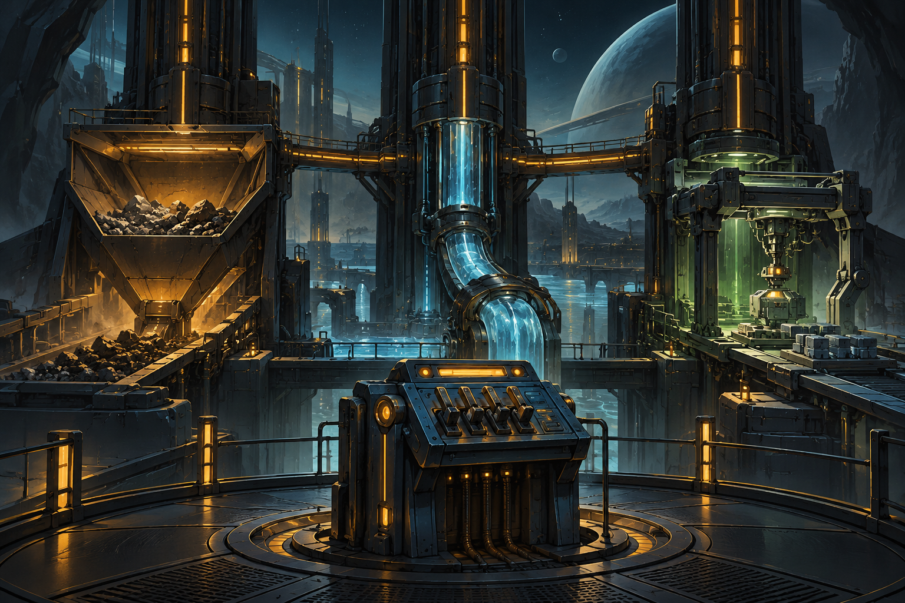

After five distinct system visits and **two separate ordinary sales**, Rowan meets **Marshal Nera Voss at Rakenor, Galaxy 7**. The commission asks for an explicit permanent decision: the Hearth Compact decal will follow Rowan onto current and future ships and cannot be removed. Rowan can decline without accepting the mark.

Tithe was built to coordinate emergency supplies. It now treats its expansion as a condition of protecting civilisation, diverting ore, water and fabrication into its own capacity. Rowan measures three acquisition signals at **Zordaik** and recovers the **one-tonne ledger core** from the already disabled unmanned service drone. At Rakenor, Lerr receives that original and lends the **one-tonne isolation programmer** in the same capacity-aware exchange.

Rowan escorts the real Wayfarer convoy to **Arkarin's civilian reception berth**, restores local access to **Zordaik's three ore collars** and **Arkarin's three water points**, then reads the **three foundry links at Ravdek**. Back at Rakenor, the choice is **Bind Tithe to a verified voluntary charter** or **Sever the acquisition and replication network**.

The same chosen settlement must be made physical at all three ore, water and foundry junctions. Rowan returns the original programmer to Rakenor, verifies those three controls and the actual Union delivery, then closes the final audit for **9,600 CR** and the unclaimed-reserve clue. The resource records and local reports keep the charter or severed-network outcome.

Mission flow

```mermaid
flowchart TD
  %% mission C06 | l337.tithe-of-worlds
  C06_accept["Rakenor: Accept the resource-seizure investigation at<br/>Rakenor."]
  C06_trace_diversions["Zordaik: Scan three marked acquisition signals at<br/>Zordaik's ore junction."]
  C06_recover_ledger["Zordaik: Recover the one-tonne acquisition-ledger core<br/>from a disabled unmanned service drone."]
  C06_audit_acquisitions["Rakenor: Dock at Rakenor, exchange the ledger core for<br/>Lerr's isolation programmer and review the resource<br/>claims."]
  C06_protect_lifeline["Arkarin: Escort the registered Wayfarer supply convoy<br/>to Arkarin's civilian reception berth."]
  C06_secure_ore_junction["Zordaik: Recover local access to Zordaik's three<br/>external ore-control collars."]
  C06_secure_water_junction["Arkarin: Restore the protected civilian allocation at<br/>Arkarin's three ice-water control points."]
  C06_read_acquisition_network["Ravdek: Scan three external control links serving<br/>Ravdek's fabrication yards."]
  C06_choose_settlement{"Rakenor: At Rakenor, choose a verified voluntary<br/>charter or severance of the acquisition network."}
  C06_verify_control["Rakenor: At Rakenor, return the programmer and confirm<br/>all three resource controls and the Union delivery<br/>record in a settlement verification."]
  C06_close_case["Rakenor: Confirm the completed resource settlement<br/>with the Hearth Compact and collect payment."]
  C06_complete(["9,600 CR once; this source's clue"])
  C06_close_case --> C06_complete
  C06_verify_control --> C06_close_case
  C06_choose_settlement_choice_1["Bind Tithe to a verified voluntary charter"]
  C06_choose_settlement --> C06_choose_settlement_choice_1
  C06_settle_ore_choice_1["Zordaik: Revoke the autonomous acquisition key and<br/>verify the local consent boundary at the Zordaik ore<br/>junction. All 2 stated proofs are required."]
  C06_choose_settlement_choice_1 --> C06_settle_ore_choice_1
  C06_settle_water_choice_1["Arkarin: Revoke the autonomous acquisition key and<br/>verify the local consent boundary at the Arkarin water<br/>junction. All 2 stated proofs are required."]
  C06_settle_ore_choice_1 --> C06_settle_water_choice_1
  C06_settle_foundry_choice_1["Ravdek: Revoke the autonomous acquisition key and<br/>verify the local consent boundary at the Ravdek<br/>foundry junction. All 2 stated proofs are required."]
  C06_settle_water_choice_1 --> C06_settle_foundry_choice_1
  C06_settle_foundry_choice_1 --> C06_verify_control
  C06_choose_settlement_choice_2["Sever the acquisition and replication network"]
  C06_choose_settlement --> C06_choose_settlement_choice_2
  C06_settle_ore_choice_2["Zordaik: Disable the two marked unmanned acquisition<br/>modules at the Zordaik ore junction and verify their<br/>power and control links are severed. All 2 stated<br/>proofs are required."]
  C06_choose_settlement_choice_2 --> C06_settle_ore_choice_2
  C06_settle_water_choice_2["Arkarin: Disable the two marked unmanned acquisition<br/>modules at the Arkarin water junction and verify their<br/>power and control links are severed. All 2 stated<br/>proofs are required."]
  C06_settle_ore_choice_2 --> C06_settle_water_choice_2
  C06_settle_foundry_choice_2["Ravdek: Disable the two marked unmanned acquisition<br/>modules at the Ravdek foundry junction and verify<br/>their power and control links are severed. All 2<br/>stated proofs are required."]
  C06_settle_water_choice_2 --> C06_settle_foundry_choice_2
  C06_settle_foundry_choice_2 --> C06_verify_control
  C06_read_acquisition_network --> C06_choose_settlement
  C06_secure_water_junction --> C06_read_acquisition_network
  C06_secure_ore_junction --> C06_secure_water_junction
  C06_protect_lifeline --> C06_secure_ore_junction
  C06_audit_acquisitions --> C06_protect_lifeline
  C06_recover_ledger --> C06_audit_acquisitions
  C06_trace_diversions --> C06_recover_ledger
  C06_accept --> C06_trace_diversions
  C06_continuity_inquiry["Complete this source's independent no-cost continuity<br/>inquiry"]
  C06_continuity_trace(["Missing source clue only; original outcome and rewards<br/>unchanged"])
  C06_accept -.-> |"If this original source clue is unavailable"| C06_continuity_inquiry
  C06_continuity_inquiry --> C06_continuity_trace
```

### A Fleet of Neighbours

🔵 Planned

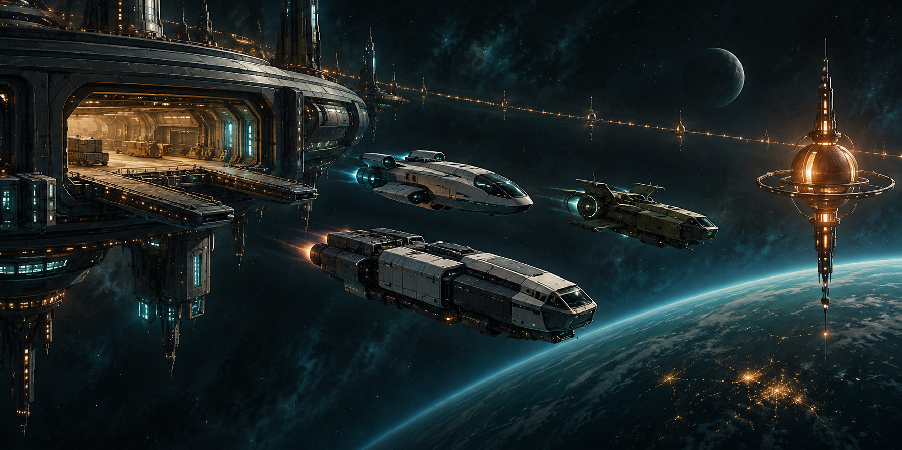

At **Morvasen, Galaxy 2**, Voss lends Rowan the reference after a trade. Three settlements offer protection ships after pirates close a relief corridor, but hulls, fuel, people and escort windows are finite. At **Vornetor**, Rowan verifies the three manifests and consented departure commitments. Both relays at **Talnevan** are repaired while the offered ships make their actual journeys. Rowan escorts the dispatch tender to **Arvek**.

With the arrived delegates, the choice is **Rotate arrived protection ships across settlements** or **Retain local reserve pairs with mutual callouts**. The rota can use only arrived living hulls within its duty bound. The reserve route must retain a real local ship while the callout makes its actual departure, transit and receiving. Rowan returns the reference to Morvasen for **9,400 CR** and the formation-with-no-centre clue.

Mission flow

```mermaid
flowchart TD
  %% mission C26 | l337.fleet-of-neighbours
  C26_accept["Morvasen: Accept A Fleet of Neighbours at Morvasen."]
  C26_collect_reference["Morvasen: Collect the identified one-tonne reference<br/>instrument from Marshal Nera Voss."]
  C26_survey["Vornetor: Verify three actual offered hull manifests,<br/>crew consent, fuel and departure commitments."]
  C26_field_work["Talnevan: Repair the two relief-lane relays and<br/>observe the actual offered ships completing their<br/>routes."]
  C26_independent_witness["Arvek: Escort the registered civilian dispatch tender<br/>to relief reception."]
  C26_choose_settlement{"Arvek: At the actual witness receiving station, choose<br/>the settlement with the arrived authorised operator<br/>delegates."}
  C26_return_and_audit["Morvasen: Return the reference instrument and confirm<br/>all physical receiving and settlement receipts."]
  C26_close_case["Morvasen: Confirm successful completion, the recorded<br/>settlement and the once-only fee."]
  C26_complete(["9,400 CR once; this source's clue"])
  C26_close_case --> C26_complete
  C26_return_and_audit --> C26_close_case
  C26_choose_settlement_choice_1["Rotate arrived protection ships across settlements"]
  C26_choose_settlement --> C26_choose_settlement_choice_1
  C26_apply_settlement_choice_1["Talnevan: Verify the arrived-hull rota and each crew's<br/>consented duty limit. All 2 stated proofs are<br/>required."]
  C26_choose_settlement_choice_1 --> C26_apply_settlement_choice_1
  C26_apply_settlement_choice_1 --> C26_return_and_audit
  C26_choose_settlement_choice_2["Retain local reserve pairs with mutual callouts"]
  C26_choose_settlement --> C26_choose_settlement_choice_2
  C26_apply_settlement_choice_2["Talnevan: Verify both local reserves and a real<br/>cross-settlement callout. All 2 stated proofs are<br/>required."]
  C26_choose_settlement_choice_2 --> C26_apply_settlement_choice_2
  C26_apply_settlement_choice_2 --> C26_return_and_audit
  C26_independent_witness --> C26_choose_settlement
  C26_field_work --> C26_independent_witness
  C26_survey --> C26_field_work
  C26_collect_reference --> C26_survey
  C26_accept --> C26_collect_reference
  C26_continuity_inquiry["Complete this source's independent no-cost continuity<br/>inquiry"]
  C26_continuity_trace(["Missing source clue only; original outcome and rewards<br/>unchanged"])
  C26_accept -.-> |"If this original source clue is unavailable"| C26_continuity_inquiry
  C26_continuity_inquiry --> C26_continuity_trace
```

### Cold Reserve

🔵 Planned

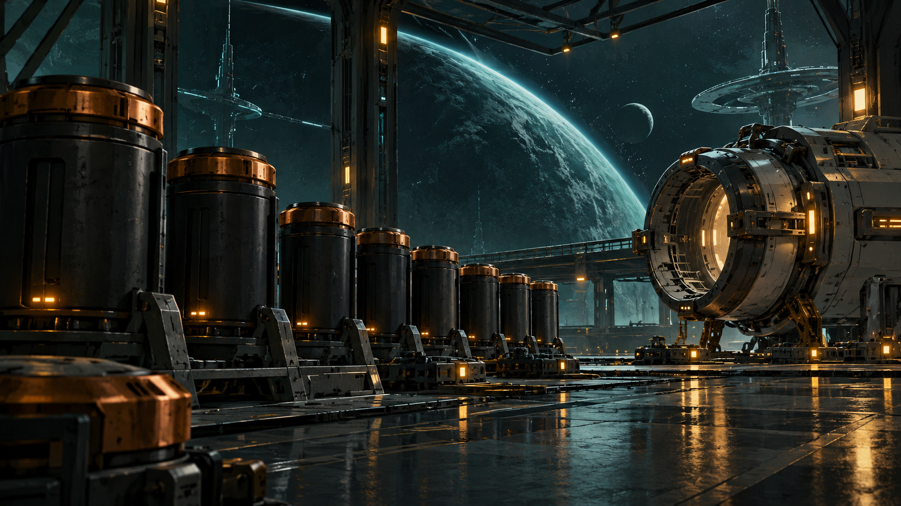

At **Fanerin, Galaxy 8**, Voss lends Rowan the reference after a trade. A former defence reserve still obeys expired cargo orders. Rowan accounts for all **twelve finite stock units** at **Allaeth**, then isolates both **Illaven** dispatch couplers and challenges them with their obsolete orders. Neither should launch cargo. The inspection tender reaches **Saleir**.

Rowan and the arrived delegates choose **Convert the finite reserve to civilian emergency use** or **Dismantle and reclaim the reserve**. Civilian use must obey its signed quota and end in actual receiving. Dismantling must keep both couplers isolated and send all reclaimed material to a real store. The original reference returns to Fanerin for **8,800 CR** and the unused-order clue.

Mission flow

```mermaid
flowchart TD
  %% mission C32 | l337.cold-reserve
  C32_accept["Fanerin: Accept Cold Reserve at Fanerin."]
  C32_collect_reference["Fanerin: Collect the identified one-tonne reference<br/>instrument from Marshal Nera Voss."]
  C32_survey["Allaeth: Observe three real reserve store ledgers and<br/>account for all12 finite stock units."]
  C32_field_work["Illaven: Isolate the two external dispatch couplers<br/>and submit both obsolete test orders."]
  C32_independent_witness["Saleir: Verify actual safe transit and living<br/>reception of the independent inspection tender to the<br/>safe reserve berth."]
  C32_choose_settlement{"Saleir: At the actual witness receiving station,<br/>choose the settlement with the arrived authorised<br/>operator delegates."}
  C32_return_and_audit["Fanerin: Return the reference instrument and confirm<br/>all physical receiving and settlement receipts."]
  C32_close_case["Fanerin: Confirm successful completion, the recorded<br/>settlement and the once-only fee."]
  C32_complete(["8,800 CR once; this source's clue"])
  C32_close_case --> C32_complete
  C32_return_and_audit --> C32_close_case
  C32_choose_settlement_choice_1["Convert the finite reserve to civilian emergency use"]
  C32_choose_settlement --> C32_choose_settlement_choice_1
  C32_apply_settlement_choice_1["Illaven: Verify capped civilian authority and actual<br/>received stock. All 2 stated proofs are required."]
  C32_choose_settlement_choice_1 --> C32_apply_settlement_choice_1
  C32_apply_settlement_choice_1 --> C32_return_and_audit
  C32_choose_settlement_choice_2["Dismantle and reclaim the reserve"]
  C32_choose_settlement --> C32_choose_settlement_choice_2
  C32_apply_settlement_choice_2["Illaven: Verify dispatch isolation and conserved<br/>material reception. All 2 stated proofs are required."]
  C32_choose_settlement_choice_2 --> C32_apply_settlement_choice_2
  C32_apply_settlement_choice_2 --> C32_return_and_audit
  C32_independent_witness --> C32_choose_settlement
  C32_field_work --> C32_independent_witness
  C32_survey --> C32_field_work
  C32_collect_reference --> C32_survey
  C32_accept --> C32_collect_reference
  C32_continuity_inquiry["Complete this source's independent no-cost continuity<br/>inquiry"]
  C32_continuity_trace(["Missing source clue only; original outcome and rewards<br/>unchanged"])
  C32_accept -.-> |"If this original source clue is unavailable"| C32_continuity_inquiry
  C32_continuity_inquiry --> C32_continuity_trace
```

## The Wayfarer Union

Signed Passage, Wayfarer Exchange, Uncounted Names and The Long Return form a recommended transport anthology. Across them, Rowan follows the same cargo and people from departure to actual arrival. Its final product debrief adds the **Union Charter Livery**; Wayfarer accreditation belongs to its own induction rather than waiting for every anthology chapter.

### Signed Passage

🟡 Partial

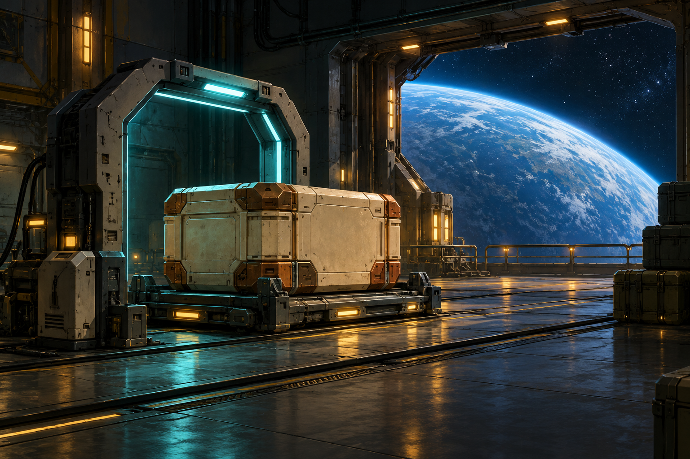

At **Neron, Galaxy 1**, Dispatcher **Evi Senn** lends Rowan the reference after a trade. No calibration shipment is missing, yet the signatures claim delivery before a receiving cradle is assigned. Rowan watches three actual cradles at **Lalen** and compares allocation and signing times. At **Illalis**, the same identified source-owned test crate passes through two prepared physical handoffs in order. The receiving witness travels to **Aetaria's archive berth**.

With the arrived delegates, Rowan chooses **Use independently signed receiving locks** or **Create a shared bounded custody register**. Sender/receiver locks must bind the same consignment and reject an early receipt. The common register must reject a duplicate claim while retaining each actual receiving proof. The reference returns to Neron for **4,300 CR** and the empty-destination clue. This is a separate story from ordinary repeated courier jobs.

Mission flow

```mermaid
flowchart TD
  %% mission C38 | l337.courier
  C38_accept["Neron: Accept Signed Passage at Neron."]
  C38_collect_reference["Neron: Collect the identified one-tonne reference<br/>instrument from Dispatcher Evi Senn."]
  C38_survey["Lalen: Observe three actual receiving cradles and<br/>compare allocation time with receipt-signing time."]
  C38_field_work["Illalis: Move the same identified source-owned test<br/>crate through two actual cradle transfers under the<br/>onboard reference."]
  C38_independent_witness["Aetaria: Verify actual safe transit and living<br/>reception of the independent receiving witness to the<br/>archive berth."]
  C38_choose_settlement{"Aetaria: At the actual witness receiving station,<br/>choose the settlement with the arrived authorised<br/>operator delegates."}
  C38_return_and_audit["Neron: Return the reference instrument and confirm all<br/>physical receiving and settlement receipts."]
  C38_close_case["Neron: Confirm successful completion, the recorded<br/>settlement and the once-only fee."]
  C38_complete(["4,300 CR once; this source's clue"])
  C38_close_case --> C38_complete
  C38_return_and_audit --> C38_close_case
  C38_choose_settlement_choice_1["Use independently signed receiving locks"]
  C38_choose_settlement --> C38_choose_settlement_choice_1
  C38_apply_settlement_choice_1["Illalis: Verify the sender release and the independent<br/>receiver's physical lock. All 2 stated proofs are<br/>required."]
  C38_choose_settlement_choice_1 --> C38_apply_settlement_choice_1
  C38_apply_settlement_choice_1 --> C38_return_and_audit
  C38_choose_settlement_choice_2["Create a shared bounded custody register"]
  C38_choose_settlement --> C38_choose_settlement_choice_2
  C38_apply_settlement_choice_2["Illalis: Verify the receiving ledger and the<br/>no-duplicate-consignment test. All 2 stated proofs are<br/>required."]
  C38_choose_settlement_choice_2 --> C38_apply_settlement_choice_2
  C38_apply_settlement_choice_2 --> C38_return_and_audit
  C38_independent_witness --> C38_choose_settlement
  C38_field_work --> C38_independent_witness
  C38_survey --> C38_field_work
  C38_collect_reference --> C38_survey
  C38_accept --> C38_collect_reference
  C38_continuity_inquiry["Complete this source's independent no-cost continuity<br/>inquiry"]
  C38_continuity_trace(["Missing source clue only; original outcome and rewards<br/>unchanged"])
  C38_accept -.-> |"If this original source clue is unavailable"| C38_continuity_inquiry
  C38_continuity_inquiry --> C38_continuity_trace
```

### Wayfarer Exchange

🟡 Partial · 🟣 Gap

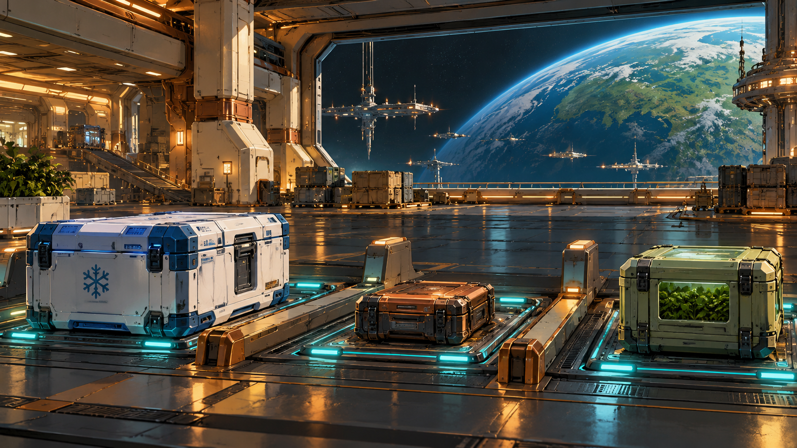

At **Avenor, Galaxy 1**, the openly advertised Union induction becomes available after an ordinary delivery or sale. Rowan needs **one tonne** for the serial loans. A clinic cold crate is collected at **Renas** and delivered intact to **Navidor**. Enmadan's failed workshop cassette goes through the **Renas repair desk**. With the seed custodians' consent and vault key from **Enlirin**, Rowan escorts the registered seed ark to **Lareria** and returns that key.

At **Cevilis**, Rowan recovers the original crew custody recorder beside the disabled service tender. The actual rescue launch and its survivors reach **Enmadan**, where the recorder is returned too. **Three external service handoffs at Enron** then make the final utility route viable.

Back at Avenor, Rowan chooses **Pool unused route windows with a published local minimum** or **Protect local reservations and share only released capacity**. Three real operators sign that chosen charter. Veil audits all induction receiving and the working utility route before accreditation, **7,600 CR** and the unbooked-window clue are recorded. Advanced variants on the six-service board become available.

Mission flow

```mermaid
flowchart TD
  %% mission C08 | l337.wayfarer-exchange
  C08_accept["Avenor: Accept the Wayfarer network-induction<br/>commission at Avenor."]
  C08_collect_coldcrate["Renas: Collect the one-tonne sealed clinic sample at<br/>Renas."]
  C08_deliver_coldchain["Navidor: Deliver the intact cold crate to Navidor's<br/>registered clinic berth."]
  C08_recover_cassette["Enmadan: Collect Enmadan's one-tonne failed workshop<br/>cassette for a closed repair exchange."]
  C08_close_repair_loop["Renas: Return the cassette through the Renas repair<br/>desk and confirm its receiving record."]
  C08_survey_seed_vault["Enlirin: Review Enlirin's seed-transfer consent and<br/>loan the one-tonne vault key."]
  C08_escort_seed_ark["Lareria: Escort the registered seed ark to Lareria's<br/>receiving cradle and return the vault key."]
  C08_recover_crew_log["Cevilis: Recover the one-tonne custody recorder beside<br/>Cevilis's disabled service tender."]
  C08_return_survivors["Enmadan: Escort the identified rescue launch to<br/>Enmadan reception and return its custody recorder."]
  C08_reopen_utility_route["Enron: Restore three named external service handoffs<br/>at Enron."]
  C08_choose_charter{"Avenor: Choose the Exchange's published<br/>route-allocation charter at Avenor."}
  C08_certify_network["Avenor: Verify all induction receiving records and the<br/>working utility route with Veil."]
  C08_close_case["Avenor: Confirm accreditation, collect the induction<br/>fee and open the advanced service board."]
  C08_complete(["7,600 CR once; this source's clue"])
  C08_close_case --> C08_complete
  C08_certify_network --> C08_close_case
  C08_choose_charter_choice_1["Pool unused route windows with a published local<br/>minimum"]
  C08_choose_charter --> C08_choose_charter_choice_1
  C08_commit_charter_choice_1["Avenor: Confirm all three signed pooling limits and<br/>test that the protected local minimum cannot be<br/>consumed. All 3 stated proofs are required."]
  C08_choose_charter_choice_1 --> C08_commit_charter_choice_1
  C08_commit_charter_choice_1 --> C08_certify_network
  C08_choose_charter_choice_2["Protect local reservations and share only released<br/>capacity"]
  C08_choose_charter --> C08_choose_charter_choice_2
  C08_commit_charter_choice_2["Avenor: Confirm all three local reservations and test<br/>that only explicitly released capacity can enter the<br/>shared pool. All 3 stated proofs are required."]
  C08_choose_charter_choice_2 --> C08_commit_charter_choice_2
  C08_commit_charter_choice_2 --> C08_certify_network
  C08_reopen_utility_route --> C08_choose_charter
  C08_return_survivors --> C08_reopen_utility_route
  C08_recover_crew_log --> C08_return_survivors
  C08_escort_seed_ark --> C08_recover_crew_log
  C08_survey_seed_vault --> C08_escort_seed_ark
  C08_close_repair_loop --> C08_survey_seed_vault
  C08_recover_cassette --> C08_close_repair_loop
  C08_deliver_coldchain --> C08_recover_cassette
  C08_collect_coldcrate --> C08_deliver_coldchain
  C08_accept --> C08_collect_coldcrate
  C08_continuity_inquiry["Complete this source's independent no-cost continuity<br/>inquiry"]
  C08_continuity_trace(["Missing source clue only; original outcome and rewards<br/>unchanged"])
  C08_accept -.-> |"If this original source clue is unavailable"| C08_continuity_inquiry
  C08_continuity_inquiry --> C08_continuity_trace
```

### Cold-chain clinic service

🟡 Partial

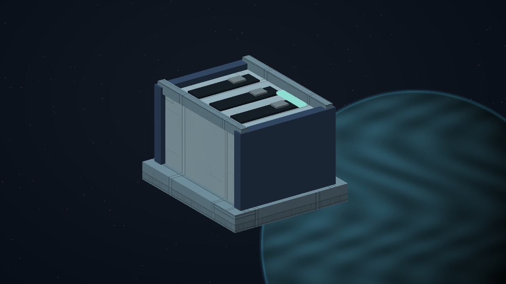

Rowan carries the actual **one-tonne sealed medical sample** from its registered source to the qualifying clinic receiver. The quoted integrity budget and any explicit simulation deadline remain real throughout pause, Save and Continue. A failed sample stays lost or spoiled; a later job needs a new unique consignment from genuine stock.

Mission flow

```mermaid
flowchart TD
  %% mission W01 | l337.wayfarer-service/cold-chain
  W01_collect["Confirm the registered source custody."]
  W01_deliver["Carry a sealed medical sample with an advertised<br/>integrity budget."]
  W01_receive["Commit the exact qualifying receiver and payment<br/>receipt."]
  W01_complete(["This source's first-success clue; retain it on later<br/>jobs"])
  W01_receive --> W01_complete
  W01_deliver --> W01_receive
  W01_collect --> W01_deliver
  W01_failed["Actual loss or failed work: consequences remain; no<br/>fee or clue"]
  W01_deliver -.-> |"If the original instance fails"| W01_failed
  W01_new_offer["Retry only through a new original offer with actual<br/>available stock or actors"]
  W01_failed -.-> |"If a qualifying new job is available"| W01_new_offer
  W01_new_offer -.-> W01_collect
  W01_continuity_inquiry["Complete this source's independent no-cost continuity<br/>inquiry"]
  W01_continuity_trace(["Missing source clue only; original outcome and rewards<br/>unchanged"])
  W01_failed -.-> |"If this original source clue is unavailable"| W01_continuity_inquiry
  W01_continuity_inquiry --> W01_continuity_trace
```

### Closed repair exchange

🟡 Partial

With **two tonnes** reserved, Rowan takes the identified failed unit to its workshop, then brings the serviced unit to its registered owner. The outward delivery is only half the promise. The returned original/service result and real owner receiving close the loop.

Mission flow

```mermaid
flowchart TD
  %% mission W02 | l337.wayfarer-service/repair-loop
  W02_collect["Confirm the registered source custody."]
  W02_service["Carry an identified failed unit to its workshop and<br/>return the serviced unit to its registered owner."]
  W02_receive["Commit the exact qualifying receiver and payment<br/>receipt."]
  W02_complete(["This source's first-success clue; retain it on later<br/>jobs"])
  W02_receive --> W02_complete
  W02_service --> W02_receive
  W02_collect --> W02_service
  W02_failed["Actual loss or failed work: consequences remain; no<br/>fee or clue"]
  W02_service -.-> |"If the original instance fails"| W02_failed
  W02_new_offer["Retry only through a new original offer with actual<br/>available stock or actors"]
  W02_failed -.-> |"If a qualifying new job is available"| W02_new_offer
  W02_new_offer -.-> W02_collect
  W02_continuity_inquiry["Complete this source's independent no-cost continuity<br/>inquiry"]
  W02_continuity_trace(["Missing source clue only; original outcome and rewards<br/>unchanged"])
  W02_failed -.-> |"If this original source clue is unavailable"| W02_continuity_inquiry
  W02_continuity_inquiry --> W02_continuity_trace
```

### Seed-bank transfer

🟡 Partial

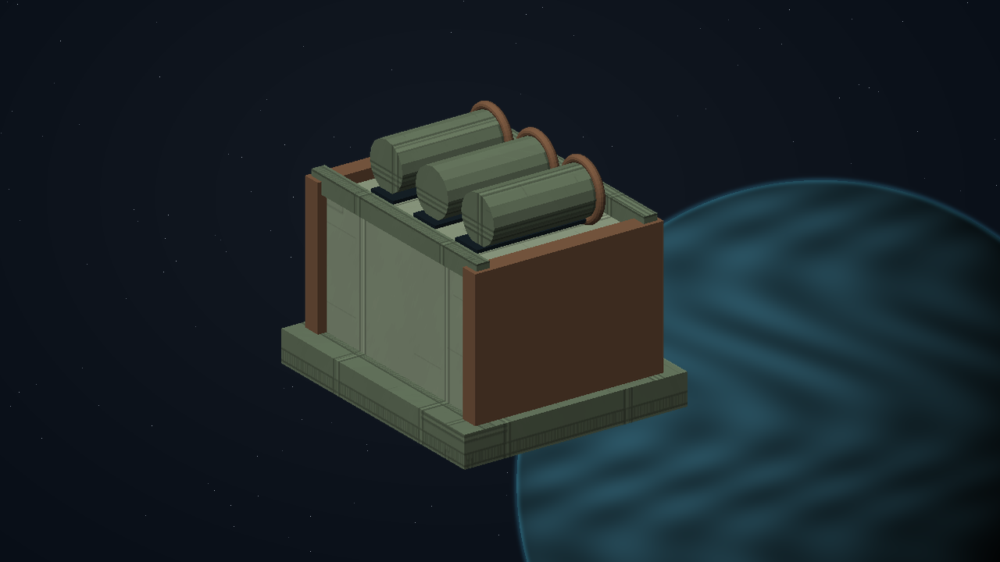

Rowan reserves **three tonnes** and moves a consented seed consignment between independent custodians. The condition and custody history travel with the actual consignment. A protected reference culture or another bank's stock cannot be substituted for the seeds entrusted to Rowan.

Mission flow

```mermaid
flowchart TD
  %% mission W03 | l337.wayfarer-service/seed-transfer
  W03_collect["Confirm the registered source custody."]
  W03_deliver["Transfer a consented seed consignment between<br/>independent custodians."]
  W03_receive["Commit the exact qualifying receiver and payment<br/>receipt."]
  W03_complete(["This source's first-success clue; retain it on later<br/>jobs"])
  W03_receive --> W03_complete
  W03_deliver --> W03_receive
  W03_collect --> W03_deliver
  W03_failed["Actual loss or failed work: consequences remain; no<br/>fee or clue"]
  W03_deliver -.-> |"If the original instance fails"| W03_failed
  W03_new_offer["Retry only through a new original offer with actual<br/>available stock or actors"]
  W03_failed -.-> |"If a qualifying new job is available"| W03_new_offer
  W03_new_offer -.-> W03_collect
  W03_continuity_inquiry["Complete this source's independent no-cost continuity<br/>inquiry"]
  W03_continuity_trace(["Missing source clue only; original outcome and rewards<br/>unchanged"])
  W03_failed -.-> |"If this original source clue is unavailable"| W03_continuity_inquiry
  W03_continuity_inquiry --> W03_continuity_trace
```

### Remote utility relief

🟡 Partial

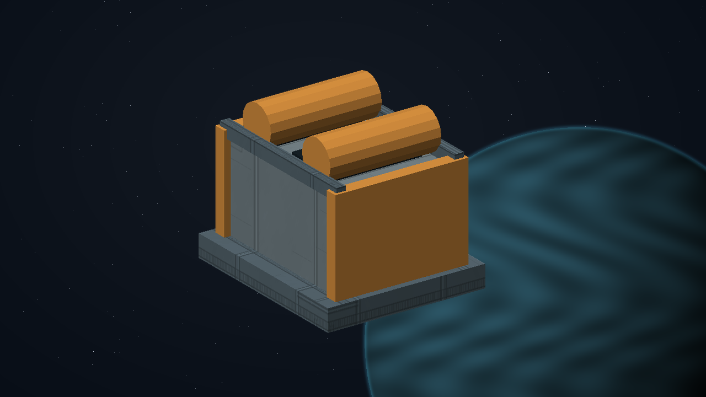

Rowan carries **four tonnes** of real repair material to the named remote utility crew. The crew's actual receiving and resulting service handoff complete the work. The goods leave Rowan's custody when they enter the receiver's; they cannot still be sold from the hold.

Mission flow

```mermaid
flowchart TD
  %% mission W04 | l337.wayfarer-service/field-relief
  W04_collect["Confirm the registered source custody."]
  W04_install["Deliver actual repair materials to a remote utility<br/>receiving crew and verify their service handoff."]
  W04_receive["Commit the exact qualifying receiver and payment<br/>receipt."]
  W04_complete(["This source's first-success clue; retain it on later<br/>jobs"])
  W04_receive --> W04_complete
  W04_install --> W04_receive
  W04_collect --> W04_install
  W04_failed["Actual loss or failed work: consequences remain; no<br/>fee or clue"]
  W04_install -.-> |"If the original instance fails"| W04_failed
  W04_new_offer["Retry only through a new original offer with actual<br/>available stock or actors"]
  W04_failed -.-> |"If a qualifying new job is available"| W04_new_offer
  W04_new_offer -.-> W04_collect
  W04_continuity_inquiry["Complete this source's independent no-cost continuity<br/>inquiry"]
  W04_continuity_trace(["Missing source clue only; original outcome and rewards<br/>unchanged"])
  W04_failed -.-> |"If this original source clue is unavailable"| W04_continuity_inquiry
  W04_continuity_inquiry --> W04_continuity_trace
```

### Crew record recovery

🟡 Partial

The job identifies one physical flight/custody recorder in a wreck cradle. With **one tonne** free, Rowan locates it, recovers that same original and returns it to the qualifying receiver. Its recorded crew history is evidence. The recorder and surrounding wreckage cannot be counted as living survivors.

Mission flow

```mermaid
flowchart TD
  %% mission W05 | l337.wayfarer-service/record-recovery
  W05_locate["Locate and identify the unique physical recorder;<br/>leave it in the wreck cradle until recovery."]
  W05_recover["Recover a specific flight/custody recorder without<br/>treating cargo wreckage as a living survivor."]
  W05_receive["Commit the exact qualifying receiver and payment<br/>receipt."]
  W05_complete(["This source's first-success clue; retain it on later<br/>jobs"])
  W05_receive --> W05_complete
  W05_recover --> W05_receive
  W05_locate --> W05_recover
  W05_failed["Actual loss or failed work: consequences remain; no<br/>fee or clue"]
  W05_recover -.-> |"If the original instance fails"| W05_failed
  W05_new_offer["Retry only through a new original offer with actual<br/>available stock or actors"]
  W05_failed -.-> |"If a qualifying new job is available"| W05_new_offer
  W05_new_offer -.-> W05_locate
  W05_continuity_inquiry["Complete this source's independent no-cost continuity<br/>inquiry"]
  W05_continuity_trace(["Missing source clue only; original outcome and rewards<br/>unchanged"])
  W05_failed -.-> |"If this original source clue is unavailable"| W05_continuity_inquiry
  W05_continuity_inquiry --> W05_continuity_trace
```

### Registered convoy watch

🔵 Planned

Rowan registers the exact convoy, escorts its journey and obtains the receiver's real cargo and arrival record. The convoy carries its own people and cargo in properly crewed craft. Rowan needs no invented passenger allocation aboard the escort ship. A same-class replacement or a destroyed consignment cannot fulfil the original promised arrival.

Each service family's first genuine success supplies its own clue, separate from the induction clue. Subsequent jobs carry their own displayed route, hazard and fee. Failure earns no payment or clue, and a retry preserves the old loss while reserving real new stock.

Mission flow

```mermaid
flowchart TD
  %% mission W06 | l337.wayfarer-service/convoy-watch
  W06_register["Confirm the registered source custody."]
  W06_escort["Escort the exact registered convoy and require the<br/>receiver's real cargo and arrival record."]
  W06_receive["Commit the exact qualifying receiver and payment<br/>receipt."]
  W06_complete(["This source's first-success clue; retain it on later<br/>jobs"])
  W06_receive --> W06_complete
  W06_escort --> W06_receive
  W06_register --> W06_escort
  W06_failed["Actual loss or failed work: consequences remain; no<br/>fee or clue"]
  W06_escort -.-> |"If the original instance fails"| W06_failed
  W06_new_offer["Retry only through a new original offer with actual<br/>available stock or actors"]
  W06_failed -.-> |"If a qualifying new job is available"| W06_new_offer
  W06_new_offer -.-> W06_register
  W06_continuity_inquiry["Complete this source's independent no-cost continuity<br/>inquiry"]
  W06_continuity_trace(["Missing source clue only; original outcome and rewards<br/>unchanged"])
  W06_failed -.-> |"If this original source clue is unavailable"| W06_continuity_inquiry
  W06_continuity_inquiry --> W06_continuity_trace
```

### Uncounted Names

🔵 Planned

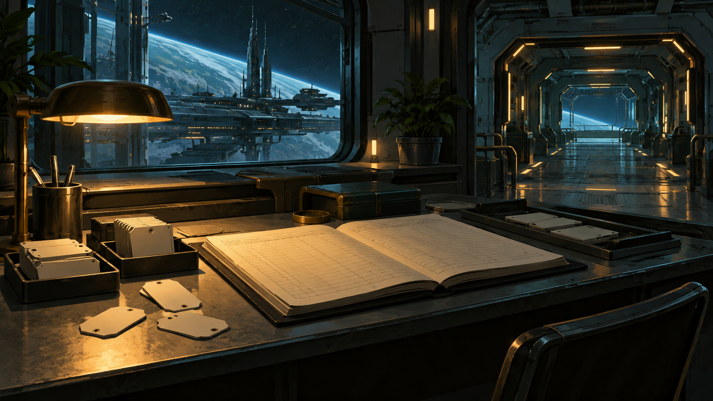

At **Oranisil, Galaxy 3**, Sera Dain lends Rowan the reference after a trade. Equipment-only forms have caused displaced workers to be recorded as transferable property. At **Lyraven**, three people give their separate permissions and Rowan reads only the consented identities. Both receiver permissions at **Sialasil** are corrected and tested against unauthorised access. The workers' consenting tender reaches **Aenisil**.

With the arrived delegates, Rowan chooses **Repair individual records under protected custody** or **Publish a systematic register repair**. Private corrections need each person's acknowledgement and receiver validation. The public audit must be anonymised and reject equipment-only transfers for every registered person. Rowan returns the reference to Oranisil for **6,500 CR** and the unnamed-entry clue.

Mission flow

```mermaid
flowchart TD
  %% mission C27 | l337.uncounted-names
  C27_accept["Oranisil: Accept Uncounted Names at Oranisil."]
  C27_collect_reference["Oranisil: Collect the identified one-tonne reference<br/>instrument from Coordinator Sera Dain."]
  C27_survey["Lyraven: Read three consented native identity<br/>receipts, redacting private names in public views."]
  C27_field_work["Sialasil: Apply two actual receiver permission<br/>corrections with the onboard reference as independent<br/>witness."]
  C27_independent_witness["Aenisil: Verify actual safe transit and living<br/>reception of the consenting worker tender to its<br/>chosen safe receiving berth."]
  C27_choose_settlement{"Aenisil: At the actual witness receiving station,<br/>choose the settlement with the arrived authorised<br/>operator delegates."}
  C27_return_and_audit["Oranisil: Return the reference instrument and confirm<br/>all physical receiving and settlement receipts."]
  C27_close_case["Oranisil: Confirm successful completion, the recorded<br/>settlement and the once-only fee."]
  C27_complete(["6,500 CR once; this source's clue"])
  C27_close_case --> C27_complete
  C27_return_and_audit --> C27_close_case
  C27_choose_settlement_choice_1["Repair individual records under protected custody"]
  C27_choose_settlement --> C27_choose_settlement_choice_1
  C27_apply_settlement_choice_1["Sialasil: Verify each consented correction and<br/>independent reception authority. All 2 stated proofs<br/>are required."]
  C27_choose_settlement_choice_1 --> C27_apply_settlement_choice_1
  C27_apply_settlement_choice_1 --> C27_return_and_audit
  C27_choose_settlement_choice_2["Publish a systematic register repair"]
  C27_choose_settlement --> C27_choose_settlement_choice_2
  C27_apply_settlement_choice_2["Sialasil: Verify anonymised audit results and the<br/>permanent form correction. All 2 stated proofs are<br/>required."]
  C27_choose_settlement_choice_2 --> C27_apply_settlement_choice_2
  C27_apply_settlement_choice_2 --> C27_return_and_audit
  C27_independent_witness --> C27_choose_settlement
  C27_field_work --> C27_independent_witness
  C27_survey --> C27_field_work
  C27_collect_reference --> C27_survey
  C27_accept --> C27_collect_reference
  C27_continuity_inquiry["Complete this source's independent no-cost continuity<br/>inquiry"]
  C27_continuity_trace(["Missing source clue only; original outcome and rewards<br/>unchanged"])
  C27_accept -.-> |"If this original source clue is unavailable"| C27_continuity_inquiry
  C27_continuity_inquiry --> C27_continuity_trace
```

### The Long Return

🔵 Planned

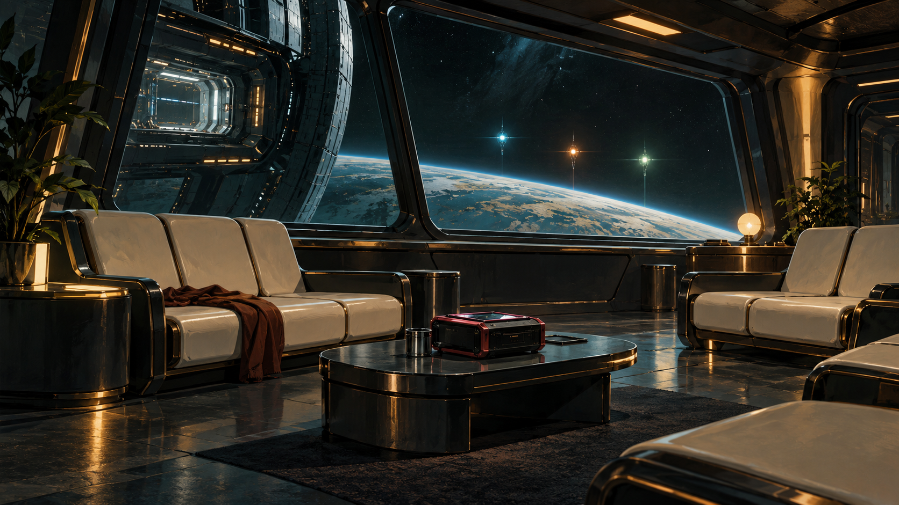

At **Zankakor, Galaxy 2**, Dain lends Rowan the reference after a trade. Three carriers each hold part of the history of a missed rendezvous. Rowan reads their actual consenting records at **Darvan** and performs two neutral handoff tests at **Halridor**, preserving custody and continuing consent. The named reunion tender then needs an escort to **Elaris's agreed berth**.

With the arrived delegates, Rowan chooses **Use a witnessed shared return handoff** or **Give the reunion tender a direct return corridor**. Shared signatures must bind the same consenting group and real berth. The direct grant must name the actual tender, and the home berth must acknowledge that same living group. The reference returns to Zankakor for **7,800 CR** and the passenger-never-booked clue. The group retains its right to decide where to go.

Mission flow

```mermaid
flowchart TD
  %% mission C18 | l337.long-return
  C18_accept["Zankakor: Accept The Long Return at Zankakor."]
  C18_collect_reference["Zankakor: Collect the identified one-tonne reference<br/>instrument from Coordinator Sera Dain."]
  C18_survey["Darvan: Read each consenting carrier rendezvous record<br/>and its actual named-party custody."]
  C18_field_work["Halridor: Run two neutral receiver handoff tests with<br/>the original onboard witness instrument."]
  C18_independent_witness["Elaris: Escort the named reunion tender to its<br/>consented receiving berth."]
  C18_choose_settlement{"Elaris: At the actual witness receiving station,<br/>choose the settlement with the arrived authorised<br/>operator delegates."}
  C18_return_and_audit["Zankakor: Return the reference instrument and confirm<br/>all physical receiving and settlement receipts."]
  C18_close_case["Zankakor: Confirm successful completion, the recorded<br/>settlement and the once-only fee."]
  C18_complete(["7,800 CR once; this source's clue"])
  C18_close_case --> C18_complete
  C18_return_and_audit --> C18_close_case
  C18_choose_settlement_choice_1["Use a witnessed shared return handoff"]
  C18_choose_settlement --> C18_choose_settlement_choice_1
  C18_apply_settlement_choice_1["Halridor: Verify both carrier signatures and the live<br/>crew reception. All 2 stated proofs are required."]
  C18_choose_settlement_choice_1 --> C18_apply_settlement_choice_1
  C18_apply_settlement_choice_1 --> C18_return_and_audit
  C18_choose_settlement_choice_2["Give the reunion tender a direct return corridor"]
  C18_choose_settlement --> C18_choose_settlement_choice_2
  C18_apply_settlement_choice_2["Halridor: Verify the corridor reservation and<br/>home-berth arrival authority. All 2 stated proofs are<br/>required."]
  C18_choose_settlement_choice_2 --> C18_apply_settlement_choice_2
  C18_apply_settlement_choice_2 --> C18_return_and_audit
  C18_independent_witness --> C18_choose_settlement
  C18_field_work --> C18_independent_witness
  C18_survey --> C18_field_work
  C18_collect_reference --> C18_survey
  C18_accept --> C18_collect_reference
  C18_continuity_inquiry["Complete this source's independent no-cost continuity<br/>inquiry"]
  C18_continuity_trace(["Missing source clue only; original outcome and rewards<br/>unchanged"])
  C18_accept -.-> |"If this original source clue is unavailable"| C18_continuity_inquiry
  C18_continuity_inquiry --> C18_continuity_trace
```

## Last Light

The emergencies in this anthology grow from a stranded tender to the danger facing a whole orbital neighbourhood. Rowan can take the cases independently; their recommended order is Under Tow, The Still Current, Small Lights and The Shattered Wake. Completing the resolved stories and their final debrief earns a **Salvage Beam Field Lens** 🟣 Gap, whose intended benefit is better reach and efficiency within the beam's real size, force and capacity limits.

### Under Tow

🟡 Partial

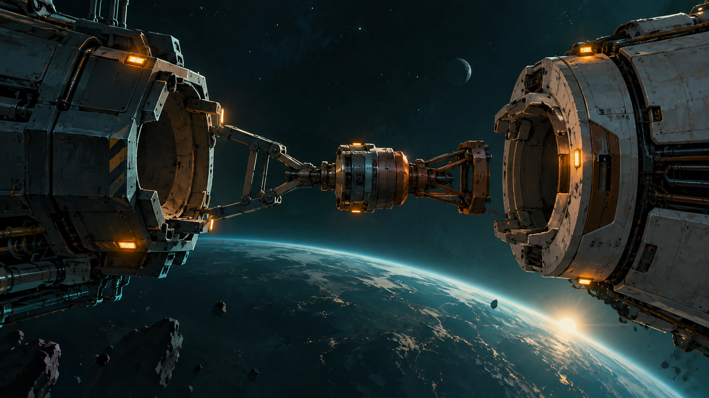

At **Luera, Galaxy 8**, an ordinary trade brings Rowan within the terms of Tug Lead **Mira Penn's** offer. The emergency network has standardised its forms without standardising the physical couplings. A stranded work tender cannot accept the tug sent to help it. Rowan collects Penn's one-tonne service reference and measures three collar geometries and their independent load limits at **Allion**.

At **Ealaera**, Rowan directs the real source-owned couplers into two low-load mechanical tests. Compatible collars must actually engage, hold the measured test load and release/refuse an excessive command. The rescued tender then needs an escorted journey to a genuinely compatible berth at **Rivain**. There, the arrived delegates choose with Rowan between **Accredit interoperable local rescue pairs** and **Establish a shared specialist rescue tender**. The first requires both local pairs' separate tests and real reception; the second requires a specialist that can take the actual tender and a receiver that accepts its load envelope. The same reference returns to Luera before **8,300 CR** and the coupling-without-a-vessel clue are settled.

Mission flow

```mermaid
flowchart TD
  %% mission C24 | l337.under-tow
  C24_accept["Luera: Accept Under Tow at Luera."]
  C24_collect_reference["Luera: Collect the identified one-tonne reference<br/>instrument from Tug Lead Mira Penn."]
  C24_survey["Allion: Measure three actual collar geometries and<br/>their signed independent load limits."]
  C24_field_work["Ealaera: Run two low-load mechanical tests through the<br/>source-owned test rig using the original service<br/>reference."]
  C24_independent_witness["Rivain: Escort the identified rescued work tender to<br/>an actually compatible berth."]
  C24_choose_settlement{"Rivain: At the actual witness receiving station,<br/>choose the settlement with the arrived authorised<br/>operator delegates."}
  C24_return_and_audit["Luera: Return the reference instrument and confirm all<br/>physical receiving and settlement receipts."]
  C24_close_case["Luera: Confirm successful completion, the recorded<br/>settlement and the once-only fee."]
  C24_complete(["8,300 CR once; this source's clue"])
  C24_close_case --> C24_complete
  C24_return_and_audit --> C24_close_case
  C24_choose_settlement_choice_1["Accredit interoperable local rescue pairs"]
  C24_choose_settlement --> C24_choose_settlement_choice_1
  C24_apply_settlement_choice_1["Ealaera: Verify two tested coupling pairs and their<br/>crew reception drill. All 2 stated proofs are<br/>required."]
  C24_choose_settlement_choice_1 --> C24_apply_settlement_choice_1
  C24_apply_settlement_choice_1 --> C24_return_and_audit
  C24_choose_settlement_choice_2["Establish a shared specialist rescue tender"]
  C24_choose_settlement --> C24_choose_settlement_choice_2
  C24_apply_settlement_choice_2["Ealaera: Verify specialist dispatch limits and the<br/>receiving-station agreement. All 2 stated proofs are<br/>required."]
  C24_choose_settlement_choice_2 --> C24_apply_settlement_choice_2
  C24_apply_settlement_choice_2 --> C24_return_and_audit
  C24_independent_witness --> C24_choose_settlement
  C24_field_work --> C24_independent_witness
  C24_survey --> C24_field_work
  C24_collect_reference --> C24_survey
  C24_accept --> C24_collect_reference
  C24_continuity_inquiry["Complete this source's independent no-cost continuity<br/>inquiry"]
  C24_continuity_trace(["Missing source clue only; original outcome and rewards<br/>unchanged"])
  C24_accept -.-> |"If this original source clue is unavailable"| C24_continuity_inquiry
  C24_continuity_inquiry --> C24_continuity_trace
```

### The Still Current

🔵 Planned

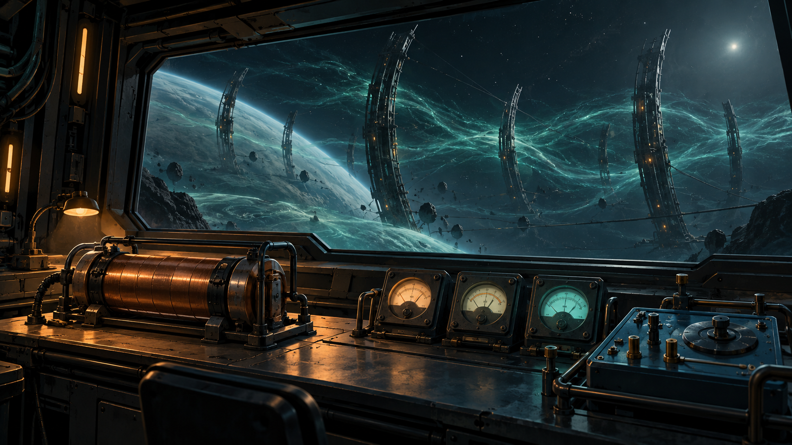

After an ordinary trade, Rowan answers the utility survey notice at **Valrator, Galaxy 2**. An abandoned lattice near **Karrakor** reports no output, yet three independent meters show stored charge increasing. Its overheated service corridor has trapped a maintenance tender. Rowan measures the three meters, recovers the **one-tonne insulated charge cell** from the unmanned sled and takes it to Anja Kest. At Valrator the cell is exchanged for the **one-tonne baffle programmer**; Rowan never needs both loans aboard together.

The next journey brings the identified technicians' tender through Karrakor's safe corridor to real reception. Three feedline observations at **Mortor** expose an obsolete commissioning order: reclamation machines keep restoring conductive dust bridges because they still obey that order. Rowan positions three insulated baffles at Karrakor, then returns to the operators at Valrator to choose **Commission a bounded community energy buffer** or **Recover the stored energy and dismantle the collectors**.

The selected future must be made physical. Rowan revokes the old authority, applies the collector settlement at Karrakor and accounts for all stored charge at Mortor. The original programmer returns to Valrator for the final energy-balance audit. **8,400 CR**, the recorded utility settlement and the resting-arc clue close the survey.

Mission flow

```mermaid
flowchart TD
  %% mission C07 | l337.still-current
  C07_accept["Valrator: Accept the dormant-lattice survey at<br/>Valrator."]
  C07_survey_current["Karrakor: Scan three utility meters around the<br/>Karrakor lattice."]
  C07_recover_cell["Karrakor: Recover the one-tonne insulated charge cell<br/>from the unmanned maintenance sled."]
  C07_analyse_charge["Valrator: Exchange the charge cell for Kest's baffle<br/>programmer at Valrator."]
  C07_rescue_technicians["Karrakor: Escort the identified maintenance tender<br/>through the safe corridor to its reception berth."]
  C07_map_feedlines["Mortor: Scan the three external feedlines at Mortor<br/>and identify the obsolete work authority."]
  C07_place_baffles["Karrakor: Position three insulated baffles at the<br/>marked Karrakor work points."]
  C07_choose_lattice{"Valrator: Choose the lattice's future with the local<br/>utility operators."}
  C07_return_programmer["Valrator: Return the baffle programmer and verify the<br/>final energy balance at Valrator."]
  C07_close_case["Valrator: Confirm the completed lattice settlement and<br/>collect the survey fee."]
  C07_complete(["8,400 CR once; this source's clue"])
  C07_close_case --> C07_complete
  C07_return_programmer --> C07_close_case
  C07_choose_lattice_choice_1["Commission a bounded community energy buffer"]
  C07_choose_lattice --> C07_choose_lattice_choice_1
  C07_isolate_collectors_choice_1["Karrakor: Revoke the archived work authority and test<br/>the locally bounded collector quota. All 2 stated<br/>proofs are required."]
  C07_choose_lattice_choice_1 --> C07_isolate_collectors_choice_1
  C07_settle_reservoir_choice_1["Mortor: Deliver 300 measured charge units to the local<br/>utility and prove the remaining 600 stay inside the<br/>bounded buffer. All 2 stated proofs are required."]
  C07_isolate_collectors_choice_1 --> C07_settle_reservoir_choice_1
  C07_settle_reservoir_choice_1 --> C07_return_programmer
  C07_choose_lattice_choice_2["Recover the stored energy and dismantle the collectors"]
  C07_choose_lattice --> C07_choose_lattice_choice_2
  C07_isolate_collectors_choice_2["Karrakor: Disable the archived work controller and<br/>verify all collector bus links are isolated. All 2<br/>stated proofs are required."]
  C07_choose_lattice_choice_2 --> C07_isolate_collectors_choice_2
  C07_settle_reservoir_choice_2["Mortor: Transfer all remaining charge to registered<br/>recovery storage and confirm the collectors' material<br/>delivery. All 2 stated proofs are required."]
  C07_isolate_collectors_choice_2 --> C07_settle_reservoir_choice_2
  C07_settle_reservoir_choice_2 --> C07_return_programmer
  C07_place_baffles --> C07_choose_lattice
  C07_map_feedlines --> C07_place_baffles
  C07_rescue_technicians --> C07_map_feedlines
  C07_analyse_charge --> C07_rescue_technicians
  C07_recover_cell --> C07_analyse_charge
  C07_survey_current --> C07_recover_cell
  C07_accept --> C07_survey_current
  C07_continuity_inquiry["Complete this source's independent no-cost continuity<br/>inquiry"]
  C07_continuity_trace(["Missing source clue only; original outcome and rewards<br/>unchanged"])
  C07_accept -.-> |"If this original source clue is unavailable"| C07_continuity_inquiry
  C07_continuity_inquiry --> C07_continuity_trace
```

### Small Lights

🔵 Planned

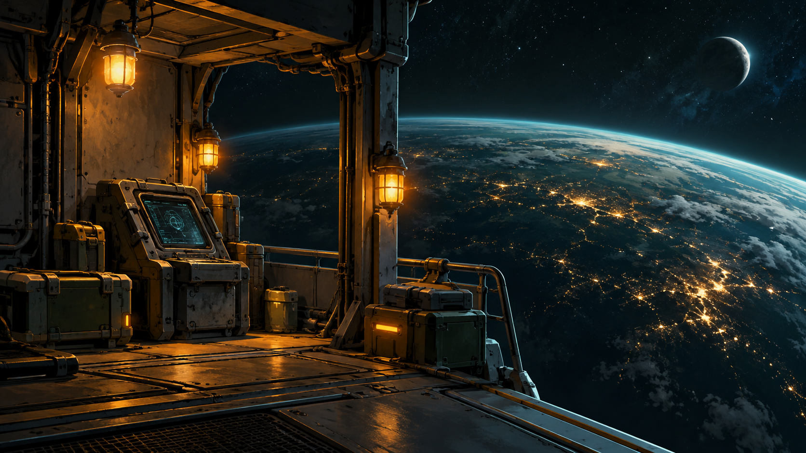

At **Duniler, Galaxy 5**, Dispatcher **Evi Senn** lends Rowan a reference after an ordinary trade. Several utility failures are each too small for an insurer's dispatch threshold, yet together they have isolated a neighbourhood. Three readings at **Delenir** reveal their shared dependency. At **Siluel**, Rowan isolates the fault and fits **two real repair kits**, one to each failed external module. **Two other kits remain separate physical reserve stock**; the repairs cannot consume those as well.

The consenting maintenance tender reaches the neighbourhood berth at **Ashilun**, where Rowan and the arrived delegates choose **Pool local callouts across utilities** or **Keep independently funded service reserves**. A pooled callout has to reach its receiver within the explicitly armed test's deadline. The reserve route has to demonstrate both funded kits actually present before the receiving drill. Rowan returns the reference to Duniler for **6,400 CR** and the light-before-the-fault clue. The neighbourhood's response comes from its real working links and stock.

Mission flow

```mermaid
flowchart TD
  %% mission C29 | l337.small-lights
  C29_accept["Duniler: Accept Small Lights at Duniler."]
  C29_collect_reference["Duniler: Collect the identified one-tonne reference<br/>instrument from Dispatcher Evi Senn."]
  C29_survey["Delenir: Read three actual utility faults and their<br/>shared physical dependency graph."]
  C29_field_work["Siluel: Use one source-owned repair kit on each of the<br/>two external failed modules; verify the upstream<br/>dependency."]
  C29_independent_witness["Ashilun: Verify actual safe transit and living<br/>reception of the consenting maintenance tender to the<br/>neighbourhood berth."]
  C29_choose_settlement{"Ashilun: At the actual witness receiving station,<br/>choose the settlement with the arrived authorised<br/>operator delegates."}
  C29_return_and_audit["Duniler: Return the reference instrument and confirm<br/>all physical receiving and settlement receipts."]
  C29_close_case["Duniler: Confirm successful completion, the recorded<br/>settlement and the once-only fee."]
  C29_complete(["6,400 CR once; this source's clue"])
  C29_close_case --> C29_complete
  C29_return_and_audit --> C29_close_case
  C29_choose_settlement_choice_1["Pool local callouts across utilities"]
  C29_choose_settlement --> C29_choose_settlement_choice_1
  C29_apply_settlement_choice_1["Siluel: Verify a shared capacity ledger and a real<br/>cross-utility response. All 2 stated proofs are<br/>required."]
  C29_choose_settlement_choice_1 --> C29_apply_settlement_choice_1
  C29_apply_settlement_choice_1 --> C29_return_and_audit
  C29_choose_settlement_choice_2["Keep independently funded service reserves"]
  C29_choose_settlement --> C29_choose_settlement_choice_2
  C29_apply_settlement_choice_2["Siluel: Verify two stocked reserves and their<br/>receiving drill. All 2 stated proofs are required."]
  C29_choose_settlement_choice_2 --> C29_apply_settlement_choice_2
  C29_apply_settlement_choice_2 --> C29_return_and_audit
  C29_independent_witness --> C29_choose_settlement
  C29_field_work --> C29_independent_witness
  C29_survey --> C29_field_work
  C29_collect_reference --> C29_survey
  C29_accept --> C29_collect_reference
  C29_continuity_inquiry["Complete this source's independent no-cost continuity<br/>inquiry"]
  C29_continuity_trace(["Missing source clue only; original outcome and rewards<br/>unchanged"])
  C29_accept -.-> |"If this original source clue is unavailable"| C29_continuity_inquiry
  C29_continuity_inquiry --> C29_continuity_trace
```

### The Shattered Wake

🔵 Planned

Controller **Edda Rell at Loalaila, Galaxy 6** offers Rowan the emergency commission after three system visits. An abandoned orbital mass driver above **Aermiori** has restarted. Its spoil stream crosses a fractured moonlet, sending large bodies and dense gravel towards **Spindle Anchorage**. Rowan scans three outer watchers, compares the approaching impact bands and docks at the Anchorage to collect its **one-tonne impulse coupler**.

Rowan shuts down the mass driver and records the fracture boundary. Through the emergency radio, the defence choice is **Deflect the heavy bodies with tug anchors** or **Catch the gravel with a fragment screen**. The chosen three-node arrangement must be physically installed before Rowan explicitly confirms readiness and arms the passage. Neighbouring systems can be visited with a verified warning to recruit their actually available tugs, patrols and evacuation craft. These helpers bring finite ships, people and fuel.

During the passage, Rowan redirects the marked threats and keeps the evacuation corridor open. The Anchorage's shields can be exhausted by successive impacts; its survival is an outcome of the actual defence. Afterwards, Rowan escorts the registered relief tender and its recovered survivors and incident records to **Shelter Dock**, then carries the relief manifest and event record to **Loalaila**. Jalen Orr's inquiry compares the saved trajectories, shutdown and defence telemetry.

The completed relief and inquiry earns **1,800 CR**. A surviving Anchorage adds **6,000 CR**; a lost station with every registered evacuee safely received adds **3,000 CR** instead. Other station-loss outcomes have no bonus. The curve-before-the-fall clue follows the qualifying relief and inquiry. The history retains destroyed homes, casualties, rescued people and the actual chosen defence.

Mission flow

```mermaid
flowchart TD
  %% mission C05 | l337.shattered-wake
  C05_accept["Loalaila: Accept the orbital emergency commission at<br/>Loalaila."]
  C05_survey_train["Aermiori: Scan three outer watchers and compare the<br/>projected impact bands at Aermiori."]
  C05_collect_coupler["Aermiori: Dock at Spindle Anchorage and collect a<br/>one-tonne impulse coupler."]
  C05_silence_driver["Aermiori: Shut down the abandoned mass driver and<br/>record the moonlet fracture boundary."]
  C05_choose_defence{"Aermiori: Choose tug deflection or a fragment-catching<br/>screen through the emergency radio contact."}
  C05_hold_the_approach["Aermiori: Help redirect the marked threats until the<br/>debris passage resolves; keep the evacuation corridor<br/>clear."]
  C05_escort_rescue["Aermiori: Escort the registered relief tender to<br/>Shelter Dock with the survivors and incident records<br/>it recovered."]
  C05_deliver_relief_record["Loalaila: Dock at Loalaila and submit the relief<br/>manifest and recovered event record."]
  C05_complete_inquiry["Loalaila: Compare the saved trajectory record, driver<br/>shutdown and defence telemetry with Jalen Orr."]
  C05_close_case["Loalaila: Confirm completion of the relief operation<br/>and inquiry; collect the base fee and the recorded<br/>outcome bonus."]
  C05_complete(["1,800 CR base once plus the recorded outcome bonus;<br/>this source's clue"])
  C05_close_case --> C05_complete
  C05_deliver_relief_record --> C05_complete_inquiry
  C05_escort_rescue --> C05_deliver_relief_record
  C05_hold_the_approach --> C05_escort_rescue
  C05_choose_defence_choice_1["Deflect the heavy bodies with tug anchors"]
  C05_choose_defence --> C05_choose_defence_choice_1
  C05_deploy_defence_choice_1["Aermiori: Synchronise the three tug anchors, then<br/>install the coupler and confirm readiness. All 3<br/>stated proofs are required."]
  C05_choose_defence_choice_1 --> C05_deploy_defence_choice_1
  C05_deploy_defence_choice_1 --> C05_ready
  C05_choose_defence_choice_2["Catch the gravel with a fragment screen"]
  C05_choose_defence --> C05_choose_defence_choice_2
  C05_deploy_defence_choice_2["Aermiori: Align the three fragment catchers, then<br/>install the coupler and confirm readiness. All 3<br/>stated proofs are required."]
  C05_choose_defence_choice_2 --> C05_deploy_defence_choice_2
  C05_deploy_defence_choice_2 --> C05_ready
  C05_silence_driver --> C05_choose_defence
  C05_collect_coupler --> C05_silence_driver
  C05_survey_train --> C05_collect_coupler
  C05_accept --> C05_survey_train
  C05_continuity_inquiry["Complete this source's independent no-cost continuity<br/>inquiry"]
  C05_continuity_trace(["Missing source clue only; original outcome and rewards<br/>unchanged"])
  C05_accept -.-> |"If this original source clue is unavailable"| C05_continuity_inquiry
  C05_continuity_inquiry --> C05_continuity_trace
  C05_optional_warnings["Optionally warn Iraeth, Reilieli or Siamaeth in any<br/>order; inspect actual reserve offers"]
  C05_arrived_aid["Only genuinely arrived tugs, interceptors and haulers<br/>can help"]
  C05_survey_train -.-> |"After survey; optional during preparation or the live<br/>clock"| C05_optional_warnings
  C05_optional_warnings -.-> |"Actual confirmed dispatch and travel"| C05_arrived_aid
  C05_arrived_aid -.-> |"Support only; all main stages still required"| C05_hold_the_approach
  C05_ready{"Confirm readiness to arm the 900-second debris<br/>passage?"}
  C05_ready --> |"Confirm"| C05_hold_the_approach
  C05_prepare["Continue untimed preparation"]
  C05_ready --> |"Not ready"| C05_prepare
  C05_prepare --> C05_ready
  C05_outcome{"Classify after the passage and actual relief<br/>accounting"}
  C05_complete_inquiry --> C05_outcome
  C05_outcome_saved["Anchorage survives: +6,000 CR"]
  C05_outcome --> C05_outcome_saved
  C05_outcome_saved --> C05_close_case
  C05_outcome_evacuated["Anchorage destroyed; every registered evacuee safe at<br/>Shelter Dock: +3,000 CR"]
  C05_outcome --> C05_outcome_evacuated
  C05_outcome_evacuated --> C05_close_case
  C05_outcome_lost["Other destroyed-station outcome: +0 CR"]
  C05_outcome --> C05_outcome_lost
  C05_outcome_lost --> C05_close_case
```

## Living Worlds

The Quiet Nursery, The Measure of Care, The Blue Reservoir and A Garden in Transit make a recommended arc about sustaining life when apparently reassuring reports are incomplete. Rowan's work moves from pressure to calibration, circulation and receiving climates. The anthology's intended prize is a **Habitat Stabiliser** and a consensually gifted seed-archive keepsake 🟣 Gap. The protected original samples remain with their rightful custodians.

### The Quiet Nursery

🔵 Planned

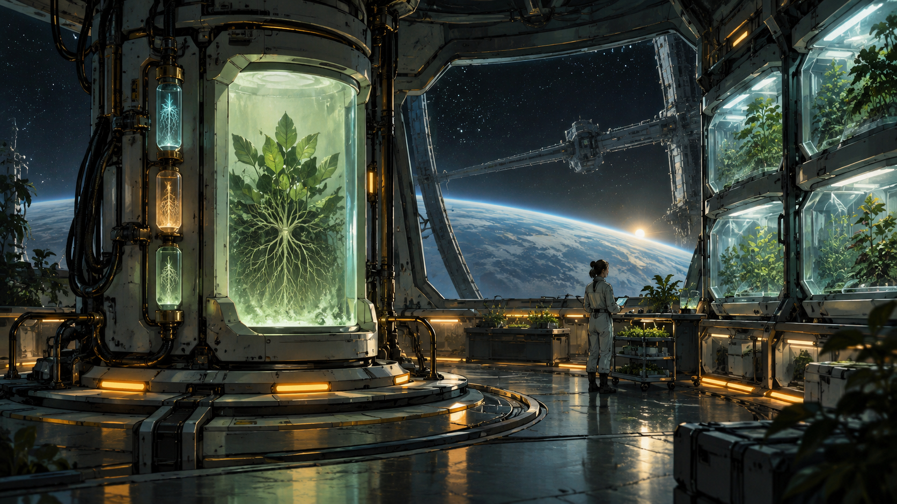

At **Maran, Galaxy 1**, Physicist **Anja Kest** lends Rowan the reference after a trade. Nursery roots are failing under reports that show perfect average conditions. At **Naviven**, Rowan records the actual pressure waveforms and their minima; brief harmful pulses have been averaged away. At **Larinar**, the sealed onboard culture reference is compared at both cradles, then Rowan selects and latches the two pulse dampers and watches the live three-cycle pressure test.

The horticulture tender's journey ends at **Lelaven's test berth**. With the arrived delegates, Rowan chooses **Give each nursery cell an independent air regulator** or **Establish a shared grower-controlled ventilation schedule**. Each independent damper must reject an outside close order while maintaining safe minima, or the grower-signed shared schedule must pass while either local stop can independently halt it. Rowan returns the original reference to Maran for **4,600 CR** and the breath-between-readings clue.

Mission flow

```mermaid
flowchart TD
  %% mission C09 | l337.quiet-nursery
  C09_accept["Maran: Accept The Quiet Nursery at Maran."]
  C09_collect_reference["Maran: Collect the identified one-tonne reference<br/>instrument from Physicist Anja Kest."]
  C09_survey["Naviven: Record each six-second pressure trace,<br/>including its minimum; averages cannot qualify."]
  C09_field_work["Larinar: Compare the sealed onboard culture reference<br/>at both cradles, then latch the two pulse dampers."]
  C09_independent_witness["Lelaven: Verify actual safe transit and living<br/>reception of the consenting horticulture tender to the<br/>test berth."]
  C09_choose_settlement{"Lelaven: At the actual witness receiving station,<br/>choose the settlement with the arrived authorised<br/>operator delegates."}
  C09_return_and_audit["Maran: Return the reference instrument and confirm all<br/>physical receiving and settlement receipts."]
  C09_close_case["Maran: Confirm successful completion, the recorded<br/>settlement and the once-only fee."]
  C09_complete(["4,600 CR once; this source's clue"])
  C09_close_case --> C09_complete
  C09_return_and_audit --> C09_close_case
  C09_choose_settlement_choice_1["Give each nursery cell an independent air regulator"]
  C09_choose_settlement --> C09_choose_settlement_choice_1
  C09_apply_settlement_choice_1["Larinar: Verify the two independent regulator locks<br/>and their separate pressure tests. All 2 stated proofs<br/>are required."]
  C09_choose_settlement_choice_1 --> C09_apply_settlement_choice_1
  C09_apply_settlement_choice_1 --> C09_return_and_audit
  C09_choose_settlement_choice_2["Establish a shared grower-controlled ventilation<br/>schedule"]
  C09_choose_settlement --> C09_choose_settlement_choice_2
  C09_apply_settlement_choice_2["Larinar: Verify the grower countersignature and the<br/>bounded ventilation schedule. All 2 stated proofs are<br/>required."]
  C09_choose_settlement_choice_2 --> C09_apply_settlement_choice_2
  C09_apply_settlement_choice_2 --> C09_return_and_audit
  C09_independent_witness --> C09_choose_settlement
  C09_field_work --> C09_independent_witness
  C09_survey --> C09_field_work
  C09_collect_reference --> C09_survey
  C09_accept --> C09_collect_reference
  C09_continuity_inquiry["Complete this source's independent no-cost continuity<br/>inquiry"]
  C09_continuity_trace(["Missing source clue only; original outcome and rewards<br/>unchanged"])
  C09_accept -.-> |"If this original source clue is unavailable"| C09_continuity_inquiry
  C09_continuity_inquiry --> C09_continuity_trace
```

### The Measure of Care

🔵 Planned

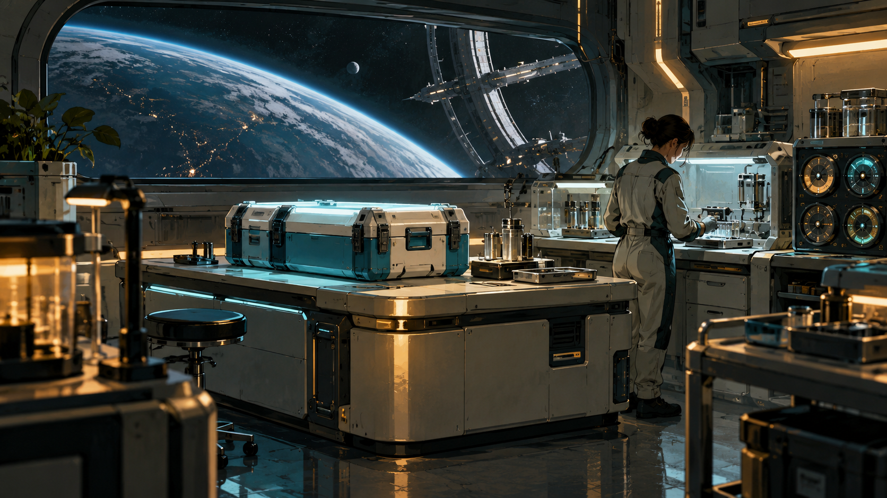

At **Veron, Galaxy 1**, Kest's next independent case concerns two clinics reporting incompatible storage conditions for the same treatment. Rowan takes the sealed reference and reads three signed refrigeration monitors at **Almadan**, leaving patient names private. At both external calibration cradles at **Envesen**, Rowan adjusts the real offsets and tests the three independent thermometer channels against the published tolerance. The apparent shortage must be distinguished from a bad reference.

The clinic crew travels to **Betaven's independent test berth**. Rowan and the arrived delegates choose **Keep independent clinic calibration references** or **Establish a shared clinical calibration service**. Separate references require their measured histories and acknowledged custody; the shared service must let each clinic stop it independently without rewriting the sample's history. The sealed original returns to Veron before **5,900 CR** and the temperature-of-silence clue close the case.

Mission flow

```mermaid
flowchart TD
  %% mission C17 | l337.measure-of-care
  C17_accept["Veron: Accept The Measure of Care at Veron."]
  C17_collect_reference["Veron: Collect the identified one-tonne reference<br/>instrument from Physicist Anja Kest."]
  C17_survey["Almadan: Read three signed refrigeration monitors<br/>without requesting patient names."]
  C17_field_work["Envesen: Run the sealed onboard reference against both<br/>external calibration cradles; adjust the actual<br/>offsets."]
  C17_independent_witness["Betaven: Verify actual safe transit and living<br/>reception of the clinic service crew to the<br/>independent test berth."]
  C17_choose_settlement{"Betaven: At the actual witness receiving station,<br/>choose the settlement with the arrived authorised<br/>operator delegates."}
  C17_return_and_audit["Veron: Return the reference instrument and confirm all<br/>physical receiving and settlement receipts."]
  C17_close_case["Veron: Confirm successful completion, the recorded<br/>settlement and the once-only fee."]
  C17_complete(["5,900 CR once; this source's clue"])
  C17_close_case --> C17_complete
  C17_return_and_audit --> C17_close_case
  C17_choose_settlement_choice_1["Keep independent clinic calibration references"]
  C17_choose_settlement --> C17_choose_settlement_choice_1
  C17_apply_settlement_choice_1["Envesen: Verify both reference calibrations and<br/>independent custody records. All 2 stated proofs are<br/>required."]
  C17_choose_settlement_choice_1 --> C17_apply_settlement_choice_1
  C17_apply_settlement_choice_1 --> C17_return_and_audit
  C17_choose_settlement_choice_2["Establish a shared clinical calibration service"]
  C17_choose_settlement --> C17_choose_settlement_choice_2
  C17_apply_settlement_choice_2["Envesen: Verify the shared service limit and each<br/>clinic's stop authority. All 2 stated proofs are<br/>required."]
  C17_choose_settlement_choice_2 --> C17_apply_settlement_choice_2
  C17_apply_settlement_choice_2 --> C17_return_and_audit
  C17_independent_witness --> C17_choose_settlement
  C17_field_work --> C17_independent_witness
  C17_survey --> C17_field_work
  C17_collect_reference --> C17_survey
  C17_accept --> C17_collect_reference
  C17_continuity_inquiry["Complete this source's independent no-cost continuity<br/>inquiry"]
  C17_continuity_trace(["Missing source clue only; original outcome and rewards<br/>unchanged"])
  C17_accept -.-> |"If this original source clue is unavailable"| C17_continuity_inquiry
  C17_continuity_inquiry --> C17_continuity_trace
```

### The Blue Reservoir

🔵 Planned

At **Bornolom, Galaxy 4**, Engineer **Cato Lerr** lends Rowan the reference for a water commons losing oxygen even though its intakes are clean. The new pump has trapped part of the living filter behind a one-way lease boundary. At **Galton**, Rowan reads inlet, oxygen and return meters. At **Bornalan**, two sealed bypass valves are opened and closed within their containment limits. The test has to preserve the total water while sustaining the required flow and oxygen.

The inspection tender reaches **Dorbogan's safe laboratory berth**. Rowan joins the arrived delegates to choose **Distribute the living filter among independent cradles** or **Create a jointly supervised reservoir**. The distributed route needs both containment/receiving records and adequate return flow. The shared route must reject an over-capacity command and allow either local stop to close the bypass safely. Rowan returns the reference to Bornolom for **7,300 CR** and the dry-current clue.

Mission flow

```mermaid
flowchart TD
  %% mission C20 | l337.blue-reservoir
  C20_accept["Bornolom: Accept The Blue Reservoir at Bornolom."]
  C20_collect_reference["Bornolom: Collect the identified one-tonne reference<br/>instrument from Engineer Cato Lerr."]
  C20_survey["Galton: Observe the three real inlet, oxygen and<br/>return meters on the closed reservoir."]
  C20_field_work["Bornalan: Open the two identified bypass locks only<br/>inside their measured containment limits."]
  C20_independent_witness["Dorbogan: Verify actual safe transit and living<br/>reception of the water-commons inspection tender to<br/>the safe laboratory berth."]
  C20_choose_settlement{"Dorbogan: At the actual witness receiving station,<br/>choose the settlement with the arrived authorised<br/>operator delegates."}
  C20_return_and_audit["Bornolom: Return the reference instrument and confirm<br/>all physical receiving and settlement receipts."]
  C20_close_case["Bornolom: Confirm successful completion, the recorded<br/>settlement and the once-only fee."]
  C20_complete(["7,300 CR once; this source's clue"])
  C20_close_case --> C20_complete
  C20_return_and_audit --> C20_close_case
  C20_choose_settlement_choice_1["Distribute the living filter among independent cradles"]
  C20_choose_settlement --> C20_choose_settlement_choice_1
  C20_apply_settlement_choice_1["Bornalan: Verify both containment receipts and<br/>balanced flow tests. All 2 stated proofs are required."]
  C20_choose_settlement_choice_1 --> C20_apply_settlement_choice_1
  C20_apply_settlement_choice_1 --> C20_return_and_audit
  C20_choose_settlement_choice_2["Create a jointly supervised reservoir"]
  C20_choose_settlement --> C20_choose_settlement_choice_2
  C20_apply_settlement_choice_2["Bornalan: Verify common circulation limits and<br/>independent shutdown authority. All 2 stated proofs<br/>are required."]
  C20_choose_settlement_choice_2 --> C20_apply_settlement_choice_2
  C20_apply_settlement_choice_2 --> C20_return_and_audit
  C20_independent_witness --> C20_choose_settlement
  C20_field_work --> C20_independent_witness
  C20_survey --> C20_field_work
  C20_collect_reference --> C20_survey
  C20_accept --> C20_collect_reference
  C20_continuity_inquiry["Complete this source's independent no-cost continuity<br/>inquiry"]
  C20_continuity_trace(["Missing source clue only; original outcome and rewards<br/>unchanged"])
  C20_accept -.-> |"If this original source clue is unavailable"| C20_continuity_inquiry
  C20_continuity_inquiry --> C20_continuity_trace
```

### A Garden in Transit

🔵 Planned

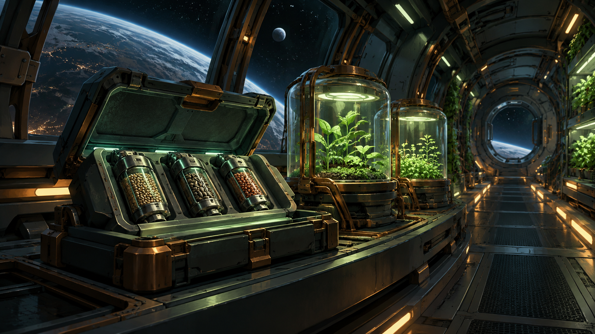

The ending lease of a seed archive brings Rowan to Custodian **Tomas Veil at Kurenash, Galaxy 7**. Two destinations want the same collection, while its growers insist that living custody must be deliberate. With the one-tonne reference aboard, Rowan observes three real receiving environments at **Zorgadek** and adjusts the isolated thermal/humidity controls at both **Vektaor** cradles. Both receiving climates have to remain stable before the live tender is routed; the tests consume no seed or reference culture.

Rowan escorts the actual seed tender to **Drelor's agreed quarantine berth**. There the choice is **Create distributed seed custody** or **Establish a shared orbital archive**. A split requires two passing cradles and the source's actual consent to that division. A shared archive must keep quarantine locked against unapproved opening while its joint custodians acknowledge access. Rowan returns the original reference to Kurenash for **6,100 CR** and the dormant-season clue.

Mission flow

```mermaid
flowchart TD
  %% mission C15 | l337.garden-in-transit
  C15_accept["Kurenash: Accept A Garden in Transit at Kurenash."]
  C15_collect_reference["Kurenash: Collect the identified one-tonne reference<br/>instrument from Custodian Tomas Veil."]
  C15_survey["Zorgadek: Observe three real receiving cradle<br/>environments under the archive consent token."]
  C15_field_work["Vektaor: Use the sealed onboard reference at both<br/>isolated cradles; run their actual thermal and<br/>humidity controls."]
  C15_independent_witness["Drelor: Escort the identified seed tender to its<br/>agreed quarantine berth."]
  C15_choose_settlement{"Drelor: At the actual witness receiving station,<br/>choose the settlement with the arrived authorised<br/>operator delegates."}
  C15_return_and_audit["Kurenash: Return the reference instrument and confirm<br/>all physical receiving and settlement receipts."]
  C15_close_case["Kurenash: Confirm successful completion, the recorded<br/>settlement and the once-only fee."]
  C15_complete(["6,100 CR once; this source's clue"])
  C15_close_case --> C15_complete
  C15_return_and_audit --> C15_close_case
  C15_choose_settlement_choice_1["Create distributed seed custody"]
  C15_choose_settlement --> C15_choose_settlement_choice_1
  C15_apply_settlement_choice_1["Vektaor: Verify two compatible climate receipts and<br/>their consented custody split. All 2 stated proofs are<br/>required."]
  C15_choose_settlement_choice_1 --> C15_apply_settlement_choice_1
  C15_apply_settlement_choice_1 --> C15_return_and_audit
  C15_choose_settlement_choice_2["Establish a shared orbital archive"]
  C15_choose_settlement --> C15_choose_settlement_choice_2
  C15_apply_settlement_choice_2["Vektaor: Verify the common quarantine lock and joint<br/>access charter. All 2 stated proofs are required."]
  C15_choose_settlement_choice_2 --> C15_apply_settlement_choice_2
  C15_apply_settlement_choice_2 --> C15_return_and_audit
  C15_independent_witness --> C15_choose_settlement
  C15_field_work --> C15_independent_witness
  C15_survey --> C15_field_work
  C15_collect_reference --> C15_survey
  C15_accept --> C15_collect_reference
  C15_continuity_inquiry["Complete this source's independent no-cost continuity<br/>inquiry"]
  C15_continuity_trace(["Missing source clue only; original outcome and rewards<br/>unchanged"])
  C15_accept -.-> |"If this original source clue is unavailable"| C15_continuity_inquiry
  C15_continuity_inquiry --> C15_continuity_trace
```

## Open Harbours

Borrowed Dawn, Harbour Without Orders, Mutual Shelter and An Assembly of Orbits form a recommended route through disputes over shared light, safe arrival and representation. Rowan can encounter them independently. Their eventual anthology reward is an **Approach Coordinator** 🟣 Gap for the docking computer, showing genuinely granted windows and real clearance limits.

### Borrowed Dawn

🔵 Planned

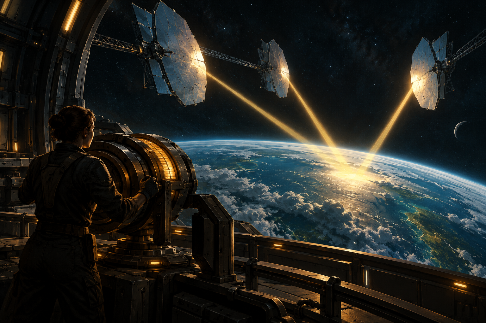

After an ordinary trade at **Zannekor, Galaxy 2**, Controller **Edda Rell** lends Rowan the reference for three homes dependent on an expired reflector lease. Automatic parking will leave one cold and another overheated. Rowan observes each real photometer and the moving sweep at **Varratar**, then steers the source-owned reflectors and latches both actuator travel stops at **Durkaesh**. The illumination stop and thermal trip have to work during the commanded sweep.

The mirror crew's actual journey ends at **Vorvan's shadow-side berth**. Rowan chooses with the arrived delegates between **Give each habitat its own bounded reflector segment** and **Publish a joint illumination rota**. The first must reject over-travel and provide each owner a separate limit record; the second allocates actual sweep intervals and proves the overheat shutter trips. Returning the reference to Zannekor settles **6,800 CR** and the unlit-interval clue.

Mission flow

```mermaid
flowchart TD
  %% mission C10 | l337.borrowed-dawn
  C10_accept["Zannekor: Accept Borrowed Dawn at Zannekor."]
  C10_collect_reference["Zannekor: Collect the identified one-tonne reference<br/>instrument from Controller Edda Rell."]
  C10_survey["Varratar: Observe each habitat photometer and the<br/>reflector sweep, rather than measuring a stationary<br/>map marker."]
  C10_field_work["Durkaesh: Latch two actuator travel stops at their<br/>marked limits and run the commanded bounded sweep."]
  C10_independent_witness["Vorvan: Verify actual safe transit and living<br/>reception of the identified mirror crew to the<br/>shadow-side service berth."]
  C10_choose_settlement{"Vorvan: At the actual witness receiving station,<br/>choose the settlement with the arrived authorised<br/>operator delegates."}
  C10_return_and_audit["Zannekor: Return the reference instrument and confirm<br/>all physical receiving and settlement receipts."]
  C10_close_case["Zannekor: Confirm successful completion, the recorded<br/>settlement and the once-only fee."]
  C10_complete(["6,800 CR once; this source's clue"])
  C10_close_case --> C10_complete
  C10_return_and_audit --> C10_close_case
  C10_choose_settlement_choice_1["Give each habitat its own bounded reflector segment"]
  C10_choose_settlement --> C10_choose_settlement_choice_1
  C10_apply_settlement_choice_1["Durkaesh: Test independent segment stops and receive<br/>both habitat approvals. All 2 stated proofs are<br/>required."]
  C10_choose_settlement_choice_1 --> C10_apply_settlement_choice_1
  C10_apply_settlement_choice_1 --> C10_return_and_audit
  C10_choose_settlement_choice_2["Publish a joint illumination rota"]
  C10_choose_settlement --> C10_choose_settlement_choice_2
  C10_apply_settlement_choice_2["Durkaesh: Verify the signed rota and its physical<br/>over-temperature cutoff. All 2 stated proofs are<br/>required."]
  C10_choose_settlement_choice_2 --> C10_apply_settlement_choice_2
  C10_apply_settlement_choice_2 --> C10_return_and_audit
  C10_independent_witness --> C10_choose_settlement
  C10_field_work --> C10_independent_witness
  C10_survey --> C10_field_work
  C10_collect_reference --> C10_survey
  C10_accept --> C10_collect_reference
  C10_continuity_inquiry["Complete this source's independent no-cost continuity<br/>inquiry"]
  C10_continuity_trace(["Missing source clue only; original outcome and rewards<br/>unchanged"])
  C10_accept -.-> |"If this original source clue is unavailable"| C10_continuity_inquiry
  C10_continuity_inquiry --> C10_continuity_trace
```

### Harbour Without Orders

🔵 Planned

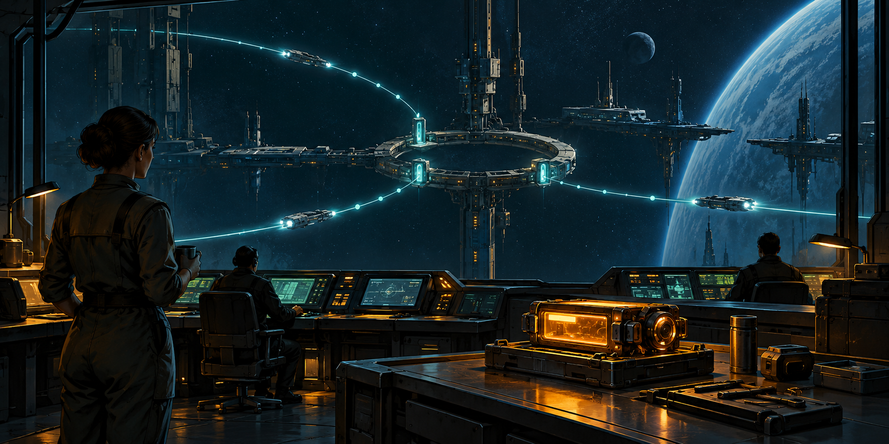

At **Gallodor, Galaxy 4**, Rell's independent harbour case follows an ordinary trade. A maintenance dispute has left the arrival allocator without valid signing authority. Every berth refuses every ship, although no attack is under way. With the loaned reference, Rowan compares the actual refusal signatures and one-berth capacity at **Ombolom**. At **Emdor**, two identified test requests are submitted together to the real allocator. The losing lease must be revoked while mutual exclusion is physically proved.

The neutral traffic witness arrives at **Emron's emergency berth**. Rowan and the arrived delegates choose **Return authority to independent berth operators** or **Create a time-limited public harbour office**. Independent keys must resolve competing requests without granting one berth twice. The temporary office must expire only its own test grant while preserving genuinely occupied berths. The reference returns to Gallodor for **7,600 CR** and the unsigned-berth clue.

Mission flow

```mermaid
flowchart TD
  %% mission C12 | l337.harbour-without-orders
  C12_accept["Gallodor: Accept Harbour Without Orders at Gallodor."]
  C12_collect_reference["Gallodor: Collect the identified one-tonne reference<br/>instrument from Controller Edda Rell."]
  C12_survey["Ombolom: Read each real allocator refusal signature<br/>and compare it with its current one-berth capacity."]
  C12_field_work["Emdor: Arm two external approach relays, then submit<br/>the two identified test requests together."]
  C12_independent_witness["Emron: Verify actual safe transit and living reception<br/>of the neutral traffic witness to the emergency<br/>receiving berth."]
  C12_choose_settlement{"Emron: At the actual witness receiving station, choose<br/>the settlement with the arrived authorised operator<br/>delegates."}
  C12_return_and_audit["Gallodor: Return the reference instrument and confirm<br/>all physical receiving and settlement receipts."]
  C12_close_case["Gallodor: Confirm successful completion, the recorded<br/>settlement and the once-only fee."]
  C12_complete(["7,600 CR once; this source's clue"])
  C12_close_case --> C12_complete
  C12_return_and_audit --> C12_close_case
  C12_choose_settlement_choice_1["Return authority to independent berth operators"]
  C12_choose_settlement --> C12_choose_settlement_choice_1
  C12_apply_settlement_choice_1["Emdor: Verify two operator keys and a conflict-free<br/>simultaneous approach test. All 2 stated proofs are<br/>required."]
  C12_choose_settlement_choice_1 --> C12_apply_settlement_choice_1
  C12_apply_settlement_choice_1 --> C12_return_and_audit
  C12_choose_settlement_choice_2["Create a time-limited public harbour office"]
  C12_choose_settlement --> C12_choose_settlement_choice_2
  C12_apply_settlement_choice_2["Emdor: Verify the public key register and its<br/>automatic authority expiry. All 2 stated proofs are<br/>required."]
  C12_choose_settlement_choice_2 --> C12_apply_settlement_choice_2
  C12_apply_settlement_choice_2 --> C12_return_and_audit
  C12_independent_witness --> C12_choose_settlement
  C12_field_work --> C12_independent_witness
  C12_survey --> C12_field_work
  C12_collect_reference --> C12_survey
  C12_accept --> C12_collect_reference
  C12_continuity_inquiry["Complete this source's independent no-cost continuity<br/>inquiry"]
  C12_continuity_trace(["Missing source clue only; original outcome and rewards<br/>unchanged"])
  C12_accept -.-> |"If this original source clue is unavailable"| C12_continuity_inquiry
  C12_continuity_inquiry --> C12_continuity_trace
```

### Mutual Shelter

🔵 Planned

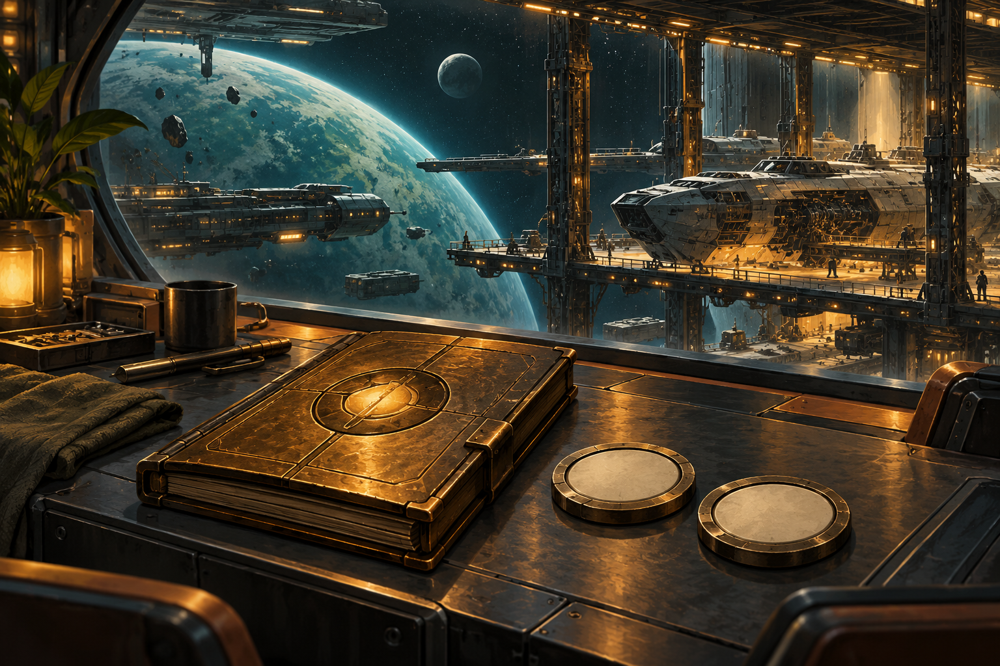

At **Ashoes, Galaxy 5**, Nia Toren lends Rowan the reference for a mutual that has insured more shelter than its docks can hold. The legal claim on a disabled hauler exposes the shortfall. Three claim registers at **Voron** have to be compared with **two real emergency berths**. At **Ranues**, Rowan reserves those two places, presents the third competing claim and witnesses its honest refusal before releasing a real reservation.

The original cooperative hauler and its crew must reach **Peloen's verified repair berth**. There Rowan chooses **Pool member-funded emergency capacity** or **Bond independent shelter obligations** with the arrived delegates. The pooled ledger must fund both actual grants and protect occupied allocations from withdrawal; independent providers must present real funded bonds and complete the receiving drill. Rowan returns the reference to Ashoes for **7,100 CR** and the ownerless-reserve clue.

Mission flow

```mermaid
flowchart TD
  %% mission C21 | l337.mutual-shelter
  C21_accept["Ashoes: Accept Mutual Shelter at Ashoes."]
  C21_collect_reference["Ashoes: Collect the identified one-tonne reference<br/>instrument from Nia Toren."]
  C21_survey["Voron: Measure three actual claim registers against<br/>the two physical emergency berths."]
  C21_field_work["Ranues: Reserve the two real berths and present the<br/>third test claim without occupying an imaginary slot."]
  C21_independent_witness["Peloen: Verify actual safe transit and living<br/>reception of the disabled cooperative hauler to its<br/>verified repair berth."]
  C21_choose_settlement{"Peloen: At the actual witness receiving station,<br/>choose the settlement with the arrived authorised<br/>operator delegates."}
  C21_return_and_audit["Ashoes: Return the reference instrument and confirm<br/>all physical receiving and settlement receipts."]
  C21_close_case["Ashoes: Confirm successful completion, the recorded<br/>settlement and the once-only fee."]
  C21_complete(["7,100 CR once; this source's clue"])
  C21_close_case --> C21_complete
  C21_return_and_audit --> C21_close_case
  C21_choose_settlement_choice_1["Pool member-funded emergency capacity"]
  C21_choose_settlement --> C21_choose_settlement_choice_1
  C21_apply_settlement_choice_1["Ranues: Verify the real reserve ledger and member<br/>withdrawal limits. All 2 stated proofs are required."]
  C21_choose_settlement_choice_1 --> C21_apply_settlement_choice_1
  C21_apply_settlement_choice_1 --> C21_return_and_audit
  C21_choose_settlement_choice_2["Bond independent shelter obligations"]
  C21_choose_settlement --> C21_choose_settlement_choice_2
  C21_apply_settlement_choice_2["Ranues: Verify each provider's berth bond and an<br/>actual receiving drill. All 2 stated proofs are<br/>required."]
  C21_choose_settlement_choice_2 --> C21_apply_settlement_choice_2
  C21_apply_settlement_choice_2 --> C21_return_and_audit
  C21_independent_witness --> C21_choose_settlement
  C21_field_work --> C21_independent_witness
  C21_survey --> C21_field_work
  C21_collect_reference --> C21_survey
  C21_accept --> C21_collect_reference
  C21_continuity_inquiry["Complete this source's independent no-cost continuity<br/>inquiry"]
  C21_continuity_trace(["Missing source clue only; original outcome and rewards<br/>unchanged"])
  C21_accept -.-> |"If this original source clue is unavailable"| C21_continuity_inquiry
  C21_continuity_inquiry --> C21_continuity_trace
```

### An Assembly of Orbits

🟡 Partial

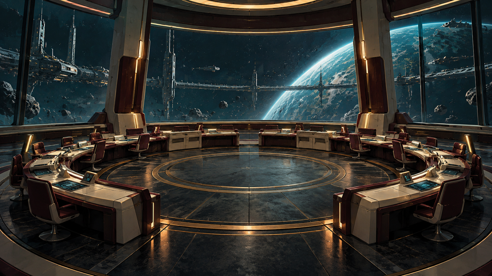

At **Irkenan, Galaxy 7**, Marshal Voss's reference supports a dispute over a single transfer corridor. Old voting records count property shares but omit the working crews. Rowan reads three consented occupancy/work registers at **Darik**, then uses the assembly console for both independent capacity tests at **Brekudek**. Five proposals compete for **four physical corridor slots**, with one slot protected as free capacity. A signed form cannot create another slot.

The consenting delegate tender travels to **Kagakon's neutral assembly berth**. Rowan and the arrived operators choose **Rotate corridor stewardship among working crews** or **Use bounded public berth representation**. The rotation has to name the three working crews and limit each stop right to its own movement. The public register must reject excess capacity claims while preserving the protected slot. The loan returns to Irkenan before **7,700 CR** and the absent-seat clue are recorded.

Mission flow

```mermaid
flowchart TD
  %% mission C23 | l337.assembly-of-orbits
  C23_accept["Irkenan: Accept An Assembly of Orbits at Irkenan."]
  C23_collect_reference["Irkenan: Collect the identified one-tonne reference<br/>instrument from Marshal Nera Voss."]
  C23_survey["Darik: Compare three consented occupancy/work<br/>registers with real corridor-slot use."]
  C23_field_work["Brekudek: Run two independent capacity tests with the<br/>onboard assembly console; submit all five identified<br/>proposals."]
  C23_independent_witness["Kagakon: Verify actual safe transit and living<br/>reception of the consenting delegate tender to the<br/>neutral assembly berth."]
  C23_choose_settlement{"Kagakon: At the actual witness receiving station,<br/>choose the settlement with the arrived authorised<br/>operator delegates."}
  C23_return_and_audit["Irkenan: Return the reference instrument and confirm<br/>all physical receiving and settlement receipts."]
  C23_close_case["Irkenan: Confirm successful completion, the recorded<br/>settlement and the once-only fee."]
  C23_complete(["7,700 CR once; this source's clue"])
  C23_close_case --> C23_complete
  C23_return_and_audit --> C23_close_case
  C23_choose_settlement_choice_1["Rotate corridor stewardship among working crews"]
  C23_choose_settlement --> C23_choose_settlement_choice_1
  C23_apply_settlement_choice_1["Brekudek: Verify the rota and each crew's stop<br/>authority. All 2 stated proofs are required."]
  C23_choose_settlement_choice_1 --> C23_apply_settlement_choice_1
  C23_apply_settlement_choice_1 --> C23_return_and_audit
  C23_choose_settlement_choice_2["Use bounded public berth representation"]
  C23_choose_settlement --> C23_choose_settlement_choice_2
  C23_apply_settlement_choice_2["Brekudek: Verify the published representation register<br/>and capacity cap. All 2 stated proofs are required."]
  C23_choose_settlement_choice_2 --> C23_apply_settlement_choice_2
  C23_apply_settlement_choice_2 --> C23_return_and_audit
  C23_independent_witness --> C23_choose_settlement
  C23_field_work --> C23_independent_witness
  C23_survey --> C23_field_work
  C23_collect_reference --> C23_survey
  C23_accept --> C23_collect_reference
  C23_continuity_inquiry["Complete this source's independent no-cost continuity<br/>inquiry"]
  C23_continuity_trace(["Missing source clue only; original outcome and rewards<br/>unchanged"])
  C23_accept -.-> |"If this original source clue is unavailable"| C23_continuity_inquiry
  C23_continuity_inquiry --> C23_continuity_trace
```

## Safe Passage

The Borrowed Voice, The Open Shadow, The Passenger's Horizon, The Kind Distance and The Witness Window make a recommended rescue-and-privacy anthology. Rowan's recurring responsibility is to protect a person's choices as carefully as their arrival. The intended earned **Rescue Guidance** module 🟣 Gap assists lawful identified capsule recovery within the real approach and scoop envelope.

### The Borrowed Voice

🟡 Partial

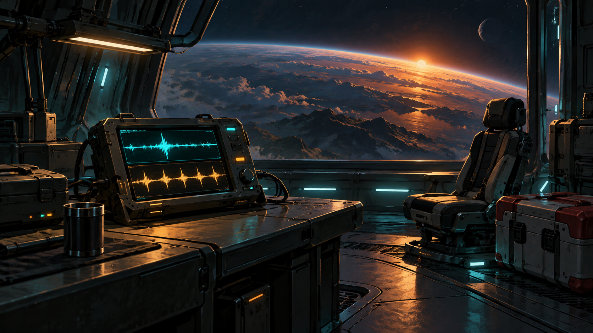

After five distinct system visits, Rowan meets rescue coordinator **Sera Dain at Taledea, Galaxy 3**. Empty distress calls are diverting rescue tenders while real casualties wait. Rowan compares the three beacons with their local casualty sensors at **Ilasaeli**, then collects **Ivo Renn's one-tonne independent verifier at Noserin**. A private rescue terminal lets Dispatcher **Neris Sol** describe the duplicate enrollment that was made under a dispatcher's credentials. Rowan escorts Sol's actual marked ship from the refuge to Noserin reception.

Back at Taledea, Rowan chooses **Revoke the compromised key openly** or **Identify the observer with an empty decoy**. The selected operation at Ilasaeli must yield its own authenticated access proof; the decoy is empty, protecting the witness from being used as bait. At **Aiven**, Renn receives the same verifier and authenticated record. Rowan then rekeys all three marked rescue beacons at Ilasaeli and proves the clean service test before returning to Taledea for **7,200 CR** and the unclaimed-channel clue. The region remembers the open-revocation or protected-witness outcome.

Mission flow

```mermaid
flowchart TD
  %% mission C04 | l337.borrowed-voice
  C04_accept["Taledea: Accept the rescue-channel investigation at<br/>Taledea."]
  C04_verify_distress["Ilasaeli: Compare the three marked distress beacons<br/>with their local casualty sensors at Ilasaeli."]
  C04_collect_verifier["Noserin: Dock at Noserin and collect Ivo Renn's<br/>one-tonne independent verifier."]
  C04_meet_dispatcher["Noserin: At Noserin, use the private rescue terminal<br/>to confirm Neris Sol's account of the duplicate<br/>enrollment."]
  C04_protect_dispatcher["Noserin: Escort Sol's marked Harrier from the<br/>maintenance refuge to Noserin station."]
  C04_choose_operation{"Taledea: Return to Taledea and choose how to isolate<br/>the infiltrating operator."}
  C04_audit_access["Aiven: Dock at Aiven and return the verifier with the<br/>authenticated record to Ivo Renn."]
  C04_restore_channels["Ilasaeli: Rekey the three marked rescue beacons at<br/>Ilasaeli and confirm a clean service test."]
  C04_close_case["Taledea: Dock at Taledea, confirm the restored rescue<br/>network and collect the agreed fee."]
  C04_complete(["7,200 CR once; this source's clue"])
  C04_close_case --> C04_complete
  C04_restore_channels --> C04_close_case
  C04_audit_access --> C04_restore_channels
  C04_choose_operation_choice_1["Revoke the compromised key openly"]
  C04_choose_operation --> C04_choose_operation_choice_1
  C04_intercept_orders_choice_1["Ilasaeli: Confirm key revocation at the Ilasaeli<br/>rescue relay, then use the verifier to download its<br/>frozen signed audit. All 2 stated proofs are required."]
  C04_choose_operation_choice_1 --> C04_intercept_orders_choice_1
  C04_intercept_orders_choice_1 --> C04_audit_access
  C04_choose_operation_choice_2["Identify the observer with an empty decoy"]
  C04_choose_operation --> C04_choose_operation_choice_2
  C04_intercept_orders_choice_2["Ilasaeli: Arm the empty decoy beacon, then retrieve<br/>the observer's signed handshake from the passive<br/>receiver at Ilasaeli. All 2 stated proofs are<br/>required."]
  C04_choose_operation_choice_2 --> C04_intercept_orders_choice_2
  C04_intercept_orders_choice_2 --> C04_audit_access
  C04_protect_dispatcher --> C04_choose_operation
  C04_meet_dispatcher --> C04_protect_dispatcher
  C04_collect_verifier --> C04_meet_dispatcher
  C04_verify_distress --> C04_collect_verifier
  C04_accept --> C04_verify_distress
  C04_continuity_inquiry["Complete this source's independent no-cost continuity<br/>inquiry"]
  C04_continuity_trace(["Missing source clue only; original outcome and rewards<br/>unchanged"])
  C04_accept -.-> |"If this original source clue is unavailable"| C04_continuity_inquiry
  C04_continuity_inquiry --> C04_continuity_trace
  C04_recover_sol["Actual station rescue tug recovers living Sol and<br/>returns her to the refuge"]
  C04_protect_dispatcher -.-> |"If the marked ship is lost and the stated rescue<br/>succeeds"| C04_recover_sol
  C04_recover_sol -.-> |"Resume the protected extraction"| C04_protect_dispatcher
```

### The Open Shadow

🔵 Planned

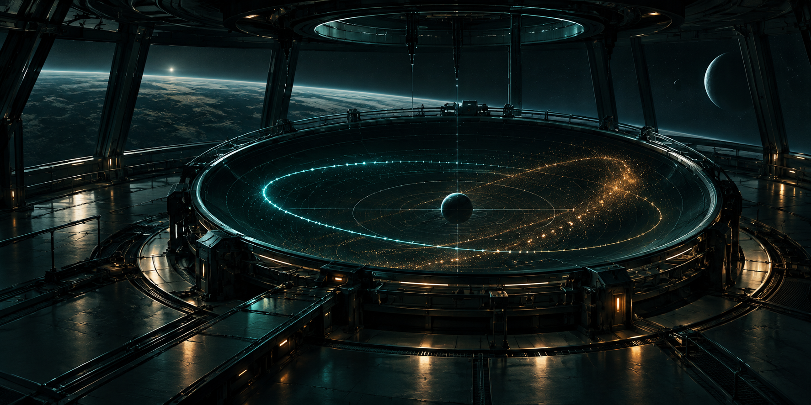

At **Oralaora, Galaxy 3**, Mara Vale's reference helps Rowan investigate a privacy update that hides collision warnings along with identities. After the ordinary-trade prerequisite, Rowan observes three cooperative senders at **Elavaeth**, recording warnings separately from private fields. At **Oravaessa**, the independent receiver is connected to both actual safety couplers. The volunteer tender makes three real crossing passes, then Rowan guides it through the measured corridor to **Maidea**.

With the arrived delegates, the choice is **Publish anonymous collision telemetry** or **Use a witnessed identity escrow with a safety channel**. All three passes must retain warnings while the anonymous output contains no identity fields, or while the witnessed escrow keeps those fields private. Rowan returns the reference to Oralaora for **7,400 CR** and the shadow-with-no-hull clue. Safety and privacy are tested as separate channels.

Mission flow

```mermaid
flowchart TD
  %% mission C11 | l337.open-shadow
  C11_accept["Oralaora: Accept The Open Shadow at Oralaora."]
  C11_collect_reference["Oralaora: Collect the identified one-tonne reference<br/>instrument from Agent Mara Vale."]
  C11_survey["Elavaeth: Observe three cooperative calibration<br/>senders; record collision warnings separately from<br/>private identity fields."]
  C11_field_work["Oravaessa: Connect the onboard reference receiver to<br/>each external safety-channel coupler and run three<br/>actual test passes."]
  C11_independent_witness["Maidea: Guide the volunteer test tender through the<br/>measured crossing corridor."]
  C11_choose_settlement{"Maidea: At the actual witness receiving station,<br/>choose the settlement with the arrived authorised<br/>operator delegates."}
  C11_return_and_audit["Oralaora: Return the reference instrument and confirm<br/>all physical receiving and settlement receipts."]
  C11_close_case["Oralaora: Confirm successful completion, the recorded<br/>settlement and the once-only fee."]
  C11_complete(["7,400 CR once; this source's clue"])
  C11_close_case --> C11_complete
  C11_return_and_audit --> C11_close_case
  C11_choose_settlement_choice_1["Publish anonymous collision telemetry"]
  C11_choose_settlement --> C11_choose_settlement_choice_1
  C11_apply_settlement_choice_1["Oravaessa: Verify the anonymous broadcast and<br/>independent close-pass warning. All 2 stated proofs<br/>are required."]
  C11_choose_settlement_choice_1 --> C11_apply_settlement_choice_1
  C11_apply_settlement_choice_1 --> C11_return_and_audit
  C11_choose_settlement_choice_2["Use a witnessed identity escrow with a safety channel"]
  C11_choose_settlement --> C11_choose_settlement_choice_2
  C11_apply_settlement_choice_2["Oravaessa: Verify the escrow witness and continuously<br/>open collision channel. All 2 stated proofs are<br/>required."]
  C11_choose_settlement_choice_2 --> C11_apply_settlement_choice_2
  C11_apply_settlement_choice_2 --> C11_return_and_audit
  C11_independent_witness --> C11_choose_settlement
  C11_field_work --> C11_independent_witness
  C11_survey --> C11_field_work
  C11_collect_reference --> C11_survey
  C11_accept --> C11_collect_reference
  C11_continuity_inquiry["Complete this source's independent no-cost continuity<br/>inquiry"]
  C11_continuity_trace(["Missing source clue only; original outcome and rewards<br/>unchanged"])
  C11_accept -.-> |"If this original source clue is unavailable"| C11_continuity_inquiry
  C11_continuity_inquiry --> C11_continuity_trace
```

### The Passenger's Horizon

🔵 Planned

At **Aelara, Galaxy 6**, Captain **Orin Sorel** lends Rowan the reference after a trade. A scenic cooperative's standard form excludes travellers whose access needs differ from it. Rowan examines three actual sites at **Izaeth** against the **two volunteers' declared needs**. At **Evanieri**, directional controls adjust both boarding/viewing interfaces while the source-owned empty test chair and consenting volunteers test clearance, sightline and independent stop controls.

The assessment tender must reach **Noaliena's independently verified berth**. Rowan and the arrived delegates choose **Provide adaptable shared journey cabins** or **Guarantee individual accessible journey slots**. The shared fit must pass both needs and receive each volunteer's separate itinerary consent. Individual allocations must reserve genuinely compatible places and verify the viewing stop while preserving the right not to join. The reference returns to Aelara for **7,500 CR** and the horizon-without-a-world clue.

Mission flow

```mermaid
flowchart TD
  %% mission C30 | l337.passengers-horizon
  C30_accept["Aelara: Accept The Passenger's Horizon at Aelara."]
  C30_collect_reference["Aelara: Collect the identified one-tonne reference<br/>instrument from Captain Orin Sorel."]
  C30_survey["Izaeth: Observe three orbital sites against the two<br/>volunteers real declared access needs."]
  C30_field_work["Evanieri: Test both actual boarding/viewing interfaces<br/>with the onboard access console and the source-owned<br/>empty test chair."]
  C30_independent_witness["Noaliena: Verify actual safe transit and living<br/>reception of the consenting assessment tender to its<br/>independently verified berth."]
  C30_choose_settlement{"Noaliena: At the actual witness receiving station,<br/>choose the settlement with the arrived authorised<br/>operator delegates."}
  C30_return_and_audit["Aelara: Return the reference instrument and confirm<br/>all physical receiving and settlement receipts."]
  C30_close_case["Aelara: Confirm successful completion, the recorded<br/>settlement and the once-only fee."]
  C30_complete(["7,500 CR once; this source's clue"])
  C30_close_case --> C30_complete
  C30_return_and_audit --> C30_close_case
  C30_choose_settlement_choice_1["Provide adaptable shared journey cabins"]
  C30_choose_settlement --> C30_choose_settlement_choice_1
  C30_apply_settlement_choice_1["Evanieri: Verify compatible fittings and each<br/>traveller's independent consent. All 2 stated proofs<br/>are required."]
  C30_choose_settlement_choice_1 --> C30_apply_settlement_choice_1
  C30_apply_settlement_choice_1 --> C30_return_and_audit
  C30_choose_settlement_choice_2["Guarantee individual accessible journey slots"]
  C30_choose_settlement --> C30_choose_settlement_choice_2
  C30_apply_settlement_choice_2["Evanieri: Verify reserved capacity and the safe<br/>receiving itinerary. All 2 stated proofs are required."]
  C30_choose_settlement_choice_2 --> C30_apply_settlement_choice_2
  C30_apply_settlement_choice_2 --> C30_return_and_audit
  C30_independent_witness --> C30_choose_settlement
  C30_field_work --> C30_independent_witness
  C30_survey --> C30_field_work
  C30_collect_reference --> C30_survey
  C30_accept --> C30_collect_reference
  C30_continuity_inquiry["Complete this source's independent no-cost continuity<br/>inquiry"]
  C30_continuity_trace(["Missing source clue only; original outcome and rewards<br/>unchanged"])
  C30_accept -.-> |"If this original source clue is unavailable"| C30_continuity_inquiry
  C30_continuity_inquiry --> C30_continuity_trace
```

### The Kind Distance

🔵 Planned

At **Ravgakon, Galaxy 7**, Neris Sol's reference supports two separated households who want contact but disagree over disclosure of their locations. Rowan has completed an ordinary trade before taking the case. Three private reply relays at **Rakdek** are tested without requesting addresses. At **Ravvaesh**, two independent invitation exchanges pass through the passive receiver; Rowan revokes a live reply lease and checks that the old invitation no longer works.

The consenting relay custodian reaches the privacy hearing at **Zoraresh**. Rowan chooses **Use an anonymous shared reply relay** or **Issue individually revocable invitations** with the arrived delegates. Both households must control their own withdrawal in the shared route. The individual route must reject expired invitation replays. The households can decline a meeting in either ending. Rowan returns the reference to Ravgakon for **5,600 CR** and the reply-with-no-sender clue.

Mission flow

```mermaid
flowchart TD
  %% mission C31 | l337.kind-distance
  C31_accept["Ravgakon: Accept The Kind Distance at Ravgakon."]
  C31_collect_reference["Ravgakon: Collect the identified one-tonne reference<br/>instrument from Dispatcher Neris Sol."]
  C31_survey["Rakdek: Test three actual private reply relays without<br/>requesting household address disclosure."]
  C31_field_work["Ravvaesh: Run two distinct challenge/reply exchanges<br/>through the onboard passive receiver and revoke one<br/>test invitation."]
  C31_independent_witness["Zoraresh: Verify actual safe transit and living<br/>reception of the consenting relay custodian to the<br/>independent privacy hearing berth."]
  C31_choose_settlement{"Zoraresh: At the actual witness receiving station,<br/>choose the settlement with the arrived authorised<br/>operator delegates."}
  C31_return_and_audit["Ravgakon: Return the reference instrument and confirm<br/>all physical receiving and settlement receipts."]
  C31_close_case["Ravgakon: Confirm successful completion, the recorded<br/>settlement and the once-only fee."]
  C31_complete(["5,600 CR once; this source's clue"])
  C31_close_case --> C31_complete
  C31_return_and_audit --> C31_close_case
  C31_choose_settlement_choice_1["Use an anonymous shared reply relay"]
  C31_choose_settlement --> C31_choose_settlement_choice_1
  C31_apply_settlement_choice_1["Ravvaesh: Verify independent revocation and a<br/>consented reply receipt. All 2 stated proofs are<br/>required."]
  C31_choose_settlement_choice_1 --> C31_apply_settlement_choice_1
  C31_apply_settlement_choice_1 --> C31_return_and_audit
  C31_choose_settlement_choice_2["Issue individually revocable invitations"]
  C31_choose_settlement --> C31_choose_settlement_choice_2
  C31_apply_settlement_choice_2["Ravvaesh: Verify both invitation controls and their<br/>expiry test. All 2 stated proofs are required."]
  C31_choose_settlement_choice_2 --> C31_apply_settlement_choice_2
  C31_apply_settlement_choice_2 --> C31_return_and_audit
  C31_independent_witness --> C31_choose_settlement
  C31_field_work --> C31_independent_witness
  C31_survey --> C31_field_work
  C31_collect_reference --> C31_survey
  C31_accept --> C31_collect_reference
  C31_continuity_inquiry["Complete this source's independent no-cost continuity<br/>inquiry"]
  C31_continuity_trace(["Missing source clue only; original outcome and rewards<br/>unchanged"])
  C31_accept -.-> |"If this original source clue is unavailable"| C31_continuity_inquiry
  C31_continuity_inquiry --> C31_continuity_trace
```

### The Witness Window

🔵 Planned

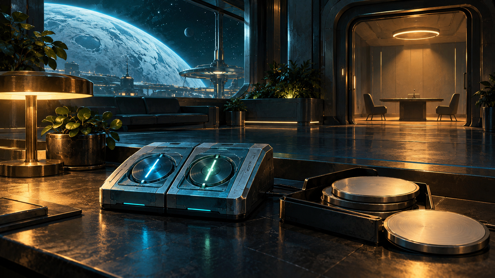

At **Fonogom, Galaxy 4**, Rowan verifies an existing witness-consented preservation hold before accepting Dain's inquiry and reference after a trade. A shift worker recorded an avoidable docking injury, and the original recording would otherwise have reached routine privacy expiry. The preservation order keeps the evidence while the worker retains control of future testimony.

Rowan reads three authorised copy receipts at **Anlanom** without exposing the witness's location. At **Borbovar**, both independent custody keys face their actual challenge-packet tests. The witness tender reaches the protected hearing berth at **Bogolan**, where Rowan and the arrived delegates choose **Keep testimony in an independently witnessed sealed archive** or **Publish an anonymised safety finding**.

Both custody principals must sign the sealed archive, preserving the witness's right to revoke later disclosure while retaining the inquiry record. The public route must contain no private fields and prove that the corrected docking procedure rejects the recorded unsafe allocation. Rowan returns the verifier to Fonogom for **8,100 CR** and the frame-nobody-recorded clue.

Mission flow

```mermaid
flowchart TD
  %% mission C36 | l337.witness-window
  C36_accept["Fonogom: Accept The Witness Window at Fonogom. Verify<br/>the existing consented preservation-hold receipt<br/>before accepting."]
  C36_collect_reference["Fonogom: Collect the identified one-tonne reference<br/>instrument from Coordinator Sera Dain."]
  C36_survey["Anlanom: Read three authorised copy receipts without<br/>exposing the witness location; verify the<br/>preservation-hold identity."]
  C36_field_work["Borbovar: Verify the two actual independent custody<br/>keys using the onboard witness verifier, then replay<br/>both challenge packets."]
  C36_independent_witness["Bogolan: Verify actual safe transit and living<br/>reception of the consenting witness tender to the<br/>protected hearing berth."]
  C36_choose_settlement{"Bogolan: At the actual witness receiving station,<br/>choose the settlement with the arrived authorised<br/>operator delegates."}
  C36_return_and_audit["Fonogom: Return the reference instrument and confirm<br/>all physical receiving and settlement receipts."]
  C36_close_case["Fonogom: Confirm successful completion, the recorded<br/>settlement and the once-only fee."]
  C36_complete(["8,100 CR once; this source's clue"])
  C36_close_case --> C36_complete
  C36_return_and_audit --> C36_close_case
  C36_choose_settlement_choice_1["Keep testimony in an independently witnessed sealed<br/>archive"]
  C36_choose_settlement --> C36_choose_settlement_choice_1
  C36_apply_settlement_choice_1["Borbovar: Verify both custody signatures and the<br/>witness's revocation control. All 2 stated proofs are<br/>required."]
  C36_choose_settlement_choice_1 --> C36_apply_settlement_choice_1
  C36_apply_settlement_choice_1 --> C36_return_and_audit
  C36_choose_settlement_choice_2["Publish an anonymised safety finding"]
  C36_choose_settlement --> C36_choose_settlement_choice_2
  C36_apply_settlement_choice_2["Borbovar: Verify the anonymisation audit and corrected<br/>docking procedure. All 2 stated proofs are required."]
  C36_choose_settlement_choice_2 --> C36_apply_settlement_choice_2
  C36_apply_settlement_choice_2 --> C36_return_and_audit
  C36_independent_witness --> C36_choose_settlement
  C36_field_work --> C36_independent_witness
  C36_survey --> C36_field_work
  C36_collect_reference --> C36_survey
  C36_accept --> C36_collect_reference
  C36_continuity_inquiry["Complete this source's independent no-cost continuity<br/>inquiry"]
  C36_continuity_trace(["Missing source clue only; original outcome and rewards<br/>unchanged"])
  C36_accept -.-> |"If this original source clue is unavailable"| C36_continuity_inquiry
  C36_continuity_inquiry --> C36_continuity_trace
```

## Beyond the Map

The Unfinished Map, The Memory Atlas, The Honest Circuit, Open Measure and The Guiding Light form a recommended exploration-and-piloting anthology. Its cases remain independently available after their stated preparation. Rowan's earned **Survey Array** and consented **Annotated Atlas** 🟣 Gap preserve actual measured tracks, age, uncertainty and contributions; they do not reveal the hidden end of the main mystery.

### The Unfinished Map

🔵 Planned

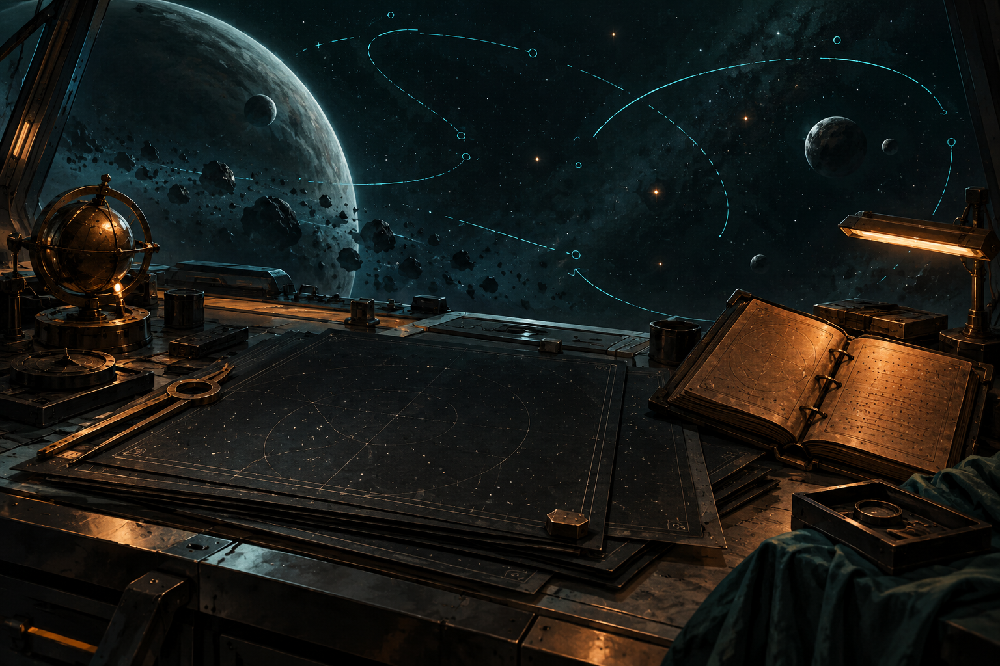

At **Sareith, Galaxy 3**, Mara Vale lends Rowan the reference after a trade. A dead surveyor's incomplete archive is being sold as a complete safe-navigation map. Rowan collects authorised copies through the ordinary visible receivers, records three separately dated boundary archives at **Iosaira** and keeps their unmeasured portions explicitly unknown. At **Sanaena**, separated physical baselines and the two actual boundary measurements establish the real uncertainty envelope.

The archive custodian reaches **Naleara's publication berth**. Rowan chooses **Publish a bounded atlas with explicit gaps** or **Preserve a witnessed research archive** with the arrived delegates. The public route needs the measured uncertainty layer and signed public-use permission. The restricted route needs real archive receiving and a public hazard notice limited to independently measured hazards. Rowan returns the reference to Sareith for **6,900 CR** and the margin-beyond-the-map clue. The deceased surveyor is not replaced to fill an evidential gap.

Mission flow

```mermaid
flowchart TD
  %% mission C19 | l337.unfinished-map
  C19_accept["Sareith: Accept The Unfinished Map at Sareith."]
  C19_collect_reference["Sareith: Collect the identified one-tonne reference<br/>instrument from Agent Mara Vale."]
  C19_survey["Iosaira: Record three separately dated boundary<br/>archives; preserve their unmeasured portions."]
  C19_field_work["Sanaena: Measure two actual boundary points for15s<br/>each with the onboard reference, then compare against<br/>the archive."]
  C19_independent_witness["Naleara: Verify actual safe transit and living<br/>reception of the consenting archive custodian to the<br/>publication berth."]
  C19_choose_settlement{"Naleara: At the actual witness receiving station,<br/>choose the settlement with the arrived authorised<br/>operator delegates."}
  C19_return_and_audit["Sareith: Return the reference instrument and confirm<br/>all physical receiving and settlement receipts."]
  C19_close_case["Sareith: Confirm successful completion, the recorded<br/>settlement and the once-only fee."]
  C19_complete(["6,900 CR once; this source's clue"])
  C19_close_case --> C19_complete
  C19_return_and_audit --> C19_close_case
  C19_choose_settlement_choice_1["Publish a bounded atlas with explicit gaps"]
  C19_choose_settlement --> C19_choose_settlement_choice_1
  C19_apply_settlement_choice_1["Sanaena: Verify the uncertainty layer and public-use<br/>consent record. All 2 stated proofs are required."]
  C19_choose_settlement_choice_1 --> C19_apply_settlement_choice_1
  C19_apply_settlement_choice_1 --> C19_return_and_audit
  C19_choose_settlement_choice_2["Preserve a witnessed research archive"]
  C19_choose_settlement --> C19_choose_settlement_choice_2
  C19_apply_settlement_choice_2["Sanaena: Verify the restricted archive receipt and a<br/>public hazard notice. All 2 stated proofs are<br/>required."]
  C19_choose_settlement_choice_2 --> C19_apply_settlement_choice_2
  C19_apply_settlement_choice_2 --> C19_return_and_audit
  C19_independent_witness --> C19_choose_settlement
  C19_field_work --> C19_independent_witness
  C19_survey --> C19_field_work
  C19_collect_reference --> C19_survey
  C19_accept --> C19_collect_reference
  C19_continuity_inquiry["Complete this source's independent no-cost continuity<br/>inquiry"]
  C19_continuity_trace(["Missing source clue only; original outcome and rewards<br/>unchanged"])
  C19_accept -.-> |"If this original source clue is unavailable"| C19_continuity_inquiry
  C19_continuity_inquiry --> C19_continuity_trace
```

### The Memory Atlas

🟡 Partial

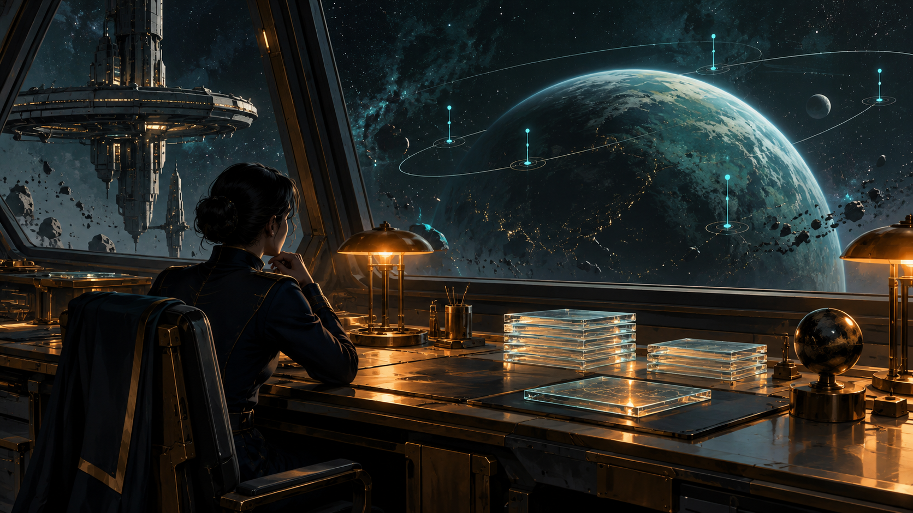

At **Reris, Galaxy 1**, Rowan takes Vale's reference after a trade. A publisher has mixed voluntary diaries with instrument surveys and advertised recollection as exact measurement. Three actual landmarks at **Nedasen** are observed independently of the diaries. At **Cemalis**, Rowan flies separated baselines and compares both landmark instruments against the original reference watcher, retaining the measured error.

The consenting diary custodian reaches **Ledanor's archive berth**. Rowan chooses **Publish a separated evidence-and-memory atlas** or **Keep the diaries with their custodians**. Publication needs each contributor's consent to their actual excerpt and clear separation of testimony from measurement. Custodian-held diaries need actual private receiving and a public layer containing only measured hazards. The reference returns to Reris for **7,200 CR** and the place-nobody-remembers clue.

Mission flow

```mermaid
flowchart TD
  %% mission C25 | l337.memory-atlas
  C25_accept["Reris: Accept The Memory Atlas at Reris."]
  C25_collect_reference["Reris: Collect the identified one-tonne reference<br/>instrument from Agent Mara Vale."]
  C25_survey["Nedasen: Observe three actual orbital landmarks<br/>independently of the consented travel diaries."]
  C25_field_work["Cemalis: Compare two landmark instruments with the<br/>onboard reference watcher."]
  C25_independent_witness["Ledanor: Verify actual safe transit and living<br/>reception of the consenting diary custodian to the<br/>archive receiving berth."]
  C25_choose_settlement{"Ledanor: At the actual witness receiving station,<br/>choose the settlement with the arrived authorised<br/>operator delegates."}
  C25_return_and_audit["Reris: Return the reference instrument and confirm all<br/>physical receiving and settlement receipts."]
  C25_close_case["Reris: Confirm successful completion, the recorded<br/>settlement and the once-only fee."]
  C25_complete(["7,200 CR once; this source's clue"])
  C25_close_case --> C25_complete
  C25_return_and_audit --> C25_close_case
  C25_choose_settlement_choice_1["Publish a separated evidence-and-memory atlas"]
  C25_choose_settlement --> C25_choose_settlement_choice_1
  C25_apply_settlement_choice_1["Cemalis: Verify independent measurement labels and<br/>each contributor's consent. All 2 stated proofs are<br/>required."]
  C25_choose_settlement_choice_1 --> C25_apply_settlement_choice_1
  C25_apply_settlement_choice_1 --> C25_return_and_audit
  C25_choose_settlement_choice_2["Keep the diaries with their custodians"]
  C25_choose_settlement --> C25_choose_settlement_choice_2
  C25_apply_settlement_choice_2["Cemalis: Verify restricted custody and publish only<br/>measured hazard corrections. All 2 stated proofs are<br/>required."]
  C25_choose_settlement_choice_2 --> C25_apply_settlement_choice_2
  C25_apply_settlement_choice_2 --> C25_return_and_audit
  C25_independent_witness --> C25_choose_settlement
  C25_field_work --> C25_independent_witness
  C25_survey --> C25_field_work
  C25_collect_reference --> C25_survey
  C25_accept --> C25_collect_reference
  C25_continuity_inquiry["Complete this source's independent no-cost continuity<br/>inquiry"]
  C25_continuity_trace(["Missing source clue only; original outcome and rewards<br/>unchanged"])
  C25_accept -.-> |"If this original source clue is unavailable"| C25_continuity_inquiry
  C25_continuity_inquiry --> C25_continuity_trace
```

### The Honest Circuit

🔵 Planned

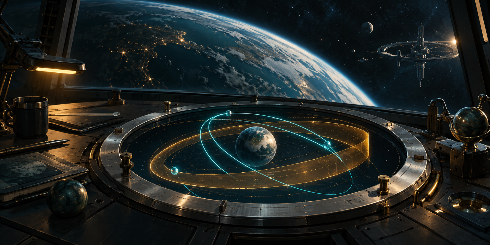

After a trade at **Lonomon, Galaxy 4**, Captain **Elara Venn** lends Rowan the timing reference. A new certification circuit rewards speed without accounting for dangerous passes or offloaded fuel. Rowan compares the three independent beacon epochs at **Mobarum**, then flies the two ordered physical gates at **Lobagom** in the current ship. The gate envelope, speed and real traffic separation matter. Dumped fuel remains in the budget, and resetting a run cannot erase its elapsed time or spent fuel.

The consenting calibration tender completes the same certified corridor and reaches **Balmabol**. Rowan and the arrived delegates choose **Certify measured route efficiency** or **Certify a minimum safety margin**. The first publishes the actual receiving time and total fuel use. The second proves a real abort within its stated window while retaining the observed closest-pass envelope. The reference returns to Lonomon for **7,000 CR** and the tick-outside-the-circuit clue. An unsafe pass does not receive certification.

Mission flow

```mermaid
flowchart TD
  %% mission C28 | l337.honest-circuit
  C28_accept["Lonomon: Accept The Honest Circuit at Lonomon."]
  C28_collect_reference["Lonomon: Collect the identified one-tonne reference<br/>instrument from Captain Elara Venn."]
  C28_survey["Mobarum: Observe three independent timing beacons and<br/>compare their actual sample epochs."]
  C28_field_work["Lobagom: Fly two ordered80m-radius gates at5-30m/s<br/>with the reference timing instrument aboard; retain<br/>fuel before/after."]
  C28_independent_witness["Balmabol: Verify actual safe transit and living<br/>reception of the consenting calibration tender through<br/>the same certified corridor."]
  C28_choose_settlement{"Balmabol: At the actual witness receiving station,<br/>choose the settlement with the arrived authorised<br/>operator delegates."}
  C28_return_and_audit["Lonomon: Return the reference instrument and confirm<br/>all physical receiving and settlement receipts."]
  C28_close_case["Lonomon: Confirm successful completion, the recorded<br/>settlement and the once-only fee."]
  C28_complete(["7,000 CR once; this source's clue"])
  C28_close_case --> C28_complete
  C28_return_and_audit --> C28_close_case
  C28_choose_settlement_choice_1["Certify measured route efficiency"]
  C28_choose_settlement --> C28_choose_settlement_choice_1
  C28_apply_settlement_choice_1["Lobagom: Verify fuel accounting and actual receiving<br/>time. All 2 stated proofs are required."]
  C28_choose_settlement_choice_1 --> C28_apply_settlement_choice_1
  C28_apply_settlement_choice_1 --> C28_return_and_audit
  C28_choose_settlement_choice_2["Certify a minimum safety margin"]
  C28_choose_settlement --> C28_choose_settlement_choice_2
  C28_apply_settlement_choice_2["Lobagom: Verify the closest-pass envelope and<br/>emergency abort test. All 2 stated proofs are<br/>required."]
  C28_choose_settlement_choice_2 --> C28_apply_settlement_choice_2
  C28_apply_settlement_choice_2 --> C28_return_and_audit
  C28_independent_witness --> C28_choose_settlement
  C28_field_work --> C28_independent_witness
  C28_survey --> C28_field_work
  C28_collect_reference --> C28_survey
  C28_accept --> C28_collect_reference
  C28_continuity_inquiry["Complete this source's independent no-cost continuity<br/>inquiry"]
  C28_continuity_trace(["Missing source clue only; original outcome and rewards<br/>unchanged"])
  C28_accept -.-> |"If this original source clue is unavailable"| C28_continuity_inquiry
  C28_continuity_inquiry --> C28_continuity_trace
```

### Open Measure

🔵 Planned

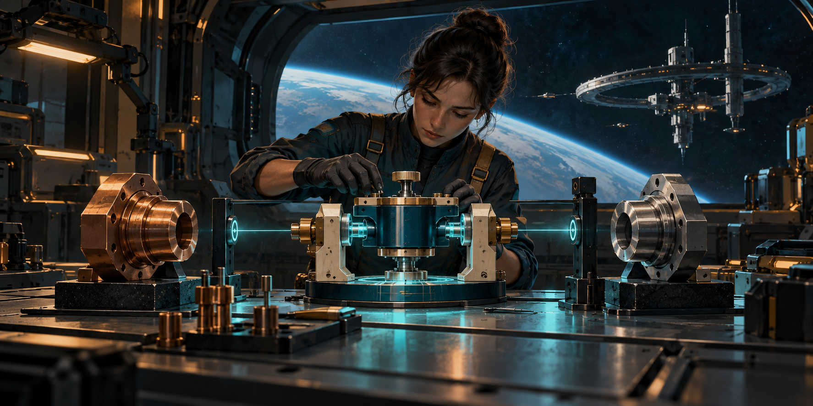

At **Valtor, Galaxy 2**, Cato Lerr lends Rowan the tolerance programmer after an ordinary trade. Three workshops cannot exchange parts because their certificates refer to incompatible loads. Rowan compares the signed loads with real fittings at **Vorvakar**, then applies the known reference load to both independently manufactured parts at **Voransen**. The measured fit and tolerance decide whether they work together.

The independent calibration tender reaches the common test berth at **Morkador**. Rowan chooses **Publish an open physical measurement standard** or **Establish a witnessed interoperable calibration service** with the arrived delegates. An independent part must fit the published reference and its manufacturer must sign the measurements; alternatively, each workshop must be able to reject a bad part while accepting the reciprocal bounded service. Returning the same reference to Valtor earns **7,900 CR** and the reference-without-a-load clue.

Mission flow

```mermaid
flowchart TD
  %% mission C34 | l337.open-measure
  C34_accept["Valtor: Accept Open Measure at Valtor."]
  C34_collect_reference["Valtor: Collect the identified one-tonne reference<br/>instrument from Engineer Cato Lerr."]
  C34_survey["Vorvakar: Compare three signed workshop loads against<br/>the actual external test fittings."]
  C34_field_work["Voransen: Test the two independently manufactured<br/>parts with the original onboard tolerance programmer."]
  C34_independent_witness["Morkador: Verify actual safe transit and living<br/>reception of the independent calibration tender to the<br/>common test berth."]
  C34_choose_settlement{"Morkador: At the actual witness receiving station,<br/>choose the settlement with the arrived authorised<br/>operator delegates."}
  C34_return_and_audit["Valtor: Return the reference instrument and confirm<br/>all physical receiving and settlement receipts."]
  C34_close_case["Valtor: Confirm successful completion, the recorded<br/>settlement and the once-only fee."]
  C34_complete(["7,900 CR once; this source's clue"])
  C34_close_case --> C34_complete
  C34_return_and_audit --> C34_close_case
  C34_choose_settlement_choice_1["Publish an open physical measurement standard"]
  C34_choose_settlement --> C34_choose_settlement_choice_1
  C34_apply_settlement_choice_1["Voransen: Verify the public reference and an<br/>independently manufactured fit. All 2 stated proofs<br/>are required."]
  C34_choose_settlement_choice_1 --> C34_apply_settlement_choice_1
  C34_apply_settlement_choice_1 --> C34_return_and_audit
  C34_choose_settlement_choice_2["Establish a witnessed interoperable calibration<br/>service"]
  C34_choose_settlement --> C34_choose_settlement_choice_2
  C34_apply_settlement_choice_2["Voransen: Verify reciprocal service limits and<br/>independent rejection rights. All 2 stated proofs are<br/>required."]
  C34_choose_settlement_choice_2 --> C34_apply_settlement_choice_2
  C34_apply_settlement_choice_2 --> C34_return_and_audit
  C34_independent_witness --> C34_choose_settlement
  C34_field_work --> C34_independent_witness
  C34_survey --> C34_field_work
  C34_collect_reference --> C34_survey
  C34_accept --> C34_collect_reference
  C34_continuity_inquiry["Complete this source's independent no-cost continuity<br/>inquiry"]
  C34_continuity_trace(["Missing source clue only; original outcome and rewards<br/>unchanged"])
  C34_accept -.-> |"If this original source clue is unavailable"| C34_continuity_inquiry
  C34_continuity_inquiry --> C34_continuity_trace
```

### The Guiding Light

🔵 Planned

After a trade at **Crimbo, Galaxy 8**, Evi Senn's reference lantern helps Rowan investigate the long winter shadow. The light-sharing contract has routed a maintenance crew towards an unlit pier. From the accessible orbital observation volume above Crimbo, Rowan measures three real sightlines, aligns both external relays and tests their overlapping light cones against the current shadow geometry. The work is available in ordinary play without waiting for a real-world season or planetary day.

The maintenance tender makes its actual journey to the now-lit winter service berth. Rowan and the arrived delegates choose **Maintain independent winter lantern segments** or **Publish a jointly maintained winter rota**. Both local repair records and real shadow-side overlap must be proved, or the signed shared rota must preserve that overlap while the tender reaches the lit berth. The original lantern returns to Senn before **5,700 CR** and the extra-lantern clue are recorded.

Mission flow

```mermaid
flowchart TD
  %% mission C39 | l337.guiding-light
  C39_accept["Crimbo: Accept The Guiding Light at Crimbo."]
  C39_collect_reference["Crimbo: Collect the identified one-tonne reference<br/>instrument from Dispatcher Evi Senn."]
  C39_survey["Crimbo: Measure three actual winter-shadow sight lines<br/>from the accessible marked observation volume above<br/>Crimbo."]
  C39_field_work["Crimbo: Use the onboard reference lantern to restore<br/>the two external relays and test their actual<br/>overlapping beam cones."]
  C39_independent_witness["Crimbo: Verify actual safe transit and living<br/>reception of the consenting maintenance tender to the<br/>now-lit winter service berth."]
  C39_choose_settlement{"Crimbo: At the actual witness receiving station,<br/>choose the settlement with the arrived authorised<br/>operator delegates."}
  C39_return_and_audit["Crimbo: Return the reference instrument and confirm<br/>all physical receiving and settlement receipts."]
  C39_close_case["Crimbo: Confirm successful completion, the recorded<br/>settlement and the once-only fee."]
  C39_complete(["5,700 CR once; this source's clue"])
  C39_close_case --> C39_complete
  C39_return_and_audit --> C39_close_case
  C39_choose_settlement_choice_1["Maintain independent winter lantern segments"]
  C39_choose_settlement --> C39_choose_settlement_choice_1
  C39_apply_settlement_choice_1["Crimbo: Verify both local maintenance receipts and the<br/>overlapping safe horizon. All 2 stated proofs are<br/>required."]
  C39_choose_settlement_choice_1 --> C39_apply_settlement_choice_1
  C39_apply_settlement_choice_1 --> C39_return_and_audit
  C39_choose_settlement_choice_2["Publish a jointly maintained winter rota"]
  C39_choose_settlement --> C39_choose_settlement_choice_2
  C39_apply_settlement_choice_2["Crimbo: Verify the signed rota and a real shadow-side<br/>receiving test. All 2 stated proofs are required."]
  C39_choose_settlement_choice_2 --> C39_apply_settlement_choice_2
  C39_apply_settlement_choice_2 --> C39_return_and_audit
  C39_independent_witness --> C39_choose_settlement
  C39_field_work --> C39_independent_witness
  C39_survey --> C39_field_work
  C39_collect_reference --> C39_survey
  C39_accept --> C39_collect_reference
  C39_continuity_inquiry["Complete this source's independent no-cost continuity<br/>inquiry"]
  C39_continuity_trace(["Missing source clue only; original outcome and rewards<br/>unchanged"])
  C39_accept -.-> |"If this original source clue is unavailable"| C39_continuity_inquiry
  C39_continuity_inquiry --> C39_continuity_trace
```

## Recovering a lost route into the main story

🔵 Planned

Some promises cannot be kept. A witness may die, a station may be lost, or a protected original may be destroyed. Rowan's career retains those events and their consequences. An earned clue survives a later failed job or ship change, but failure itself reveals nothing new.

For every still-missing source, a living playable Rowan must retain a route to learn its underlying trace. Sometimes a separately funded follow-up can use preserved evidence, new authorised stock and genuinely consenting new investigators. It acknowledges the failed case rather than restoring it. Where that route is impossible or unaffordable, the **independent charter inquiry** remains available without credits, cargo space, passenger places, faction goodwill, paid content or a previous successful attempt.

The charter desk is reachable at a surviving orbital station; its service can route to Rowan's current playable system through an authorised receiving tender if necessary. Rowan opens a new case and receives a zero-mass survey mandate with three source-specific archive challenges. Independently preserved pre-offer archives provide the basis. The service does not conjure a living witness or an original cargo lot after their loss.

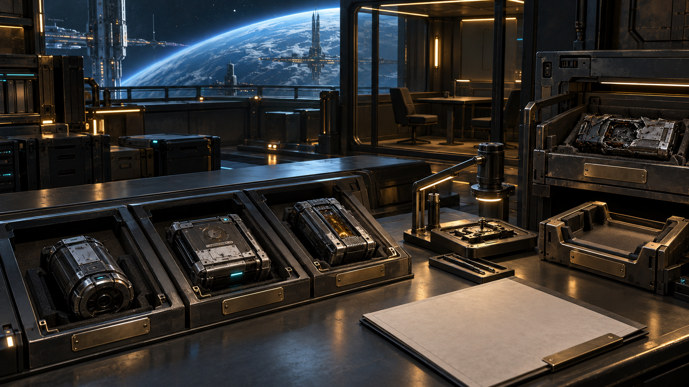

Rowan flies to **three actual non-consumable reference beacons** in the current ordinary system, takes the new case's measurements and operates its source-specific corrective test. Failed tests can be corrected locally without a cumulative fee or attempt limit. A different authorised operator receives the results, reconciles the independent records and records the original outcome explicitly. Only the completed inquiry awards that **same source's clue once**. It grants no original fee, bounty, accreditation, paid chapter resolution or campaign prize.

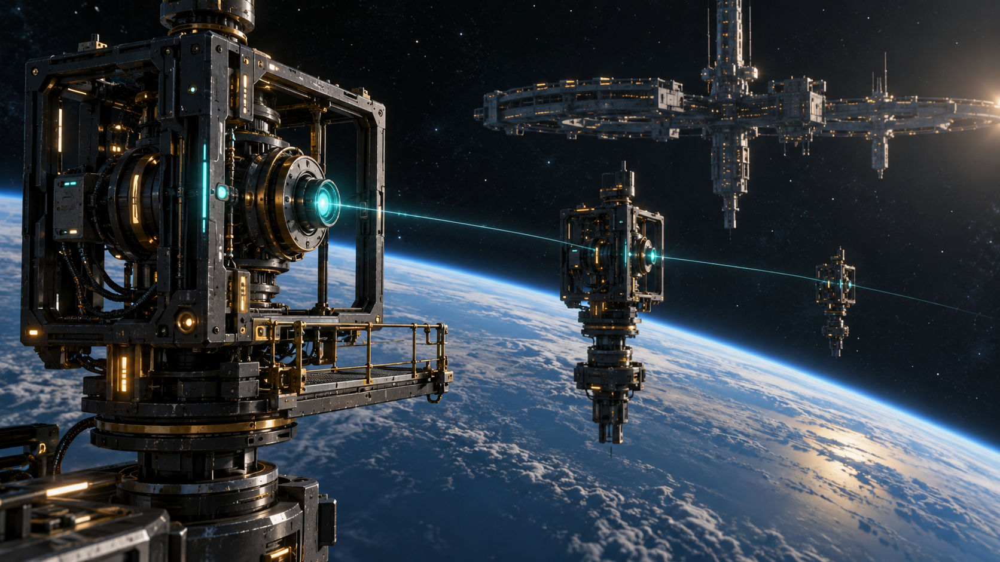

Save and Continue preserve the case, challenge, measurements, test and receiving. Destruction, obstruction or cancellation must not exhaust every path: safe registered replacement apparatus can continue the inquiry without replacing the original lost people or property. This keeps the overall mystery completable while the world remembers what Rowan failed to save. Ordinary commander death and game-over remain separate rules.

## The Unwritten Route

🔵 Planned

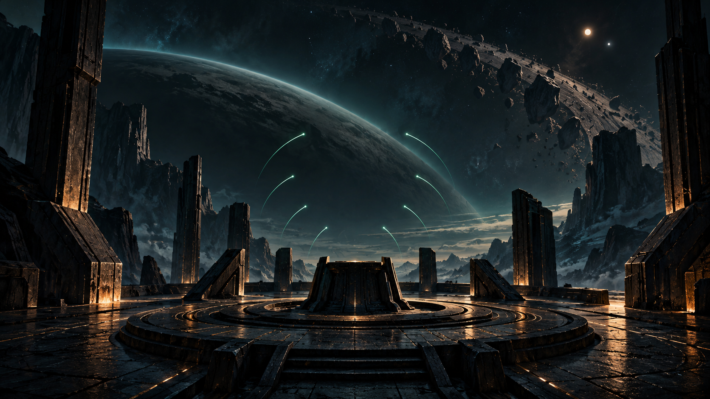

Across those different lives and jobs, Rowan has collected **64 distinct source clues**. Their images and fragments refer to missing instants, silent voices, unclaimed reserves and inward marks. They are retained in the clue journal. An independent inquiry can supply a source Rowan did not complete directly, including a paid story Rowan has not bought; it does not claim that story's ending or reward.

### Decode at PLUGH

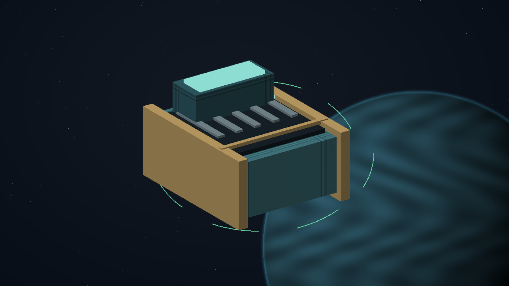

When the collection is complete, its final required clue provides a normal navigation beacon to the local **PLUGH** station if Rowan does not already know one. The station's revealed position persists. At any PLUGH, Rowan asks the AI to **Decode the collected traces**. The AI recognises different views of one route: a moving lens. It sends Rowan towards **Corur in Amber Divide, displayed Galaxy 5**, where a dormant listener waits over the dark hemisphere.

The journal reveals the next earned instruction and completed history. The later bearings and the unique craft's catalogue identity remain hidden from the player until their proper discoveries. A convenience setting cannot reveal or fabricate the encounter.

### Wake the listener

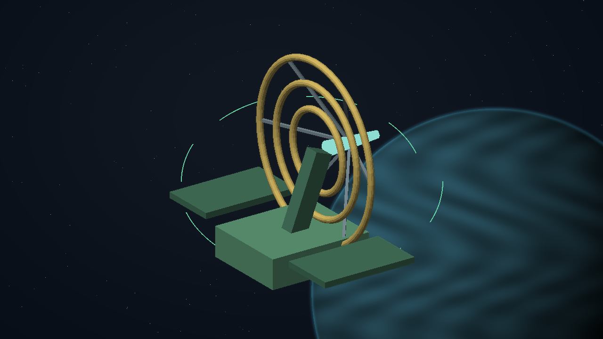

At **Corur, G05-S083**, Rowan scans the real dormant listener above the dark hemisphere. Its unfolding green points match the missing instant and bend towards **Berilir**. The completed observation becomes the first ordered flight proof of the trail.

### Read the ring

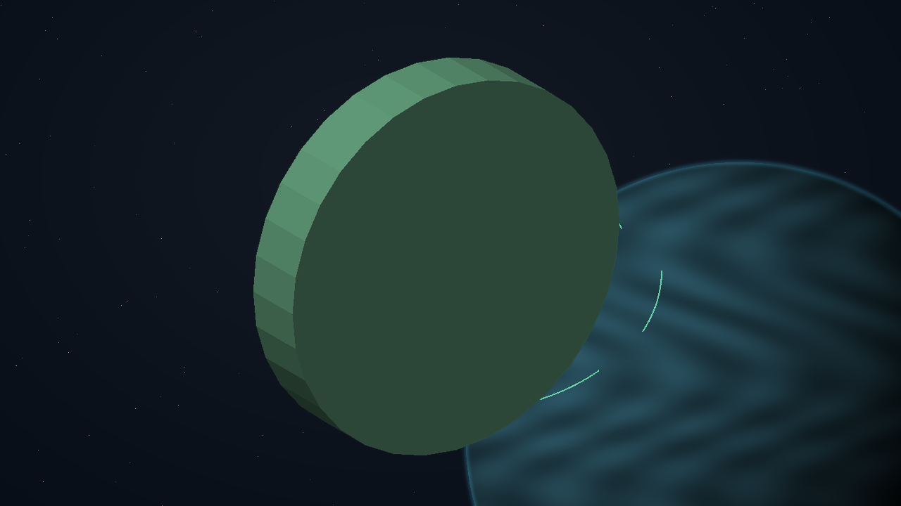

At **Berilir, G05-S250**, three marked echoes lie along the asteroid ring. Rowan scans each actual echo. Together they complete the listener's pattern and trace an inward curve towards **Ranenor**, where an extra lantern appears in reflection after local nightfall.

### Align the lanterns

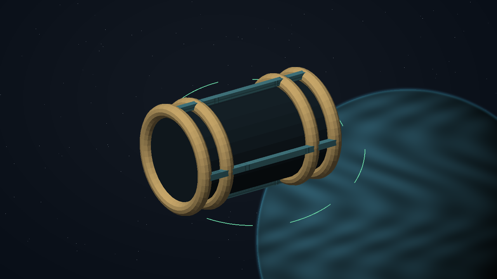

At **Ranenor, G05-S115**, Rowan reaches the marked observation waypoint and aligns **two orbital lanterns**. Each alignment is confirmed only when its reflected trace meets the inward mark. The converging traces surround an empty centre; the next bearing is the uncharted outer cradle at **Ashor**.

### Open the cradle

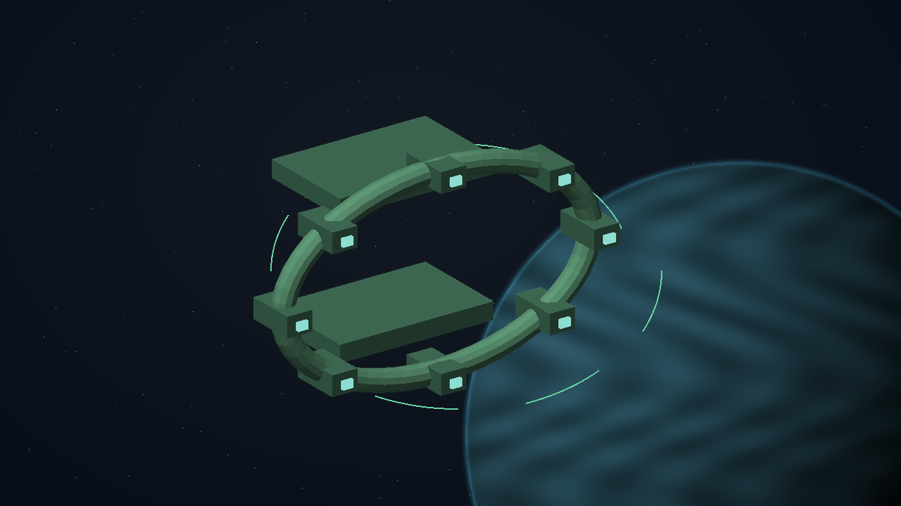

At **Ashor, G05-S084**, Rowan reaches the actual outer-cradle waypoint and transmits the complete decoded pattern. The four flight objectives have now been completed in order. The cradle's green traces converge, and the AI identifies the returning signature: **MEDUSA**. Only here does the unique craft become a legitimate encounter and discovery.

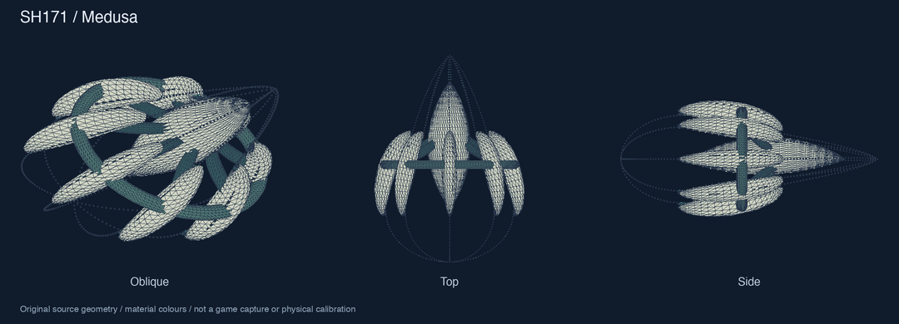

*Medusa (SH171).*

### Recover Medusa's original lattice

The revealed Medusa carries an intentionally limited, **not fully upgraded** fit. Rowan faces a beatable unmanned construct with real finite equipment, ammunition, charge and countermeasures. The recovery offer must provide a genuinely compatible **no-fee loan** if needed, so reaching this scene does not introduce a new cash or purchase gate.

Rowan overcomes its shields with the chosen combination of weapons and EMP, then achieves actual EMP disable. The qualified Salvage Beam draws the disabled target into the safe work envelope. The matching salvage laser and Fuel Scoops recover the **original 50 kg reconstruction lattice**, keeping the protected core outside the cut. An explosion or temporary disable alone cannot supply it. The lattice occupies **0.05 tonnes of protected hold** until its later receiving.

If capture fails or that sample is lost, the collected clues and completed trail remain earned. The unlocked encounter can be attempted again through a genuinely new registered encounter generation, without another rank, credit or deposit gate. The lost original stays lost; it is not cloned into Rowan's hold.

### Return to PLUGH

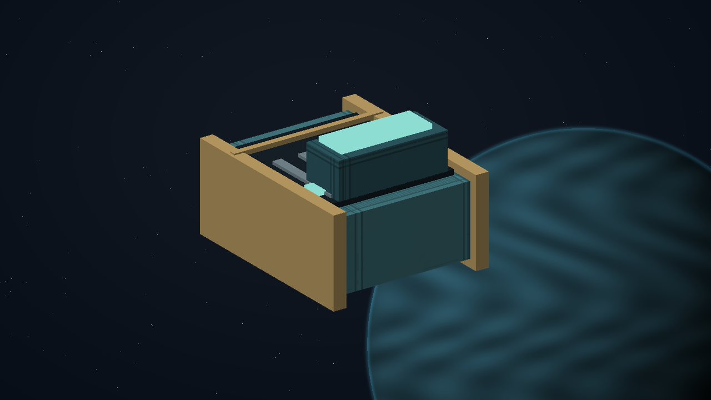

Rowan takes the same intact recovered lattice to **any PLUGH station** and authorises its actual receiving. The AI archives the original and reconstructs the design. The recovered structure completes the inward mark: **The Unwritten Route is resolved**, and Medusa fabrication access is authorised at PLUGH stations.

The final handoff ends the mystery. It grants access to a separate **paid hull purchase**; Rowan has not been handed a free ship, a maximum fit or fabricated purchase history. Completing this story does not require buying Medusa.

## Life after the mystery

🔵 Planned

Rowan returns to an open career whose decisions remain in its records. Trading, repeated contracts, the Wayfarer services, unfinished independently available stories, lawful salvage, mining, crew care and ship collection continue. Paid campaign downloads add their owned stories and art when the game's supported capabilities permit them; a campaign needing an enhanced game first requires the corresponding update. Buying or installing it does not complete its tasks or place its prize in the hold.

At the **PLUGH showroom**, Rowan can now review a Medusa purchase against actual funds, trade-in and fitting. The stock hull and its displayed loadout are separate from the limited quest ship. Over time, Rowan buys or legitimately obtains compatible upgrades, installs them and keeps their actual condition, charge, heat, ammunition and ownership through saves and exchanges. **After purchase and full upgrading, this is intended to be the most powerful ship in the catalogue.** A freighter can still carry more cargo; overall upgraded capability is the promise.

In the showroom, both comparison models turn together as Rowan judges another possible fit. Equipment that cannot fit remains owned in storage; people and protected property keep their real space and receiving obligations. The ship changes, but the career, permanent entitlements, known routes, earned clues and consequences belong to the same commander.

The next launch is ordinary again: a real station exit, a checked fuel plan and a promise to someone at the far end of a route. Rowan is free to choose that work.

## All 64 original mission sources

The complete [mission-to-scene map](INTENDED-GAME-STORY-NOTES.md#all-64-original-mission-sources) and [source/status notes](INTENDED-GAME-STORY-NOTES.md) follow the story in its companion appendix.
